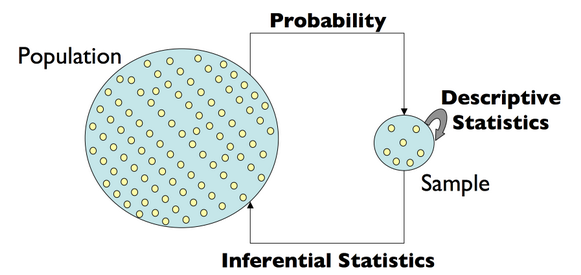
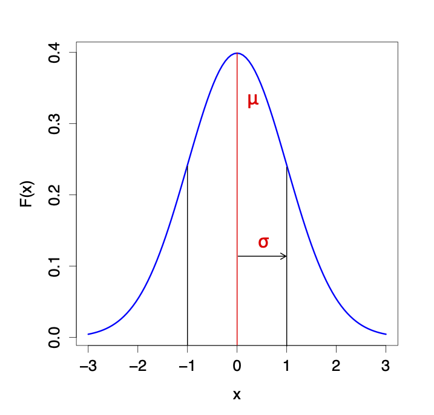

class: middle
layout: true

<big>
---

<style>
div.blue { background-color:#e6f0ff; border-radius: 5px; padding: 20px;}
</style>

# <center> Preview of next 6 lectures

* **2020/01/15 - Lecture 4: Stats Philosophy, Math/stat background & review**

* 2020/01/20 - Lecture 5: Statistical Inference - two group comparisons 

* 2020/01/22 - Lecture 6: Statistical Inference - linear regression and ANOVA

* 2020/01/27 - Lecture 7: Statistical Inference - linear models (more than two groups, and interaction testing)

* 2020/01/29 - Lecture 8: Statistical Inference - continuous model + limma

* 2020/02/03 - Lecture 9: Statistical Inference - multiple testing

---

# <center> Outline for today

* Intro: Philosophy, goals, and central concepts

* Review: Random Variables, Probability Distributions, Sampling Distribution, Estimation, Inference, CLT, Hypothesis Testing

<div class = "blue">
Your goals: 
  <ol>1. be familiar with the terminology</ol>
  <ol>2. have a clear understanding of the concepts</ol>
</div>
---

# <center> What is Statistics?

  
---

# <center> Statistics 

* The field of statistics concerns the science of **collecting, analyzing/modeling, interpreting** data and **communicating uncertainty** about the results
  - Data science and machine learning have enabled application to 'big data'
  
* Statistical and computational methods should not be used as generic "recipes" to follow $\rightarrow$ non-robust science

* We aim for:
  - rigorous understanding to perform routine statistical analysis
  
  - solid foundation to follow up on specific topics
---


# <center> Statistical Inference
A framework for generating conclusions about a population from noisy data from a sample

<center>
</center>

* Language of **probability** enables us to make *predictions* and discuss *uncertainty*
* **Statistical inference** enables us to *understand* the data and make *conclusions*
* We need both to learn from data

---

# <center> Review: terminology & basic concepts

* Random variables and their distributions

* Models, parameters, and their estimators

* Central Limit Theorem (CLT)

* Hypothesis Testing

---

# <center> Variables

<div class = "blue">
<b>Variable <i>(noun)</i>:</b> an element, feature, or factor that is liable to vary or change
</div>

* In statistical terminology, a **variable** is an unknown quantity that we'd like to study

* Most research questions can be formulated as 
>What's the *relationship* between two or more variables?  

---

# <center> Random variables

<div class = "blue">
<b>Random Variable (RV):</b> A variable whose value results from the measurement of a quantity that is subject to variation (e.g. the <i>outcome</i> an experiment)
</div>

  - Examples: a coin flip, a dice throw, the expression level of gene X
  
  - An RV has a *probability distribution*
  
---
  
# <center> Distributions of RVs

<div class = "blue">
<b>Probability:</b> A number assigned to an outcome/event that describes the extent to which it is likely to occur
</div>

  - Must satisfy certain rules (e.g. be between 0 and 1)
  
  - Represents the (long-term) *frequency* of an event
  
--

<div class = "blue">
<b>Probability distribution:</b> A mathematical function that maps outcomes/events to probabilities
</div>  
  
---

# <center> Example experiment: Two coin tosses

.pull-left[

* **Experiment**: Toss two coins

* **Sample space**: set of all possible outcomes $S=\{TT, TH, HT, HH\}$

* **Random Variable of interest**: number of heads


* Can you think of other RVs?

]
.pull-right[

|       | Outcome  | Number of Heads |
| :---: |:---------:| :-----------:| 
| TT    |  | 0 |
| TH    |  | 1 |
| HT    |  | 1 |
| HH    |  | 2 |

]

---

# <center> Assigning probability to outcomes

.pull-left[

* Let:

  * $\omega=$ an outcome 

  * $X(\omega)=$ number of heads in $\omega$
  
* Each possible outcome is associated with a probability

* **Event:** A set of outcomes that satisfy some condition

* Each realization of the RV corresponds to an **event** (e.g. $X(\omega)=1$ corresponds to the outcomes $TH$ and $HT$ )

]

.pull-right[

|       | $\omega$  | $X(\omega)$ | Probability |
| :---: |:---------:| :-----------:| :---------: |
| TT    |  | 0 | 0.25 |
| TH    |  | 1 | 0.25 |
| HT    |  | 1 | 0.25 |
| HH    |  | 2 | 0.25 |
]

---

# <center> Assigning probability to events

The probability distribution of the Random Variable $X$ tells us how likely each event (number of heads) is to occur in the experiment


| Event | $x$ | $P(X=x)$ |
| :-----------:| :-----------:| :---------: |
|  | 0 | 0.25 |
|  <big>,  | 1 | 0.50 |
|  | 2 | 0.25 |


<small> Note on notation: $P(X=x)$ can also be written as $P_X(x)$

---

# <center> Two types of random variables

* A **discrete** RV has a countable number of possible values
  
  - e.g. throwing dice, genotype measured on a SNP chip

* A **continuous** RV takes on values in an interval of numbers

  - e.g. expression level of a gene, blood glucose level, height of individuals
  
---

# <center> Standard Gaussian (Normal) distribution 

.pull-left[
* probability density function:
$$f(x|\mu,\sigma^2) = \frac{1}{\sqrt{2\pi}\sigma}e^{-\frac{(x-\mu)^2}{2\sigma^2}}$$

* Mean $=\mu$

* Standard Deviation $=\sigma$

* For convenience, we write $N(\mu, \sigma^2)$

* When $\mu=0$ and $\sigma=1$, this is the *Standard* Normal distribution $N(0,1)$
]

.pull-right[

]

---

# <center> Gaussian (Normal) distribution 

<center>

$$\text{Probability density function: }f(x|\mu,\sigma^2) = \phi(x) = \frac{1}{\sqrt{2\pi}\sigma}e^{-\frac{(x-\mu)^2}{2\sigma^2}}$$

---

# <center> Density $\rightarrow$ probability requires integration

```{r echo=FALSE, fig.width=8, fig.height=5, fig.align='center'}
library(ggplot2)
theme_set(theme_bw())
x_lower <- -3
x_upper <- 3

max_height <- max(dnorm(x_lower:x_upper))

ggplot(data.frame(x = c(x_lower, x_upper)), aes(x = x)) + xlim(x_lower, x_upper) + 
  ylim(0, max_height) +
  geom_area(stat = "function", fun = dnorm, fill = "blue", alpha = 0.25, xlim = c(-1, 1)) +
  stat_function(fun = dnorm) + 
  xlab("x") + 
  ylab(bquote(phi(x))) +
  theme(plot.title = element_text(hjust = 0.5), 
        axis.title.x = element_text(face="bold", colour="blue", size = 24),
        axis.title.y = element_text(face="bold", colour="blue", size = 24)) +
  geom_vline(xintercept = -1, linetype="dashed", colour="blue") +
  geom_vline(xintercept = 1, linetype="dashed", colour="blue")

```
---

# <center> Statistical Inference

* The **parameter space** is the set of all possible values for the parameter

* One major goal: to "figure out" (i.e. estimate) the **parameter values**
  - i.e. *"fit the model to the data"*
  
* The model is a representation that (we hope) approximates the data and (more importantly) the population that the data were sampled from 

* We can then use this model for:
  - hypothesis testing
  - prediction 
  - simulation
