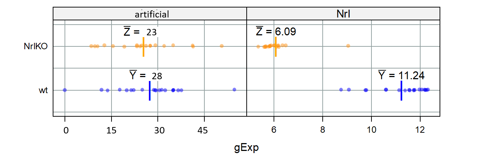
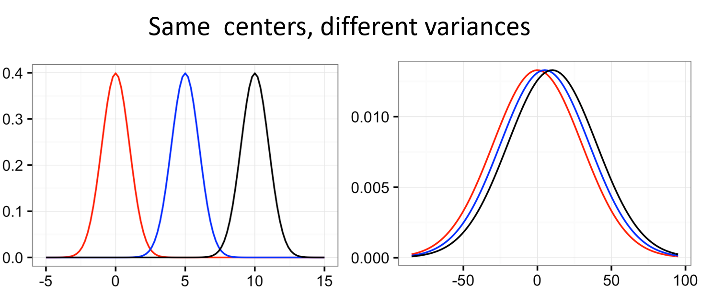

class: middle


### We want to understand a **population** (e.g., gene behaviour) but we can only study a <font color=red>**random sample**</font> from it.
### <font size=5><p align=right> Picture from Dr. Fowler, UW </p></font>
---
class: middle
# <center> Hypothesis Testing in Genomics


<big>


- Retina presents a model system for investigating **regulatory networks** underlying neuronal differentiation.

- **Nrl** transcription factor is known to be important for Rod development

- <font color="red">**What happens if you delete Nrl?**

---
class: middle

# <center> Why a hypothesis test?
<big>
From paper: *". we hypothesized that Nrl is the ideal transcription factor to gain insights into gene expression changes ..."*

> **Biological question:** Is the expression level of gene A affected by ablation of the Nrl gene in mice?

**Experimental Design: <font color=red>we observe a random sample</font>**
<br> (random sample of gene expressions from our experiment)


<br> 4 Developmental stages
<br> 2 genotypes: Wild type, NrlKO
<br> 3-4 replicas for each combination

### We can use **statistical inference** to better understand our biological question.
---
class: middle, center
### Let's take a look at 4 genes as an example: **Irs4 and Nrl**

### <font color="red"> Are these genes truly different in NrlKO compared to WT?</font>

### We only observe a random sample.
```{r, include=FALSE}
library(lattice)
library(latticeExtra)

jCols <- c(x = "blue", y = "orange")
trellis.par.set(superpose.symbol = list(col = jCols),
                superpose.line = list(col = jCols))
jCex <- 3 

prDes <- readRDS("data/GSE4051_design.rds")
str(prDes)

prDat<-read.table("data/GSE4051_data.tsv",
                      sep = "\t", header = T, row.names = 1)
str(prDat, list.len = 10)

miniDat <- as.vector(t(prDat[c("1422248_at", "1450946_at"), ]))
miniDat <- data.frame(gene = rep(c("Irs4", "Nrl"), each = nrow(prDes)),
                      gExp = miniDat)
miniDat <- data.frame(prDes, miniDat) # ignore the warning about row names
str(miniDat)
```

```{r echo=FALSE, fig.height=3.5, dev='svg'}
stripplot(gType ~ gExp | gene, miniDat,
          scales = list(x = list(relation = "free")),
          groups = gType, auto.key = FALSE,
          aspect = 1, layout = c(2, 1),
          alpha = 0.4, pch = 16)
```

---
class: middle

# <center> Statistical Hypothesis
<big>
** Experimental Design:**
  - 2 conditions: Wt *vs* NrlKO
  - random sample: we observe the expression of many genes in all mice

** Biological Hypothesis:** for some  genes, the expression levels are different in both conditions.

** Statistical Hypotheses:** one gene at a time
  - H<sub>0</sub> (null hypothesis): the expression level of gene A is the same.
  - <font color="blue">H<sub>A</sub> (alternative hypothesis): the expression level of gene A is different.</font>
---
class: middle, center
### <font color="red"> Are these genes truly different in NrlKO compared to WT?</font>

### H<sub>0</sub>: the expression level of gene A is the same.

### Is there **enough** evidence in the data to reject H<sub>0</sub>?

```{r echo=FALSE, fig.height=3.5, dev='svg'}
stripplot(gType ~ gExp | gene, miniDat,
          scales = list(x = list(relation = "free")),
          groups = gType, auto.key = FALSE,
          aspect = 1, layout = c(2, 1),
          alpha = 0.4, pch = 16)
```

---
class: center, middle

Empirical distributions are **based on DATA**
```{r echo=FALSE, fig.height=3, dev='svg'}
densityplot(~ gExp | gene, miniDat,
            scales = list(x = list(relation = "free")),
            groups = gType, auto.key = TRUE,
            aspect = 0.5,
            alpha = 0.4, pch = 16)
```

The true underlying distribution is **unknown**
```{r echo=FALSE, fig.height=3, dev='svg'}
stripplot(gType ~ gExp | gene, miniDat,
          scales = list(x = list(relation = "free")),
          groups = gType, auto.key = FALSE,
          aspect = 0.5, layout = c(2, 1),
          alpha = 0.4, pch = 16)
```

---

# Slide 9 -> Toss or keep?

---
class: middle

# <center> Notation

<big>

- ### Random variables (we can observe)

$Y_i$ : expression of gene A in the WT <font color="red">sample</font> $i$

$Z_i$: expression of gene A in NrlKO sample $i$

$Y_1, Y_2,..., Y_{n_Y}$ : a <font color="green">random sample</font> of size $n_Y$

$\bar{Y}=\frac{\sum_{i=1}^{n_Y}Y_i}{n_Y}$: sample mean of expression levels of gene A from WT mice

- ### Population parameters (unknown)

$\mu_Y = E[Y]$ : the (population) expected expression level of gene A in WT mice
---
class: middle

### We observe... the difference between the **sample averages**!
``` {r echo=FALSE, fig.height=2.25, dev='svg'}
jFudge <- 0.35
stripplot(gType ~ gExp | gene, miniDat,
          grid = TRUE,
          scales = list(x = list(relation = "free")),
          groups = gType, jitter.data = TRUE,
          aspect = 0.5, layout = c(2, 1),
          alpha = 0.4, pch = 16,
          panel = panel.superpose,
          panel.groups = function(x, y, ..., group.number) {
            yo <- group.number
            panel.stripplot(x, y, ...)
            theAvg <- mean(x)
            panel.points(theAvg, y[1], pch = "|", cex = jCex,
                         col = jCols[group.number])
            jLab <- substitute(paste(bar(Z), " = ", foo),
                        list(Z = c("Y", "Z")[group.number],
                             foo = round(theAvg, 2)))
            panel.text(x = mean(x), y = y[1] + jFudge,
                       jLab)
          })
```

```{r}
theAvgs <- with(miniDat,
                 tapply(gExp, list(gType, gene), mean))
```
```{r, echo=FALSE}
theAvgs
```

```{r}
theDiff <- theAvgs["NrlKO", ] - theAvgs["wt", ]
```
```{r, echo=FALSE}
theDiff
```
---
class: middle

## Is this convincing evidence that $\mu_Y \neq \mu_Z$?
``` {r echo=FALSE,fig.height=3, dev='svg'}
jFudge <- 0.35
stripplot(gType ~ gExp | gene, miniDat,
          grid = TRUE,
          scales = list(x = list(relation = "free")),
          groups = gType, jitter.data = TRUE,
          aspect = 0.5, layout = c(2, 1),
          alpha = 0.4, pch = 16,
          panel = panel.superpose,
          panel.groups = function(x, y, ..., group.number) {
            yo <- group.number
            panel.stripplot(x, y, ...)
            theAvg <- mean(x)
            panel.points(theAvg, y[1], pch = "|", cex = jCex,
                         col = jCols[group.number])
            jLab <- substitute(paste(bar(Z), " = ", foo),
                        list(Z = c("Y", "Z")[group.number],
                             foo = round(theAvg, 2)))
            panel.text(x = mean(x), y = y[1] + jFudge,
                       jLab)
          })
```
.pull-left[
### $H_0 : \mu_Y = \mu_Z$
### $H_A : \mu_Y \neq \mu_Z$
]
.pull-right[
<center>
### **Statistical Inference**
### Sample estimates -> Population parameters
]

---
class: middle

## Is this convincing evidence that $\mu_Y \neq \mu_Z$?

.center[

]

<big>
- The sample means by themselves are not enough to make conclusions about the population

- What is a "large" difference? "Large" relative to what?
---
class: center, middle



.pull-left[
### What do we want to know to help us interpret the mean difference?
]
.pull-right[
### $$\frac{\bar{Y}-\bar{Z}}{??}$$
]
---
class: center, middle
# What do we want to know to help us interpret the mean difference?

.pull-left[
## "Large" relative to the observed variation
]
.pull-right[
## $\frac{\bar{Y}-\bar{Z}}{\sqrt{V(\bar{Y}-\bar{Z})}}$
]

.center[

]
---
class: middle

### Assuming that the random variables of each group are independent and identically distributed (iid):
- $Y_1, Y_2,..., Y_{n_Y}$ are iid
- $Z_1, Z_2,..., Z_{n_Z}$ are iid
- $Y_i, Z_j$ are independent

$$V(\bar{Z}-\bar{Y})=\frac{\sigma_Z^2}{n_Z}+\frac{\sigma_Y^2}{n_Y}$$
<br>
If we also assume equal population variances:</big> $\sigma_Z^2=\sigma_Y^2=\sigma^2$
$$V(\bar{Z}-\bar{Y})=\frac{\sigma_Z^2}{n_Z}+\frac{\sigma_Y^2}{n_Y}=\sigma^2\left[\frac{1}{n_Z}+\frac{1}{n_Y}\right]$$
### But how can we calculate population variance $\sigma$ if it is **unknown**?
---
class: middle

### ...using the sample variances (combined, somehow)!
```{r echo=FALSE, fig.height=3.5, dev='svg'}
stripplot(gType ~ gExp | gene, miniDat,
          scales = list(x = list(relation = "free")),
          groups = gType, auto.key = FALSE,
          aspect = 0.5, layout = c(2, 1),
          alpha = 0.4, pch = 16)
```

```
(theVars <- with(miniDat,
                 tapply(gExp, list(gType, gene), var)))
```
.pull-left[
```{r echo=FALSE}
(theVars <- with(miniDat,
                 tapply(gExp, list(gType, gene), var)))
```
]
.pull-right[
$$S_Y^2=\frac{1}{n_Y}\sum_{i=1}^{n_Y}(Y_i-\bar{Y})^2$$
]
---
class: middle

## Plug these sample variances into your chosen formula for the variance of the difference of sample means.

Assuming <b>equal</b> variance of Y's and Z's

$$'pooled'\;\hat{\sigma}^2=S_Y^2\frac{n_Y-1}{n_Y+n_Z-2}+S_Z^2\frac{n_z-1}{n_Y+n_Z-2}$$
$$\hat{V}(\bar{Z_n}-\bar{Y_n})=\;'pooled'\;\hat{\sigma}^2\left[\frac{1}{n_Y}+\frac{1}{n_Z}\right]$$
<br>
Assuming <b>unequal</b> variance of Y's and Z's
$$\hat{V}(\bar{Z_n}-\bar{Y_n})=\hat{\sigma}_{\bar{Z}_n-\bar{Y}_n}^2=\frac{S_Y^2}{n_Y}+\frac{S_Z^2}{n_Z}$$

> Note: the caret symbol (^) represents the 'estimate'.

---
class: middle

```{r, include=FALSE}
## compute difference of sample averages
(theAvgs <- with(miniDat,
                 tapply(gExp, list(gType, gene), mean)))

(theDiff <- theAvgs["NrlKO", ] - theAvgs["wt", ])

## compute sample variances
(theVars <- with(miniDat,
                 tapply(gExp, list(gType, gene), var)))

## compute estimated variance of zbar - ybar
(nY <- with(miniDat, sum(gType == "wt" & gene == "Nrl")))
(nZ <- with(miniDat, sum(gType == "NrlKO" & gene == "Nrl")))

## assuming unequal true variance
(s2DiffWelch <- colSums(theVars / c(nY, nZ)))

## assuming equal true variance
(s2Pooled <- colSums(theVars * c((nY - 1) / (nY + nZ - 2),
                                 (nZ - 1) / (nY + nZ - 2))))

(s2Diff <- s2Pooled * (1/nY + 1/nZ))

(welchStat <- theDiff / sqrt(s2DiffWelch))

by(miniDat, miniDat$gene, function(theDat) {
  ## to be compatible with the direction of the test, as I've described in
  ## lecture slides, I need to reverse order of levels of gType factor
  theDat$gType <- factor(theDat$gType, rev(levels(theDat$gType)))
  t.test(gExp ~ gType, theDat)
})

(tstStat <- theDiff / sqrt(s2Diff))

by(miniDat, miniDat$gene, function(theDat) {
  theDat$gType <- factor(theDat$gType, rev(levels(theDat$gType)))
  t.test(gExp ~ gType, theDat, var.equal = TRUE)
})
```
<center>*T*&nbsp; is a test statistic:&nbsp; $T=\frac{\bar{Z}_n-\bar{Y}_n}{\hat{\sigma}_{Z_n-Y_n}}$
</center>
Assuming equal variances:
```{r}
tstStat <- theDiff / sqrt(s2Diff)
```
```{r, echo=FALSE}
tstStat
```
Without assuming equal variances:
```{r}
welchStat <- theDiff / sqrt(s2DiffWelch)
```
```{r, echo=FALSE}
welchStat
```
### Now we can we say the observed differences are 'big'?

The difference is about half a standard deviation for Irs4 and ~16 standard deviations for Nrl.

I predict we will conclude that true means are same for Irs and different for Nrl.

---
class: middle

## The test statistic *t* &nbsp; is a <font color=red>random variable</font> because it's based on our random sample.

### We need a measure of its uncertainty to determine how big/small T is:
> ### If we were to repeat the experiment many times, what's the probability of observing a value of T **as extreme** as the one we observed?

### We need to have a probability distribution!
### However, this is unknown to us so we need to **make more assumptions**.
---
class: middle

## Theory now tells us specific **null distributions** for this test statistic, depending on your assumptions.

> ### Willing to assume that F and G are normal distributions?

.pull-left[
### <center> equal variance
$$T\sim t_{n_Y+n_Z-2}$$
]
.pull-right[
### <center> unequal variance
$$T\sim t_{<something\,ugly>}$$
]
<br>
> ### Unwilling to assume that F and G are normal distributions? But you feel that n<sub>Y</sub> and n<sub>Z</sub> are large enough?

Then go right ahead and use the t-distribution above or even a normal distribution as a decent approximation.

---
class: middle

## Student's t-distribution
### Recall that *T*&nbsp; is a **random variable**. Under certain assumptions, we can prove that *T*&nbsp; follows a **t-distribution**.

<center>

where df = degrees of freedom.

---
class: middle

## Assuming that H<sub>0</sub> is true:
```{r}
tstStat <- theDiff / sqrt(s2Diff)
```
<center></center>

We see that probability of seeing a test statistic as extreme that observed (T = -0.53) is pretty high.

### <center><font color=red>Thus, we don't have *enough*&nbsp; evidence to reject H<sub>0</sub>!

---

# Slide 24 -> Report

---
class: middle

# Hypothesis testing

### 1. Define a **test statistic** (*T*&nbsp;).
### 2. Compute the observed value for the test statistic based on our random sample.
### 3. Compute p-value for the observed statistic under its **null sampling distribution**. 
### 4. Make a decision about significance of results, based on a pre-specified value (alpha, significance level)

---
class: middle

# What is a p-value?
<big>
> Likelihood of obtaining a test statistic at least <font color=green> as extreme as the one observed</font>, given that the null hypothesis is true (we are making a conditional p-value statement)

# What is a p-value <font color=red>NOT</font>?

- Not the probability that the <font color=red>null hypothesis is true</font>

- Not the probability that the <font color=red>finding is a “fluke”</font>

- Not the probability of <font color=red>falsely rejecting the null</font>

- Does not <font color=red>indicate the size or importance</font> of observed effects. 

---
<big>
## "Genome-wide" testing of differential expression
- In genomics, we often perform thousands of statistical tests (e.g., a **t-test** per gene)

- The distribution of p-values across all tests provide good diagnostics/insights.

- Is it uniform (should be in most experiments) and if not, is the departure from uniform expected based on biological knowledge?

--
### Different kinds of *t*-tests:
- One sample *or* **two samples**
- One-sided *or* **two sided**
- Paired *or* **unpaired**
- **Equal variance** *or* unequal variance

---
class: middle

# Errors in hypothesis testing

<center>

---
class: middle

<big>
What if you don't wish to assume the underlying data is normally distributed AND you aren't sure your samples are large enough to invoke CLT?
</big>
# What are alternatives to the t test?

<big>
First, one could use the t test statistic but use a **bootstrap approach** to obtain statistical significance. We will cover this later on.

Alternatively, there are *non-parametric* tests that are available here:

- **Wilcoxon rank sum test**, aka Mann Whitney, uses ranks

- **Kolmogorov-Smirnov test** uses the empirical CDF

---
class: middle

# Wilcoxon rank sum test

<big>
Rank all data, ignoring the **grouping** variable

**Test statistic** = sum of the ranks for one group (optionally, subtract the minimum possible which is $\frac{n_Y(n_Y+1)}{2}$)

(Alternative but equivalent formulation based on the number of y<sub>i</sub>, z<sub>i</sub> pairs for which y<sub>i</sub> >= z<sub>i</sub>)

Null distribution of such statistics can be worked out or approximated.

---

# Slide 32 -> Report

---
class: middle

# Kolmogorov-Smirnov test (two sample)

<big>

**Null hypothesis**: F = G, i.e. the distributions are the same

Estimate each CDF with the empirical CDF (ECDF)

$$\hat{F}(x)=\frac{1}{n}\sum_{i=1}^n{I[x_i\leq{x}]}$$

**Test statistic** is the maximum of the absolute difference between the ECDFs

$$max|\hat{F}(x)-\hat{G}(x)|$$

Null distribution does not depend on F, G (!)
<br>(I'm suppressing a detail here.)

---

# Slide 34 -> Report

---
class: middle

# Discussion and questions ...
<big>

What if you are unsure whether your sample size is large enough? Outliers with small samples could be problematic

Which test result should one report ... the two sample t-test, the Wilcoxon, or the KS?

Treat p-values as one type of evidence that you should incorporate with others. 

It is worrisome when methods that are equally appropriate and defensible give very different answers.
