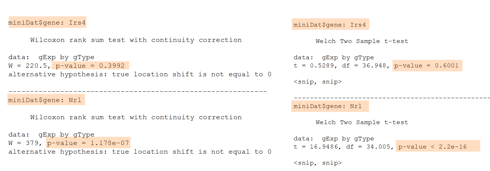

class: middle


We want to understand a **population** (e.g., gene behaviour) but we can only study a <font color=red>**random sample**</font> from it. *[Picture from Dr. Fowler, UW]*
---
class: middle
# <center> Hypothesis Testing in Genomics


<big>


- Retina presents a model system for investigating **regulatory networks** underlying neuronal differentiation.

- **Nrl** transcription factor is known to be important for Rod development

- <font color="red">**What happens if you delete Nrl?**

---
class: middle

# <center> Why a Hypothesis Test?
<big>
From paper: *". we hypothesized that Nrl is the ideal transcription factor to gain insights into gene expression changes ..."*

> **Biological question:** Is the expression level of gene A affected by ablation of the Nrl gene?

### We can use <font color=red>statistical inference</font> to answer this biological question!

**Statistical inference**: we observe and study a <font color=red>random sample</font> to make conclusions about a population (e.g., random sample of gene expressions from mice)


**Experimental design**:
<br> 4 developmental stages
<br> 2 genotypes: Wild type, NrlKO
<br> 3-4 replicas for each combination


---
<big>
Let's take a look at 2 genes as an example: **Irs4 and Nrl**

> **Biological question**: Are these genes truly different in NrlKO compared to WT?

We can't answer this question in general. We can *only* study these genes in collected data.

### <center><font color="red"> We only observe a random sample of gene expressions.</font>

```{r, include=FALSE}
library(dplyr)
library(ggplot2)
library(ggthemes)
library(grid)
library(gridExtra)
library(lattice)
library(latticeExtra)

jCols <- c(x = "blue", y = "orange")
trellis.par.set(superpose.symbol = list(col = jCols),
                superpose.line = list(col = jCols))
jCex <- 3 

prDes <- readRDS("data/GSE4051_design.rds")
str(prDes)

prDat<-read.table("data/GSE4051_data.tsv",
                      sep = "\t", header = T, row.names = 1)
str(prDat, list.len = 10)

miniDat <- as.vector(t(prDat[c("1422248_at", "1450946_at"), ]))
miniDat <- data.frame(gene = rep(c("Irs4", "Nrl"), each = nrow(prDes)),
                      gExp = miniDat)
miniDat <- data.frame(prDes, miniDat) # ignore the warning about row names
str(miniDat)
```

```{r echo=FALSE, fig.height=3.5, dev='svg'}
irsDat <- filter(miniDat, gene == "Irs4")
nrlDat <- filter(miniDat, gene == "Nrl")

irsLim <- ggplot(irsDat, aes(x = gExp, y = gType, colour = gType)) + 
             geom_point(alpha = 0.5) +
             labs(title = "Irs4 gene") +
             theme(legend.position = "none") +
             xlim(5, 15)

nrlLim <- ggplot(nrlDat, aes(x = gExp, y = gType, colour = gType)) + 
             geom_point(alpha = 0.5) +
             labs(title = "Nrl gene") +
             theme(legend.position = "none") +
             xlim(5, 15)

options(repr.plot.width=8, repr.plot.height=5)

grid.arrange(irsLim, nrlLim, ncol = 1)
```

---
class: middle

# <center> Statistical Hypothesis
<big>
** Experimental design:**
  - 2 conditions: Wt *vs* NrlKO
  - random sample: we observe the expression of many genes in all mice

** Biological hypothesis:** for some  genes, the expression levels are different in both conditions.

** Statistical hypotheses:** (for each gene ...)
  - H<sub>0</sub> (null hypothesis): the expression level of gene A is the same in both conditions.
  - <font color="blue">H<sub>A</sub> (alternative hypothesis): the expression level of gene A is different.</font>
---
class: middle

## Notation

<big>

### Random variables and estimates (we can observe)

$Y_i$ : expression of gene A in the WT sample $i$

$Z_i$: expression of gene A in NrlKO sample $i$

$Y_1, Y_2,..., Y_{n_Y}$ : a <font color="red">random sample</font> of size $n_Y$

$\bar{Y}=\frac{\sum_{i=1}^{n_Y}Y_i}{n_Y}$: sample mean of gene A expressions from WT mice

### Population parameters (unknown)

$\mu_Y = E[Y]$ : the (population) expected expression of gene A in WT mice
> <small> note the different meanings of the word "sample"
---

<big>

### <font color="red">  Is there **enough** evidence in the data to reject H<sub>0</sub>? </font>

> H<sub>0</sub>: $\mu_Y = \mu_Z$

```{r echo=FALSE, fig.height=3.5, dev='svg'}
irsDat <- filter(miniDat, gene == "Irs4")
nrlDat <- filter(miniDat, gene == "Nrl")

irsLim <- ggplot(irsDat, aes(x = gExp, y = gType, colour = gType)) + 
             geom_point(alpha = 0.5) +
             labs(title = "Irs4 gene") +
             theme(legend.position = "none") +
             xlim(5, 15)

nrlLim <- ggplot(nrlDat, aes(x = gExp, y = gType, colour = gType)) + 
             geom_point(alpha = 0.5) +
             labs(title = "Nrl gene") +
             theme(legend.position = "none") +
             xlim(5, 15)

options(repr.plot.width=8, repr.plot.height=5)

grid.arrange(irsLim, nrlLim, ncol = 1)
```

### **Statistical Inference**: random samples are used to learn about the population 
---
class: middle

### We observe... the difference between the **sample averages**: $\bar{Y}$ vs $\bar{Z}$
``` {r echo=FALSE, fig.height=2.25, dev='svg'}
#####
#GCF: THESE PLOTS NEED TO BE SCATTER PLOTS WITH MEAN AS IN ORIGINAL LECTURE
#####
irsBox <- ggplot(irsDat, aes(y = gExp, x = gType)) + 
             geom_boxplot(aes(fill = gType, alpha = 0.5)) +
             labs(title = "Irs4 gene") +
             theme(legend.position = "none") +
             coord_flip()

nrlBox <- ggplot(nrlDat, aes(y = gExp, x = gType)) + 
             geom_boxplot(aes(fill = gType, alpha = 0.5)) +
             labs(title = "Nrl gene") +
             theme(legend.position = "none") +
             coord_flip()

# Combine plots together
options(repr.plot.width=8, repr.plot.height = 3)

grid.arrange(irsBox, nrlBox, nrow = 1)
```

```{r}
theAvgs <- with(miniDat,
                 tapply(gExp, list(gType, gene), mean))
```
```{r, echo=FALSE}
round(theAvgs, 3)
```

```{r}
theDiff <- theAvgs["NrlKO", ] - theAvgs["wt", ]
```
```{r, echo=FALSE}
round(theDiff, 3)
```

---
class: middle

### Is the difference between $\bar{Y}$ and $\bar{Z}$ informative to reject H<sub>0</sub>?

``` {r echo=FALSE,fig.height=3, dev='svg'}
#####
#GCF: THESE PLOTS NEED TO BE SCATTER PLOTS WITH MEAN AS IN ORIGINAL LECTURE
#####
artDat <- data.frame("gExp" = c(rnorm(50, mean = 23, sd = 1), rnorm(50, mean = 28, sd = 1)), "gType" = c(rep("NrlKO", times = 50),rep("wt" , times = 50)))

artBox <- ggplot(artDat, aes(y = gExp, x = gType)) + 
             geom_boxplot(aes(fill = gType, alpha = 0.5)) +
             labs(title = "Artificial gene") +
             theme(legend.position = "none") +
             coord_flip()

nrlBox <- ggplot(nrlDat, aes(y = gExp, x = gType)) + 
             geom_boxplot(aes(fill = gType, alpha = 0.5)) +
             labs(title = "Nrl gene") +
             theme(legend.position = "none") +
             coord_flip()

# Combine plots together
options(repr.plot.width=8, repr.plot.height = 3)

grid.arrange(artBox, nrlBox, nrow = 1)
```

<big>
- The sample means, $\bar{Y}$ vs $\bar{Z}$, by themselves are not enough to make conclusions about the population

- What is a "large" difference? "large" relative to what?
---
class: center, middle


``` {r echo=FALSE,fig.height=3, dev='svg'}
#####
#GCF: THESE PLOTS NEED TO BE SCATTER PLOTS WITH MEAN AS IN ORIGINAL LECTURE
#####
# Combine plots together
options(repr.plot.width=8, repr.plot.height = 3)

grid.arrange(artBox, nrlBox, nrow = 1)
```


.pull-left[
### What can we use to interpret the size of the mean difference?
]
.pull-right[
### $$\frac{\bar{Y}-\bar{Z}}{??}$$
]
---
class: center, middle
### What can we use to interpret the size of the mean difference?

.pull-left[
### "large" relative to the observed variation
]
.pull-right[
### $\frac{\bar{Y}-\bar{Z}}{\sqrt{V(\bar{Y}-\bar{Z})}}$
]

``` {r echo=FALSE,fig.height=3, dev='svg'}
#####
#GCF: change to scatter PLOTS 
#####
# Combine plots together
options(repr.plot.width=8, repr.plot.height = 3)

grid.arrange(artBox, nrlBox, nrow = 1)
```
---
class: middle

### Assuming that the random variables of each group are independent and identically distributed (iid):
- $Y_1, Y_2,..., Y_{n_Y}$ are iid
- $Z_1, Z_2,..., Z_{n_Z}$ are iid
- $Y_i, Z_j$ are independent

$$V(\bar{Z}-\bar{Y})=\frac{\sigma_Z^2}{n_Z}+\frac{\sigma_Y^2}{n_Y}$$
<br>
If we also assume equal population variances:</big> $\sigma_Z^2=\sigma_Y^2=\sigma^2$
$$V(\bar{Z}-\bar{Y})=\frac{\sigma_Z^2}{n_Z}+\frac{\sigma_Y^2}{n_Y}=\sigma^2\left[\frac{1}{n_Z}+\frac{1}{n_Y}\right]$$
### But how can we calculate population variance $\sigma$ if it is **unknown**?
---
class: middle

### ...using the sample variances (combined, somehow)!
```{r echo=FALSE, fig.height=3.5, dev='svg'}
#####
#GCF: CHANGE TO Scatter PLOTS HERE
#####
irsLim <- ggplot(irsDat, aes(x = gExp, y = gType, colour = gType)) + 
             geom_point(alpha = 0.5) +
             labs(title = "Irs4 gene") +
             theme(legend.position = "none") +
             xlim(5, 15)

nrlLim <- ggplot(nrlDat, aes(x = gExp, y = gType, colour = gType)) + 
             geom_point(alpha = 0.5) +
             labs(title = "Nrl gene") +
             theme(legend.position = "none") +
             xlim(5, 15)

options(repr.plot.width=8, repr.plot.height=5)

grid.arrange(irsLim, nrlLim, ncol = 1)
```

``` {r}
theVars <- with(miniDat,
                 tapply(gExp, list(gType, gene), var))
```
.pull-left[

```{r, echo = FALSE}
round(theVars, 3)
```
]
.pull-right[
<small> $$\text{e.g., for Nrl: } S_Y^2=\frac{1}{n_Y}\sum_{i=1}^{n_Y}(Y_i-\bar{Y})^2=1.224$$
]
---
class: middle

### Plug these sample variances into your chosen formula for the variance of the difference of sample means


Assuming <b>equal</b> variance of Y's and Z's

$$'pooled'\;\hat{\sigma}^2=S_Y^2\frac{n_Y-1}{n_Y+n_Z-2}+S_Z^2\frac{n_z-1}{n_Y+n_Z-2}$$
$$\hat{V}(\bar{Z_n}-\bar{Y_n})=\;'pooled'\;\hat{\sigma}^2\left[\frac{1}{n_Y}+\frac{1}{n_Z}\right]$$
<br>
Assuming <b>unequal</b> variance of Y's and Z's
$$\hat{V}(\bar{Z_n}-\bar{Y_n})=\hat{\sigma}_{\bar{Z}_n-\bar{Y}_n}^2=\frac{S_Y^2}{n_Y}+\frac{S_Z^2}{n_Z}$$

> Note: the 'hat' (^) is used to distinguish an 'estimate' from a 'parameter'.

---
class: middle

```{r, include=FALSE}
## compute difference of sample averages
(theAvgs <- with(miniDat,
                 tapply(gExp, list(gType, gene), mean)))

(theDiff <- theAvgs["NrlKO", ] - theAvgs["wt", ])

## compute sample variances
(theVars <- with(miniDat,
                 tapply(gExp, list(gType, gene), var)))

## compute estimated variance of zbar - ybar
(nY <- with(miniDat, sum(gType == "wt" & gene == "Nrl")))
(nZ <- with(miniDat, sum(gType == "NrlKO" & gene == "Nrl")))

## assuming unequal true variance
(s2DiffWelch <- colSums(theVars / c(nY, nZ)))

## assuming equal true variance
(s2Pooled <- colSums(theVars * c((nY - 1) / (nY + nZ - 2),
                                 (nZ - 1) / (nY + nZ - 2))))

(s2Diff <- s2Pooled * (1/nY + 1/nZ))

(welchStat <- theDiff / sqrt(s2DiffWelch))

by(miniDat, miniDat$gene, function(theDat) {
  ## to be compatible with the direction of the test, as I've described in
  ## lecture slides, I need to reverse order of levels of gType factor
  theDat$gType <- factor(theDat$gType, rev(levels(theDat$gType)))
  t.test(gExp ~ gType, theDat)
})

(tstStat <- theDiff / sqrt(s2Diff))

by(miniDat, miniDat$gene, function(theDat) {
  theDat$gType <- factor(theDat$gType, rev(levels(theDat$gType)))
  t.test(gExp ~ gType, theDat, var.equal = TRUE)
})
```


## <center> The Test Statistic:  <small> $T=\frac{\bar{Z}_n-\bar{Y}_n}{\hat{\sigma}_{Z_n-Y_n}}$</small>

Assuming equal variances:
```{r}
tstStat <- theDiff / sqrt(s2Diff)
```
```{r, echo=FALSE}
round(tstStat, 3)
```
Without assuming equal variances:
```{r}
welchStat <- theDiff / sqrt(s2DiffWelch)
```
```{r, echo=FALSE}
round(welchStat, 3)
```
### Can we now say that the observed differences are 'big'?

The difference is about half a standard deviation for Irs4 and ~16 standard deviations for Nrl. 

---
class: middle

### The test statistic T is a <font color=red>random variable</font> because it's based on our <font color=red>random sample</font>.

### We need a measure of its uncertainty to determine how big T is:
> ### If we were to repeat the experiment many times, what's the probability of observing a value of T **as extreme** as the one we observed?

### We need to have a probability distribution!
### However, this is unknown to us so we need to **make more assumptions**.
---
class: middle

### Theory now tells us specific **null distributions** for this test statistic, depending on your assumptions.

> ### Willing to assume that F and G are normal distributions?

.pull-left[
### <center> 2-sample *t*-test: 
 <center> (equal variances)
$$T\sim t_{n_Y+n_Z-2}$$
]
.pull-right[
### <center> Welch test:
<center> (unequal variances)
$$T\sim t_{<something\,ugly>}$$
]

> ### Unwilling to assume that F and G are normal distributions? But you feel that n<sub>Y</sub> and n<sub>Z</sub> are large enough?

Then the t-distributions above or even a normal distribution are decent approximations.

---
class: middle

## Student's *t*-distribution
### Recall that T is a **random variable**. Under certain assumptions, we can prove that T follows a *t*-distribution.

<center>

where df = degrees of freedom.
---
class: middle
# <center> Hypothesis testing

### 1. Define a **test statistic**: 2-sample *t*-test
### 2. Compute the <font color=red>observed value</font> for the test statistic

```{r}
tstStat <- theDiff / sqrt(s2Diff)
```
```{r, echo=FALSE}
round(tstStat, 3)
```

### 3. Compute the probability of seeing a test statistic as extreme as that observed, under the **null sampling distribution** (p-value) 

[COMPUTE p-val and ADD CODE HERE]
---
class: middle

### 4. Make a decision about significance of results, based on a pre-specified value (alpha, significance level)

.pull-left[
### Assuming that H<sub>0</sub> is true: 
for Irs4, the probability of seeing a test statistic as extreme that observed (*t* = -0.53) is pretty high (*p*=0.6).
]
.pull-right[

]

Thus, we don't have <font color=red>*enough*&nbsp; evidence </font> to claim that Irs4 has a differential expression in WT compared to Nrl models. We do not reject H<sub>0</sub>!

---
class: center


---
class: middle

## What is a p-value?

> Likelihood of obtaining a test statistic at least <font color=green> as extreme as the one observed</font>, given that the null hypothesis is true (we are making a conditional p-value statement)

## What is a p-value <font color=red>NOT</font>?

- Not the probability that the <font color=red>null hypothesis is true</font>

- Not the probability that the <font color=red>finding is a “fluke”</font>

- Not the probability of <font color=red>falsely rejecting the null</font>

- Does not <font color=red>indicate the size or importance</font> of observed effects. 

*[Credit to Dr. Fowler, UW]*
---
<big>
## "Genome-wide" testing of differential expression
- In genomics, we often perform thousands of statistical tests (e.g., a *t*-test per gene)

- The distribution of p-values across all tests provide good diagnostics/insights.

- Is it uniform (should be in most experiments) and if not, is the departure from uniform expected based on biological knowledge?

--
### Different kinds of *t*-tests:
- One sample *or* **two samples**
- One-sided *or* **two sided**
- Paired *or* **unpaired**
- **Equal variance** *or* unequal variance

---
class: middle

# Types of Errors in Hypothesis Testing

<center>
*[Picture from Dr. Fowler, UW]*
---
class: middle

<big>
What if you don't wish to assume the underlying data is normally distributed AND you aren't sure your samples are large enough to invoke CLT?
</big>
## What are alternatives to the *t*-test?

<big>
First, one could use the t test statistic but use a **bootstrap approach** to obtain statistical significance. We will cover this later on.

Alternatively, there are *non-parametric* tests that are available here:

- **Wilcoxon rank sum test**, aka Mann Whitney, uses ranks

- **Kolmogorov-Smirnov test** uses the empirical CDF

---
class: middle

# Wilcoxon rank sum test

<big>
Rank all data, ignoring the **grouping** variable

**Test statistic** = sum of the ranks for one group (optionally, subtract the minimum possible which is $\frac{n_Y(n_Y+1)}{2}$)

(Alternative but equivalent formulation based on the number of $y_i, z_i$ pairs for which $y_i \geq z_i$)

Null distribution of such statistics can be worked out or approximated.

---
class: middle, center


```{r echo=FALSE, fig.height=3, dev='svg'}
options(repr.plot.width=8, repr.plot.height=3)

grid.arrange(irsLim, nrlLim, ncol = 1)
```
---
class: middle

# Kolmogorov-Smirnov test (two sample)

<big>

**Null hypothesis**: F = G, i.e. the distributions are the same

Estimate each CDF with the empirical CDF (ECDF)

$$\hat{F}(x)=\frac{1}{n}\sum_{i=1}^n{I[x_i\leq{x}]}$$

**Test statistic** is the maximum of the absolute difference between the ECDFs

$$max|\hat{F}(x)-\hat{G}(x)|$$

Null distribution does not depend on F, G (!)
<br>(I'm suppressing a detail here.)

---


---
class: middle

# Discussion and questions ...
<big>

What if you are unsure whether your sample size is large enough? Outliers with small samples could be problematic

Which test result should one report ... the 2-sample *t*-test, the Wilcoxon, or the KS?

Treat p-values as one type of evidence that you should incorporate with others. 

It is worrisome when methods that are equally appropriate and defensible give very different answers.
