class: middle, center
### <font color="red"> Are these genes truly different in NrlKO compared to WT?</font>

### H<sub>0</sub>: the expression level of gene A is the same.

### Is there **enough** evidence in the data to reject H<sub>0</sub>?
```{r, include=FALSE}
library(dplyr)
library(ggplot2)
library(ggthemes)
library(grid)
library(gridExtra)
library(lattice)
library(latticeExtra)

jCols <- c(x = "blue", y = "orange")
trellis.par.set(superpose.symbol = list(col = jCols),
                superpose.line = list(col = jCols))
jCex <- 3 

prDes <- readRDS("data/GSE4051_design.rds")
str(prDes)

prDat<-read.table("data/GSE4051_data.tsv",
                      sep = "\t", header = T, row.names = 1)
str(prDat, list.len = 10)

miniDat <- as.vector(t(prDat[c("1422248_at", "1450946_at"), ]))
miniDat <- data.frame(gene = rep(c("Irs4", "Nrl"), each = nrow(prDes)),
                      gExp = miniDat)
miniDat <- data.frame(prDes, miniDat) # ignore the warning about row names
str(miniDat)
```

```{r echo=FALSE, fig.height=3.5, dev='svg'}
irsDat <- filter(miniDat, gene == "Irs4")
nrlDat <- filter(miniDat, gene == "Nrl")

irsLim <- ggplot(irsDat, aes(x = gExp, y = gType, colour = gType)) + 
             geom_point(alpha = 0.5) +
             labs(title = "Irs4 Gene Expression") +
             theme_bw() +
             theme(legend.position = "none") +
             xlim(5, 15)

nrlLim <- ggplot(nrlDat, aes(x = gExp, y = gType, colour = gType)) + 
             geom_point(alpha = 0.5) +
             labs(title = "Nrl Gene Expression") +
             theme_bw() +
             theme(legend.position = "none") +
             xlim(5, 15)

options(repr.plot.width=8, repr.plot.height=5)

grid.arrange(irsLim, nrlLim, ncol = 1)
```

---
class: center

.pull-left[
## **Population** (unknown)
<br>
$$Y\sim F$$
$$Z\sim G$$
<br> <br>
$$E[Y] = \mu_Y$$
<br>
$$E[Z] = \mu_Z$$
<br> <br>
$$H_0 : \mu_Y = \mu_Z$$
$$H_A : \mu_Y \neq \mu_Z$$
]
.pull-right[
## **Sample** (observed with randomness)
$$Y_1, Y_2, ... Y_{n_Y}$$
$$Z_1, Z_2, ... Z_{n_Z}$$
<br>
$$\hat{\mu}_Y = \bar{Y} = \frac{\sum^{n_Y}_{i=1} Y_i}{n_Y}$$
$$\hat{\mu}_Z = \bar{Z} = \frac{\sum^{n_Z}_{i=1} Z_i}{n_Z}$$
<br> <br>
$$T = \frac{\bar{Y}-\bar{Z}}{\sqrt{V(\bar{Y} - \bar{Z})}}$$
]
---

class: middle
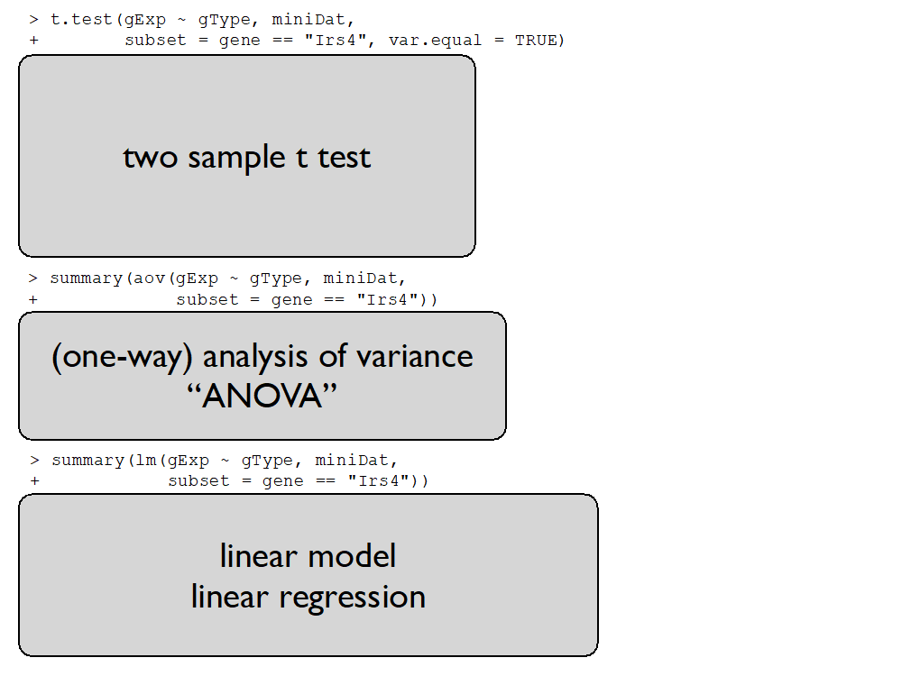
---
class: middle
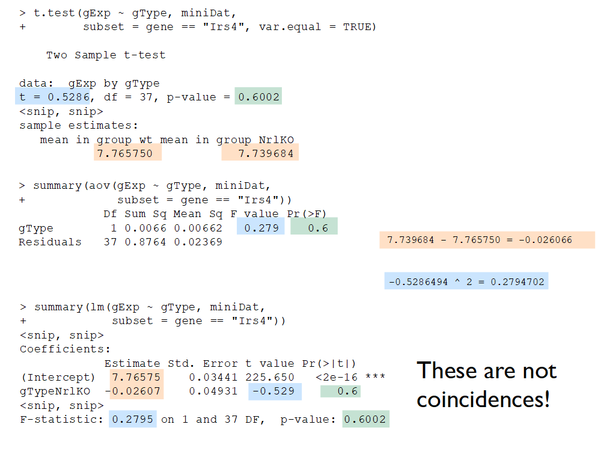

---

class: middle

# Today: beyond 2-groups comparisons


## <font color = "red">t-test</font> 
> Special case of **ANOVA**, where the only difference is that with ANOVA you can compare more than two groups.

<br>

## <font color = "red">ANOVA</font> 
> Special case of **linear regression/model**, where the only difference is with linear models you can consider quantitative and categorical variables. 

---
class: center, middle
# From t-test to linear regression
Change of notation to be consistent with conventions used in linear regression
<br> <br>
$$Y \sim F; \; E[Y] = \mu_Y$$
**↓**
$$Y = \mu_Y + \varepsilon_Y; \; \varepsilon_Y \sim F; \; E[\varepsilon_Y] = 0$$
**↓**
$$Y_j = \mu_j + \varepsilon_j; \; \varepsilon_j \sim F_j; \; E[\varepsilon_j] = 0; \; j = \textrm{\{wt, NrlKO}\} \rightarrow \textrm{\{1, 2}\}$$
<br>
where $Y_j$ is the **response variable**. For $\varepsilon_j \sim F_j$, we may even assume a common distribution $F$ for all groups, equal variances, etc.
---
class: middle

## Let's map this notation to our working example
.pull-left[
### <center> Group 1 (WT)
$$Y_1 = \mu_1 + \varepsilon_1; \varepsilon_1 \sim F_1; E[\varepsilon_1] = 0;$$
]
.pull-right[
### <center> Group 2 (NrlKO)
$$Y_2 = \mu_2 + \varepsilon_2; \varepsilon_2 \sim F_2; E[\varepsilon_2] = 0;$$
]
<br>
- Note that for each group: $E[Y_j] = \mu_j$
- $H_0 : \mu_1 = \mu_2$
- But we may actually have many groups, not just 2! **(ANOVA)**
- To test our hypothesis, we take a random sample:
$$Y_{ij}: \textrm{gene expression of gene A in condition j for the ith observation}$$
---
class: middle
.pull-left[
<big> $$H_0 : \mu_1 = \mu_2$$

```{r echo=FALSE, fig.width=5, fig.height= 3, dev='svg'}
irsDat <- filter(miniDat, gene == "Irs4")
nrlDat <- filter(miniDat, gene == "Nrl")

irsLim <- ggplot(irsDat, aes(x = gExp, y = gType, colour = gType)) + 
             geom_point(alpha = 0.5) +
             labs(title = "Irs4 Gene Expression") +
             theme_bw() +           
             theme(legend.position = "none") +
             xlim(5, 15)

nrlLim <- ggplot(nrlDat, aes(x = gExp, y = gType, colour = gType)) + 
             geom_point(alpha = 0.5) +
             labs(title = "Nrl Gene Expression") +
             theme_bw() +
             theme(legend.position = "none") +
             xlim(5, 15)

grid.arrange(irsLim, nrlLim, ncol = 1)
```
]

.pull-right[
<br>
```
data: gExp by gType
t = 0.5286, df = 37, p=value = 0.6002
<snip, snip>
sample estimates:
  mean in group wt mean in group NrlKO
          7.765750        7.739684
```
]


### **Where's the line?**
```
summary(lm(gExp ~ gType, miniDat,
           subset = gene == "Irs4"))
<snip, snip>
Coefficients:
            Estimate Std. Error t value Pr(>|t|)
(Intercept) 7.76575     0.03441 225.650   <2e-16 ***
gTypeNrlKO -0.02607     0.04931  -0.529      0.6
<snip, snip>
F-statistic: 0.2795 on 1 and 37 DF, p-value: 0.6002
```
---
class: middle, center
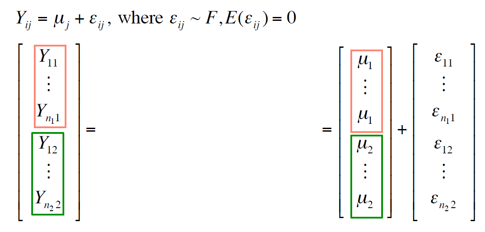
---
class: middle
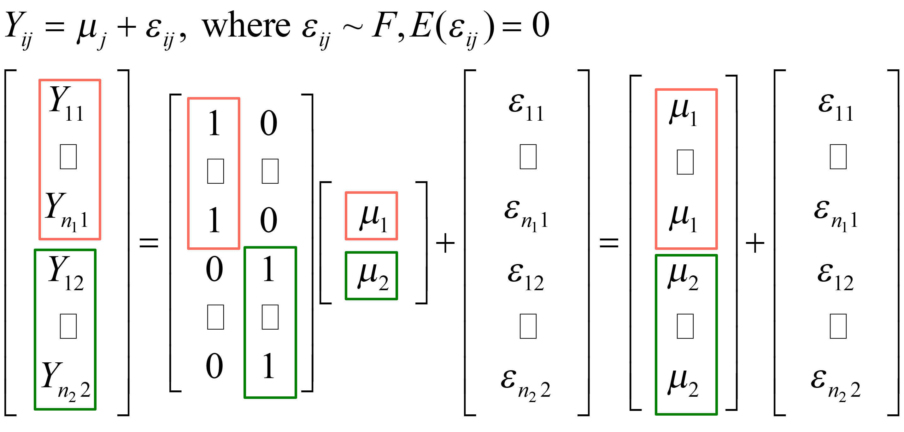
--
For example:
$$Y_{11} = 1 \ast \mu_1 + 0 \ast \mu_2 + \varepsilon_{11} = \mu_1 + \varepsilon_{11}$$
$$Y_{n_22} = 0 \ast \mu_1 + 1 \ast \mu_2 + \varepsilon_{n_22} = \mu_2 + \varepsilon_{n_22}$$
---
class: middle
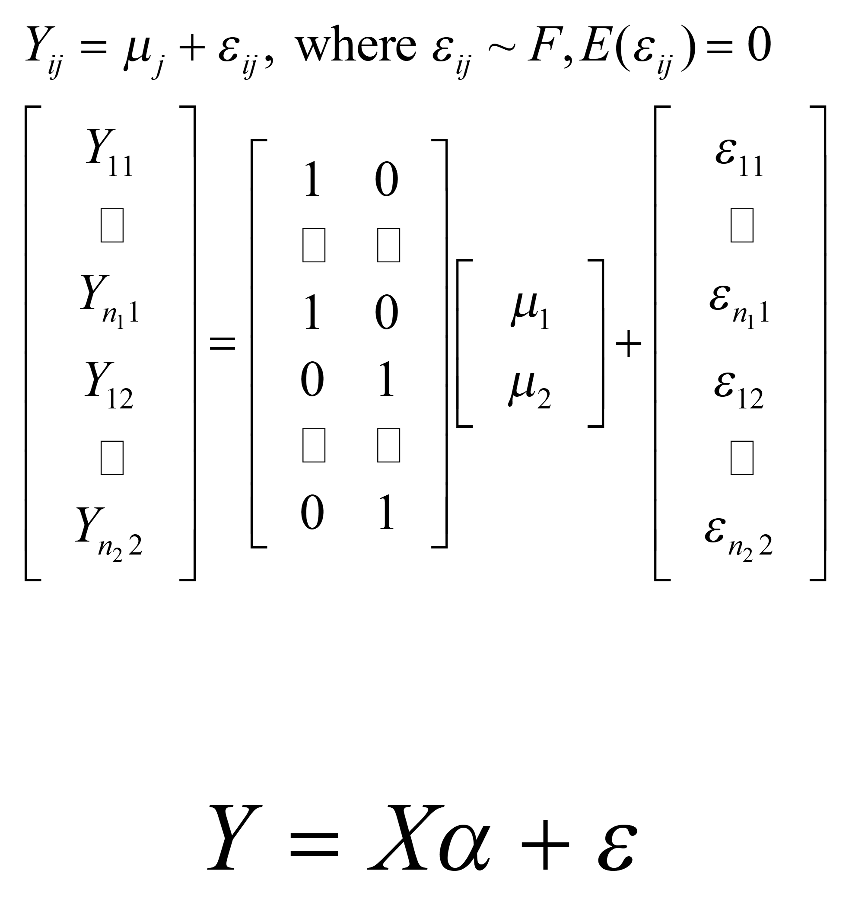
---
class: middle
<big>
<font size = 12> $$Y = X\alpha + \varepsilon$$ </font>
<font color = red> $Y:$ </font> The column vector of the responses, one element per experimental unit

<font color = red> $X:$ </font> a (design) matrix that represents covariate info, one row per experimental unit

<font color = red> $\alpha:$ </font> a column vector of parameters in the linear model

<font color = red> $\varepsilon:$ </font> a column vector of the errors
<br>
### Generic linear model, using conventional matrix formulation
---
class: middle

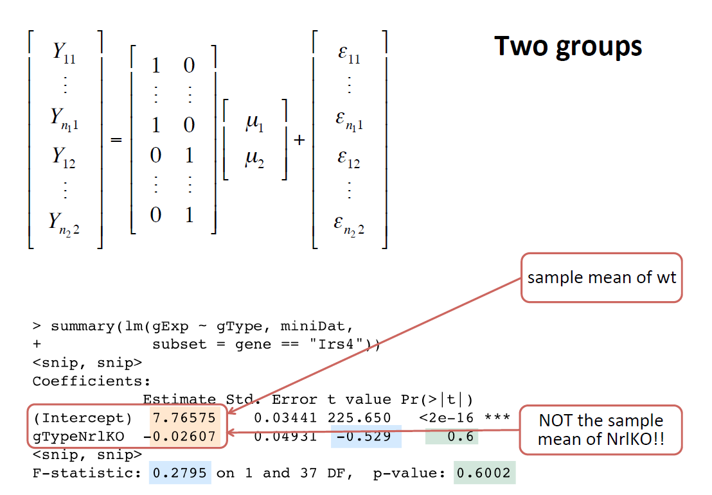
---
class: middle
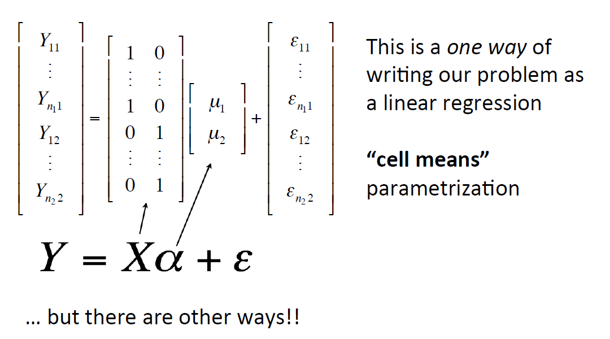
--

---
class: middle
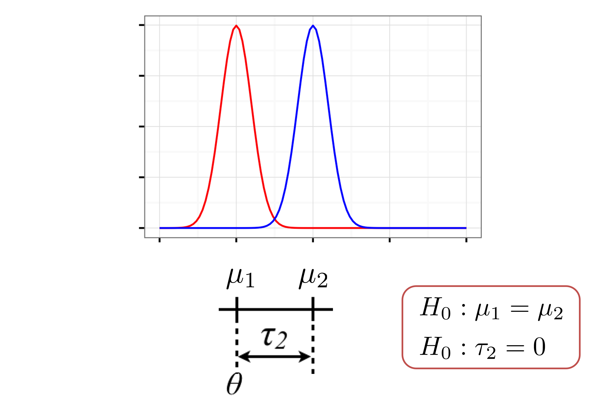
--

---
class: middle
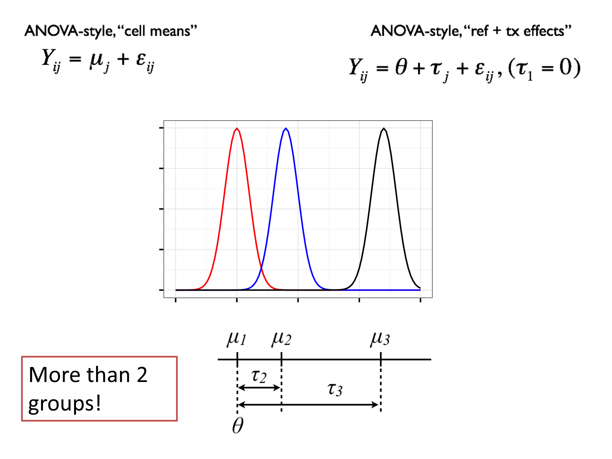
---
class: middle
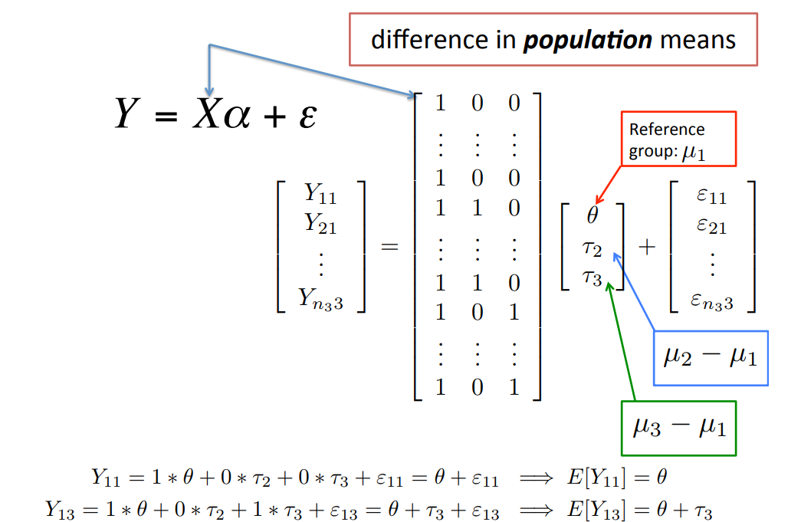
---
class: middle

---
class: middle
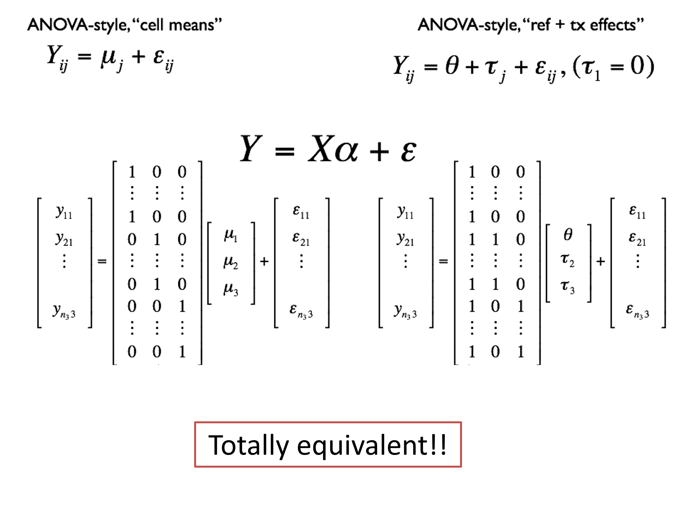
---
class: middle, center

## How it works in practice using <font color=red>lm()</font> in R

<big>

<font size = 5> $$Y = X\alpha + \varepsilon$$ **↓**
<br>
```
lm(y ~ x, data = jDat)
```
</font>
.pull-left[
<font color = red> y ~ x: </font> formula, y numeric, x factor
]

.pull-right[
<font color = red> jDat: </font> optional data.frame in which x and y are to be found (I recommend this style)
]
<br>
### By default, R uses a ref-tx parametrization but you can control that!(called "contr.treatment"; see?contrasts)
---
class: middle

---
class: middle
## Back to our example!
### <font color="red"> Is the gene expression of gene A different at different developmental stages?</font>

$$H_0 : \mu_{E16} = \mu_{P2} = \mu_{P6} = \mu_{P10} = \mu_{4weeks}$$
<center>
```{r, include=FALSE}
library(lattice)

prDes <- readRDS("data/GSE4051_design.rds")

prDat<-read.table("data/GSE4051_data.tsv",
                      sep = "\t", header = T, row.names = 1)

## I've selected this as our hit
theHit <- which(rownames(prDat) == "1440645_at") # 17843
## and this as our boring gene
theBore <- which(rownames(prDat) == "1443184_at") # 18898

keepers <- data.frame(row = c(theBore, theHit),
                       probesetID = I(rownames(prDat)[c(theBore, theHit)]))

miniDat <- as.vector(t(prDat[keepers$probesetID, ]))
miniDat <- data.frame(gene = rep(c("theBore", "theHit"), each = nrow(prDes)),
                      gExp = miniDat)
miniDat <- data.frame(prDes, miniDat)

boreDat <- filter(miniDat, gene == "theBore")
hitDat <- filter(miniDat, gene == "theHit")
```

```{r, echo=FALSE, fig.height= 3, dev='svg'}
boreLim <- ggplot(boreDat, aes(x = devStage, y = gExp)) + 
             geom_jitter(width = 0.2, alpha = 0.5) +
             labs(title = "theBore") +
             theme_bw() +
             theme(legend.position = "none") +
             ylim(5, 10) +
             xlab("") +
             stat_summary(aes(group=1), fun.y=mean, geom="line", colour="red")

hitLim <- ggplot(hitDat, aes(x = devStage, y = gExp)) + 
             geom_jitter(width = 0.2, alpha = 0.5) +
             labs(title = "theHit") +
             theme_bw() +
             theme(legend.position = "none") +
             ylim(5, 10) +
             ylab("") +
             xlab("") +
             stat_summary(aes(group=1), fun.y=mean, geom="line", colour="red")

grid.arrange(boreLim, hitLim, nrow = 1)
```
---
class: middle
``` {r}
with(miniDat,
     tapply(gExp, list(devStage, gene), mean))
```
<center>
```{r, echo=FALSE, fig.height= 3, dev='svg'}
boreLim <- ggplot(boreDat, aes(x = devStage, y = gExp)) + 
             geom_jitter(width = 0.2, alpha = 0.5) +
             labs(title = "theBore") +
             theme_bw() +           
             theme(legend.position = "none") +
             ylim(5, 10) +
             xlab("") +
             stat_summary(aes(group=1), fun.y=mean, geom="line", colour="red")

hitLim <- ggplot(hitDat, aes(x = devStage, y = gExp)) + 
             geom_jitter(width = 0.2, alpha = 0.5) +
             labs(title = "theHit") +
             theme_bw() +
             theme(legend.position = "none") +
             ylim(5, 10) +
             ylab("") +
             xlab("") +
             stat_summary(aes(group=1), fun.y=mean, geom="line", colour="red")

grid.arrange(boreLim, hitLim, nrow = 1)
```
---
class: middle
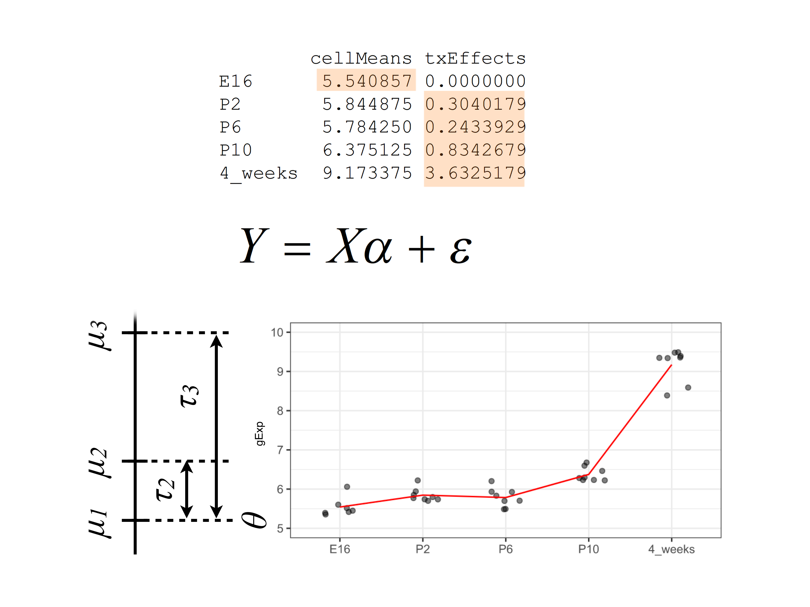
---
class: middle
```{r, echo=FALSE, fig.height= 3, dev='svg'}
(hitLim <- ggplot(hitDat, aes(x = devStage, y = gExp)) + 
             geom_jitter(width = 0.2, alpha = 0.5) +
             labs(title = "theHit") +
             theme_bw() +
             theme(legend.position = "none") +
             ylim(5, 10) +
             ylab("") +
             xlab("")) +
             stat_summary(aes(group=1), fun.y=mean, geom="line", colour="red")
```
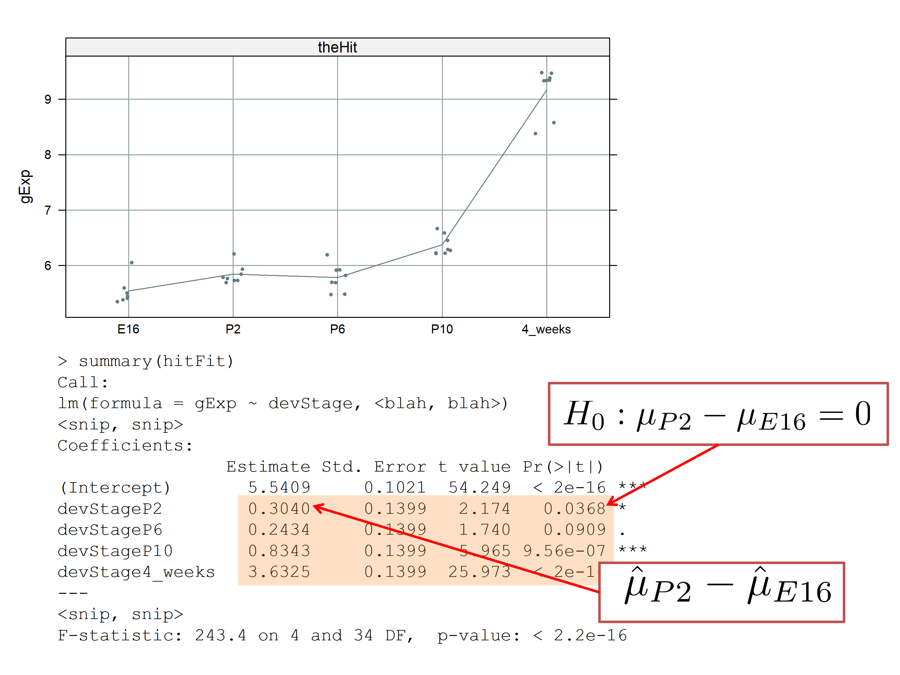
---
class: middle
```{r, echo=FALSE, fig.height= 3, dev='svg'}
(hitLim <- ggplot(hitDat, aes(x = devStage, y = gExp)) + 
             geom_jitter(width = 0.2, alpha = 0.5) +
             labs(title = "theHit") +
             theme_bw() +
             theme(legend.position = "none") +
             ylim(5, 10) +
             ylab("") +
             xlab("")) +
             stat_summary(aes(group=1), fun.y=mean, geom="line", colour="red")
```
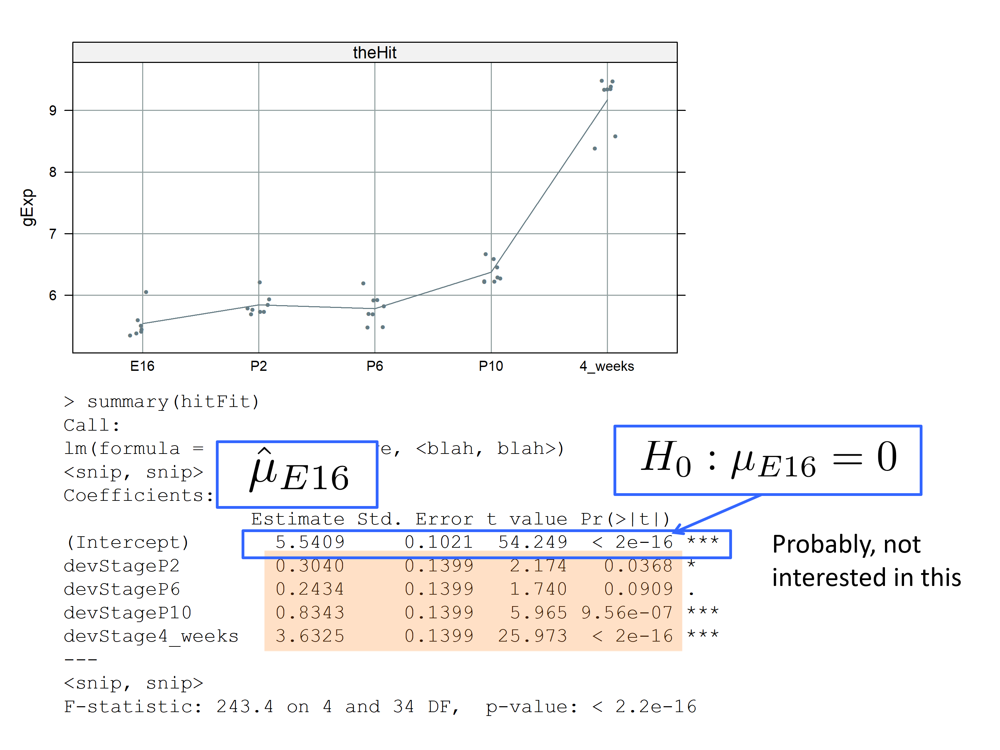
---
class: middle
```{r, echo=FALSE, fig.height= 3, dev='svg'}
(hitLim <- ggplot(hitDat, aes(x = devStage, y = gExp)) + 
             geom_jitter(width = 0.2, alpha = 0.5) +
             labs(title = "theHit") +
             theme_bw() +
             theme(legend.position = "none") +
             ylim(5, 10) +
             ylab("") +
             xlab("")) +
             stat_summary(aes(group=1), fun.y=mean, geom="line", colour="red")
```
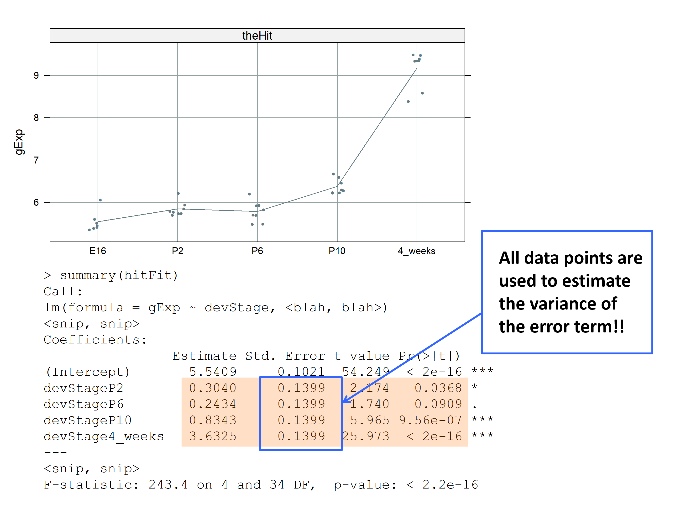
---
class: middle
<big>
<font size = 5>$$Y = X \alpha + \varepsilon$$</font>
$$\alpha = (\theta, \tau_{P2}, \tau_{P6}, \tau_{P10}, \tau_{4weeks})$$

### in the context of this model, we generally test null hypothesis of two types:
.pull-left[
<center>
$$H_0: \tau_j = 0$$
vs
$$H_0: \tau_j \neq 0$$
for each *j* individually
]

.pull-right[
<center>
$$H_0: \tau_j = 0$$
vs
$$H_0: \tau_j \neq 0$$
for all *j* at the same time
]
---
class: middle

---
class: middle

## F-test and overall significance of one or more covariates
<big>
- the t-stat in linear regression allows us to test simple hypotheses:
$$H_0 : \tau_i = 0$$
$$H_A : \tau_j \neq 0$$
- But when we have multiple covariates/factors, we often like to test more complex hypotheses: 
$$H_0 : \tau_2 = \tau_3 = ... = 0\textrm{ [AND statement]}$$
$$H_A : \tau_i \neq 0 \textrm{ for some i [OR statement]}$$
- F-test allows us to test such compound tests
---
class: middle
### Increasing the complexity of our linear regression model ...
What if you have two categorical variables: genotype and time
(we will simplify the example by only considering two time points E16 and 4weeks)

> ### Is the assocation between gene expression and genotype different at different developmental stages?

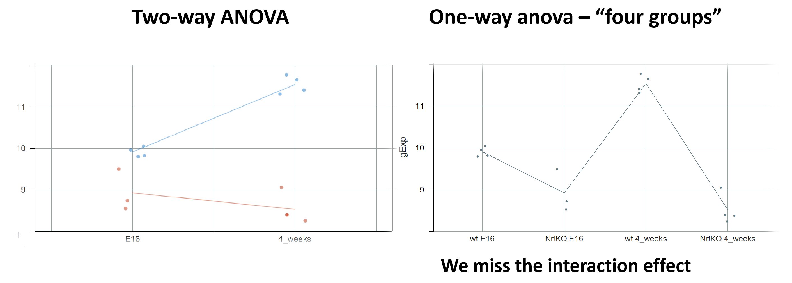
---
class: middle
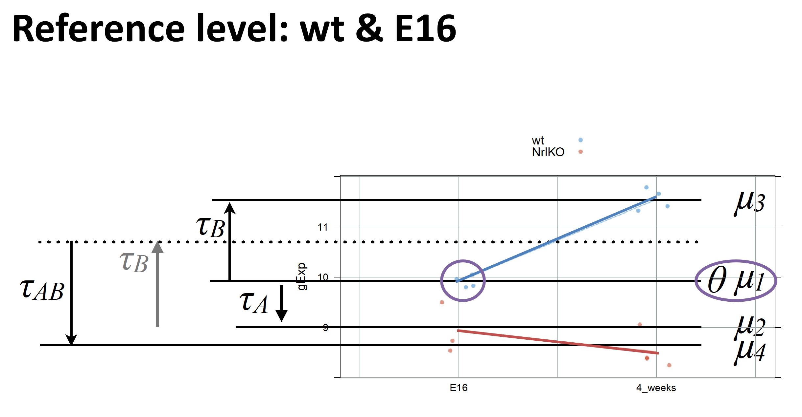
---
class: middle
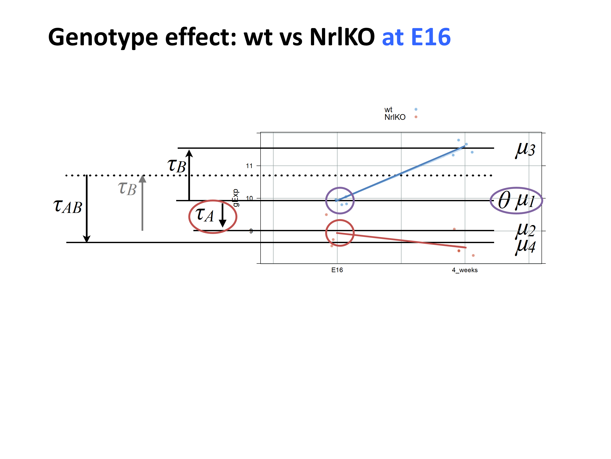
---
class: middle
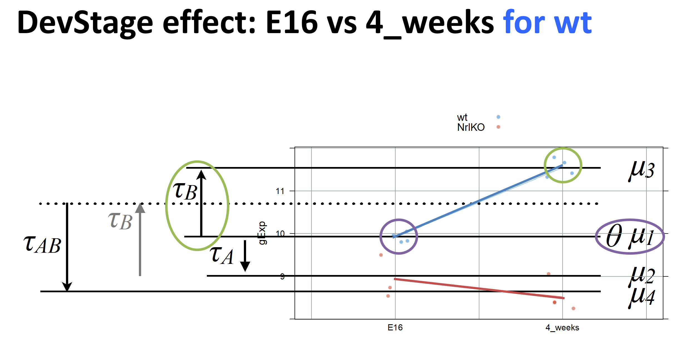
---
class: middle
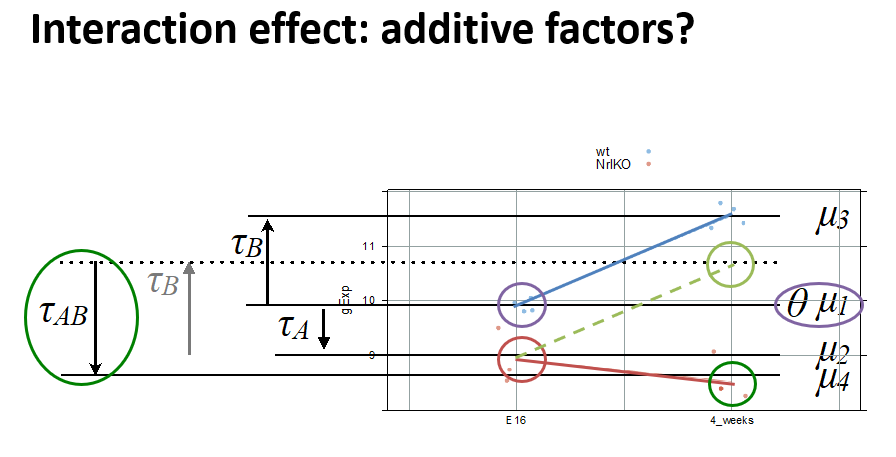
---
class: middle
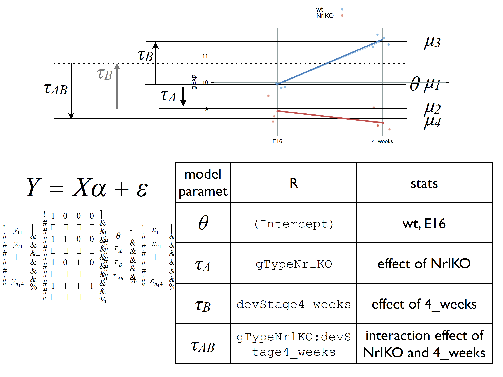
---
class: middle
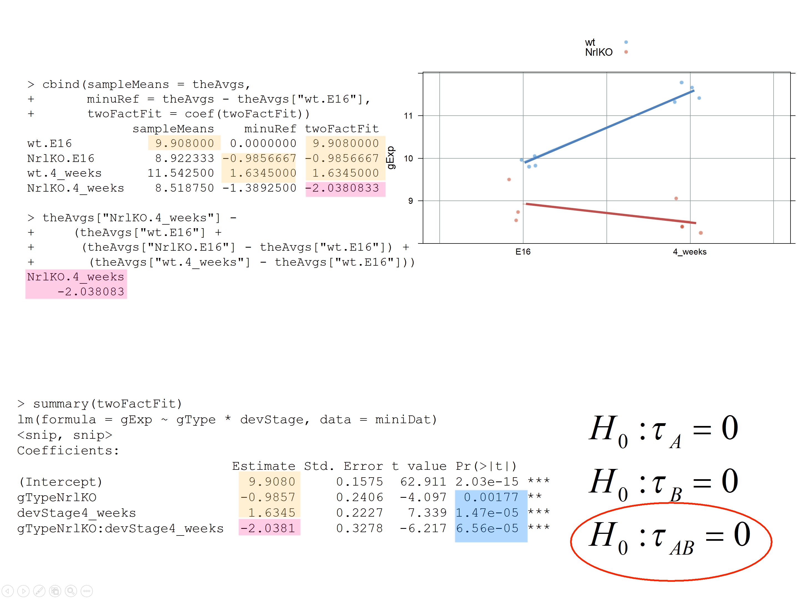
---
class: middle

## Let's go through some example genes to get a sense of what an interaction effect looks like.

We have three parameters we'd like to interpret:
.pull-left[
> ### Main effect: genotype
### Main effect: age
### Interaction: genotype*age
]
.pull-right[
<br>
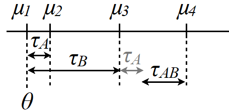
]
---
class: middle
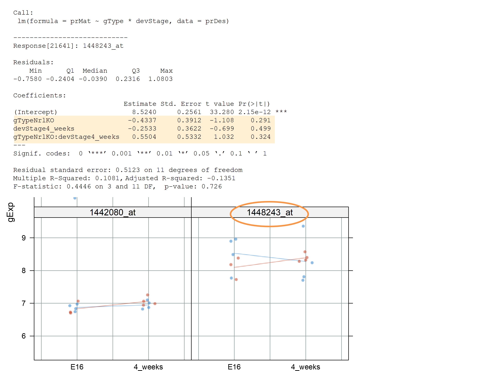
---
class: middle

---
class: middle
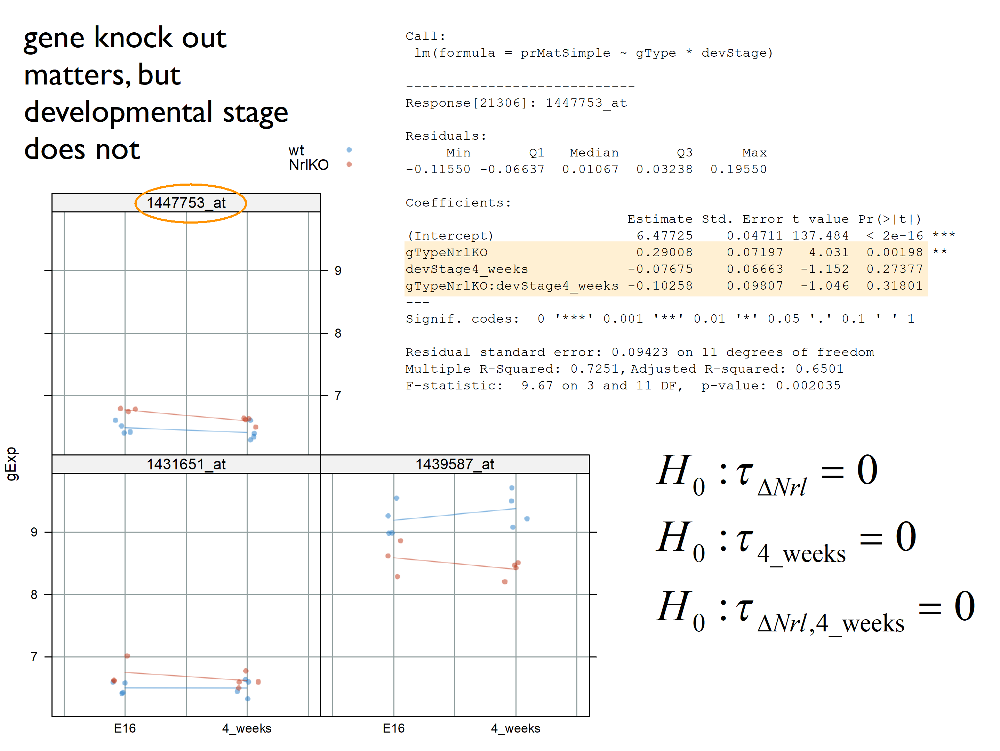
---
class: middle
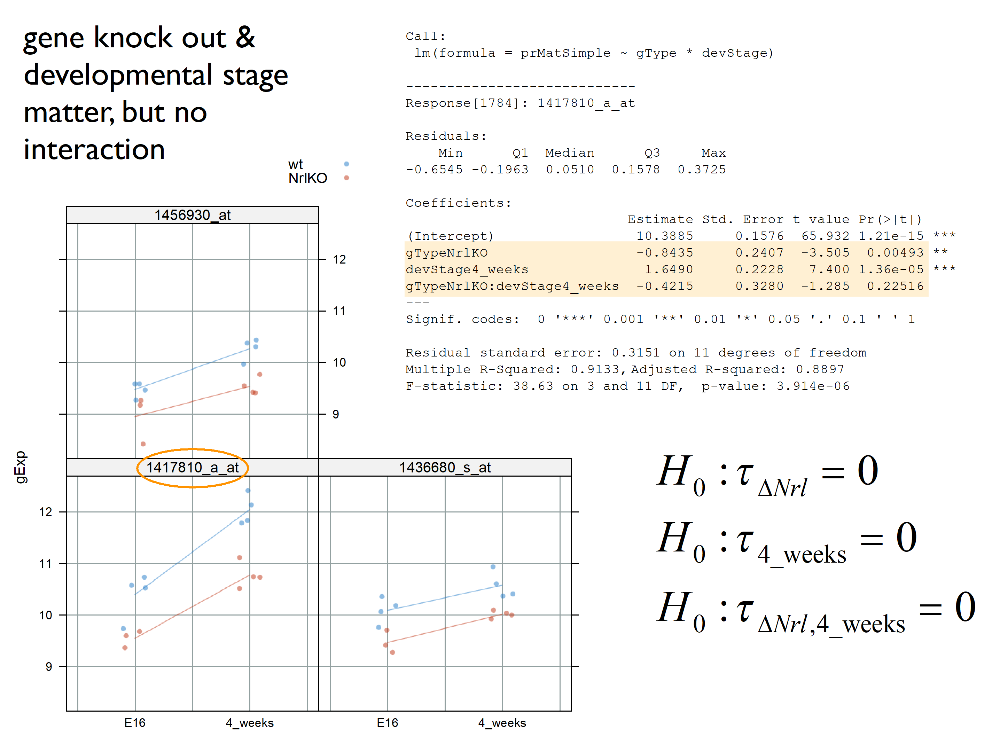
---
class: middle
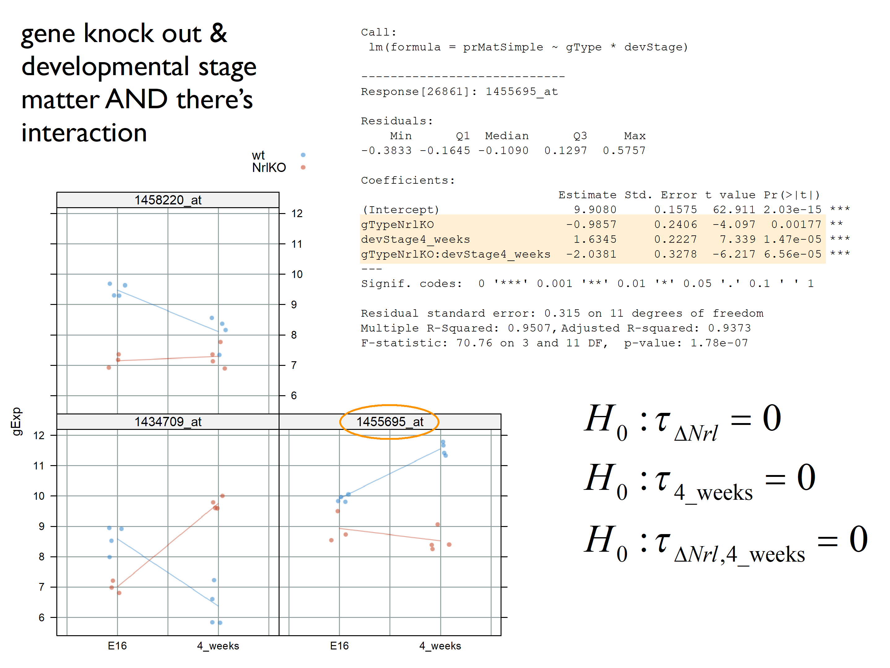