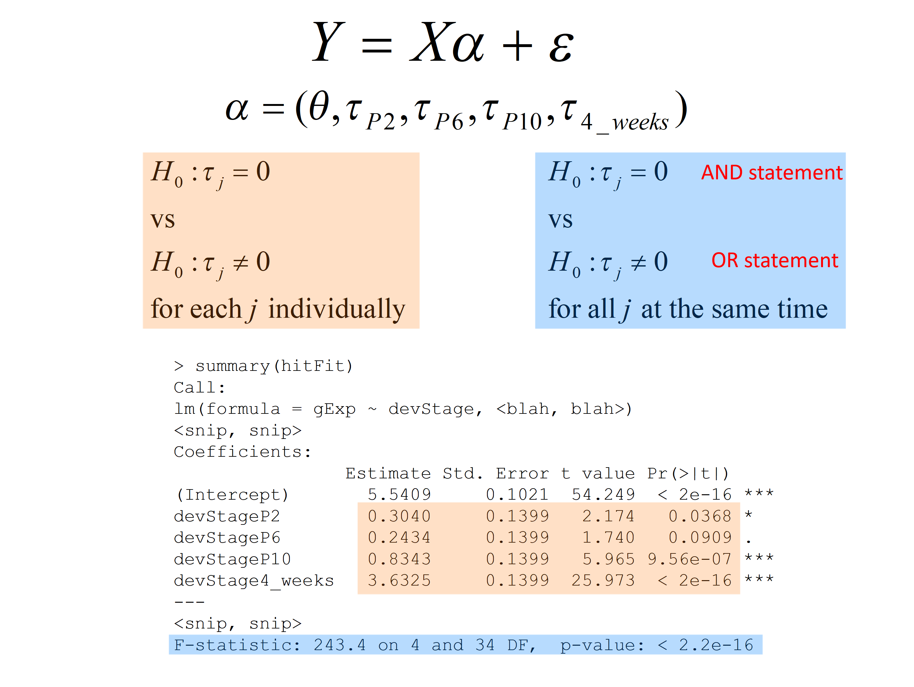

class: middle
### **Statistics**: use a random sample to learn about the population

---
class: middle

# Last class: hypothesis testing

### 1. Define a <font color = "red">test statistic</font> to test $H_0$
- 2-sample *t*-test
- Welch *t*-test
- Wilcoxon rank-sum test
- Kolmogorov-Smirnov test

### 2. Compute the <font color=red>observed value</font> for the test statistic
### 3. Compute the probability of seeing a test statistic as extreme as that observed, under the <font color = "red">null sampling distribution</font> (p-value) 
### 4. Make a decision about the <font color = "red">significance</font> of the results, based on a pre-specified value (alpha, significance level)
---
class: middle
## We can run these tests in R. 
### Example: use the `t.test` function to test $H_0$ using a classical 2-sample *t*-test.

``` {r}
miniDat %>% subset(gene=="Irs4")%>% t.test(gExp ~ gType, data=., var.equal = TRUE)
```
---
class: middle
# Today...

### - review other methods to test statistical hypothesis

### - extend tests to more than 2-groups comparisons

### - methods to analyze the association of multiple variables with the response
---
class: middle


---
class: middle
It seems that we can use any of these methods to test $H_0$


---
class: middle
## *t*-test *vs* linear regression: <font color = "red">why the same results?</font>

``` {r}
irs4Dat <- subset(miniDat,gene=="Irs4")
ttest.irs4<-t.test(gExp ~ gType, irs4Dat, var.equal = TRUE)
list("t value"=ttest.irs4$stat,"p-value"=ttest.irs4$p.value)
```


```{r}
lm.irs4 <- summary(lm(gExp ~ gType, irs4Dat))
list("t value"=lm.irs4$coeff[2,3],"p-value"=lm.irs4$coeff[2,4])
```

---
class: middle
## *t*-test *vs* linear regression: <font color = "red">where's the line?</font>

```{r echo=FALSE, fig.width=5, fig.height= 3, dev='svg'}
irsDat <- filter(miniDat, gene == "Irs4")
nrlDat <- filter(miniDat, gene == "Nrl")

irsLim <- ggplot(irsDat, aes(x = gExp, y = gType, colour = gType)) + 
             geom_point(alpha = 0.5) +
             labs(title = "Irs4") +
             theme_bw() +           
             theme(legend.position = "none") +
             xlim(5, 15)

nrlLim <- ggplot(nrlDat, aes(x = gExp, y = gType, colour = gType)) + 
             geom_point(alpha = 0.5) +
             labs(title = "Nrl") +
             theme_bw() +
             theme(legend.position = "none") +
             xlim(5, 15)

grid.arrange(irsLim, nrlLim, ncol = 1)
```

---
class: middle
# From *t*-test to linear regression
Let's change the notation to give a common framework to all methods
<br> <br>
<font size=5> $$Y \sim G; \; E[Y] = \mu_Y$$ </font>
 **<center>↓</center>**

<font size=5> $$Y = \mu_Y + \varepsilon_Y; \; \varepsilon_Y \sim G; \; E[\varepsilon_Y] = 0$$ </font>
<br>
We can use a subindeces to distinguish observations from each group, i.e., 

<font size=5> $$Y_{ij} = \mu_j + \varepsilon_{ij};\; \; \varepsilon_{ij} \sim G_j; \; \;E[\varepsilon_{ij}] = 0;$$ </font>
<br>
where $j = \textrm{\{wt, NrlKO}\}$ or $j=\textrm{\{1, 2}\}$; and $i=1, \ldots, n_j$.
<br>

 > For example: $Y_{11}$ is the first observation in group 1 or wt
 
---
class: middle

## The goal is to test 

### $$H_0 : \mu_1 = \mu_2$$

### using data from the model

<font size=5> $$Y_{ij} = \mu_j + \varepsilon_{ij};\; \; \varepsilon_{ij} \sim G; \; \;E[\varepsilon_{ij}] = 0;$$</font>
<br>
where $j = \textrm{\{wt, NrlKO}\}$ or $j=\textrm{\{1, 2}\}$; and $i=1, \ldots, n_j$.
<br>

> For simplicity, we assume a common distribution $G$ for all groups

### the model is written with a <font color = "red">cell-means</font> - $\mu_j$ - parametrization
---
class: middle

### Note that for each group, the population mean is given by 
### $$E[Y_{ij}] = \mu_j,$$ 

###A natural **estimator** of the population mean is the <font color = "red">**sample mean**</font>

### Classical methods for *t*-test, ANOVA, and linear regression use the group sample means as estimators.

See, for example, the `t.test` function in R:

```{r}
ttest.irs4$estimate
```
---
class: middle
### However, the `lm` function reports other estimates, <font color = "red">why?</font>  

```{r}
(means.irs4<-as.data.frame(irs4Dat %>% group_by(gType) %>% summarize(meanGroups=mean(gExp,digits=6))))
```

```{r}
lm.irs4$coefficients[,1]
```
$\hspace{3em}$ **↓**
<font color = "red">sample mean of NrlKO group</font> 


### But the second coefficient is <font color = "red">**not**</font> the sample mean of the WT group
---
class: middle

### By default, the `lm` function uses a different <font color=red>parametrization</font> since the goal is to *compare* the means, not to study each in isolation

<font size=5> From <font color=red>**cell-means**</font> - $\mu_j$:  $$Y_{ij} = \mu_j + \varepsilon_{ij};\; \; \varepsilon_{ij} \sim G; \; \;E[\varepsilon_{ij}] = 0;$$
**<center>↓</center>**
to <font color = "red">**reference-treatment effect**</font> - $(\theta,\tau_j)$: $$Y_{ij} = \theta+\tau_j + \varepsilon_{ij};\; \; \tau_1=0, \; \; \varepsilon_{ij} \sim G; \; \;E[\varepsilon_{ij}] = 0;$$

### Note that for each group, the population mean is given by 
<font size=5> $$E[Y_{ij}] = \theta+\tau_j=\mu_j, \; \text{and}$$
$$\tau_2=\mu_2-\mu_1$$ 
---
class: middle
## Relation between parametrizations


---
class: middle

### `lm` reports the sample mean of the <font color = "red">reference</font> group (NrlKO): $\hat\theta$

### and the <font color = "red">treatment effect</font>, i.e., difference between the sample means of both groups: $\hat\tau_2$
 
```{r}
lm.irs4$coefficients[,1]
data.frame(meanWT=means.irs4[1,2],meanDiff=diff(means.irs4$meanGroups))
```
---
class: middle
### The <font color = "red">reference-treatment effect </font> parametrization is also used by other methods

### Note that the 2-sample *t*-test presented last class equals

<font size=5>$$t=\frac{\hat \tau_2}{\sqrt{V(\hat \tau_2})},$$</font>

> $\hat \tau_2=\bar{Y_2}-\bar{Y_1}$ is the difference of sample means

```{r,include=FALSE}
theVars <- with(miniDat,
                 tapply(gExp, list(gType, gene), var))
## compute estimated variance of zbar - ybar
(nY <- with(miniDat, sum(gType == "wt" & gene == "Irs4")))
(nZ <- with(miniDat, sum(gType == "NrlKO" & gene == "Irs4")))

## assuming equal true variance
(s2Pooled <- colSums(theVars * c((nY - 1) / (nY + nZ - 2),
                                 (nZ - 1) / (nY + nZ - 2))))

(s2Diff.irs <- s2Pooled[1] * (1/nY + 1/nZ))
```

```{r}
diff(means.irs4$meanGroups)/sqrt(s2Diff.irs)
ttest.irs4$statistic
```
---
class: middle

### Similarly, `aov` uses $\hat \tau_2$ to build the *F*-statistic


```{r}
summary(aov(gExp ~gType, irs4Dat))
```
### It can be proved mathematically that 
### $$F=t^2$$ 
Here numerically,

```{r}
as.numeric(ttest.irs4$statistic^2)
```
---
class: middle
### What if there are more than 2 groups?

---
class: middle

# Beyond 2-groups comparisons


## <font color = "red">t-test</font> 
> Special case of <font color = "red">ANOVA</font>, but with ANOVA you can compare **more than two groups** and **more than one factor**.

<br>

## <font color = "red">ANOVA</font> 
> Special case of <font color = "red">linear regression</font>, but with linear regression you can model **many quantitative and qualitative variables**. 

---
class: middle

# But where's the line??
```{r,echo=FALSE}
grid.arrange(irsLim, nrlLim, ncol = 1)
```
---
class: middle
### Using a special matrix $X$, we can write our model in matrix notation:


### and "a line" seems to appear!!
---
class: middle

```{r,echo=FALSE,out.height="350px"}
knitr::include_graphics("L6_ANOVA_files/model_matrix_s.png")
```

> <font color = "red">Note that $Y_{i1}= 1 \times \theta + 0 \times \tau_2 + 0 \times \tau_3 + \varepsilon_{i1}=\theta + \varepsilon_{i1}$

> <font color = "blue">Note that $Y_{i2}= 1 \times \theta + 1 \times \tau_2 + 0 \times \tau_3 + \varepsilon_{i2}=\theta + \tau_2+\varepsilon_{i2}$

> <font color = "green">Note that $Y_{i3}= 1 \times \theta + 0 \times \tau_2 + 1 \times \tau_3 + \varepsilon_{i3}=\theta + \tau_3+\varepsilon_{i3}$

<br>

<font size=5 color="black"> 
Which is the same as $\; \rightarrow \; Y_{ij} = \theta + \tau_j + \varepsilon_{ij}, \; \tau_1=0$
---
class: middle
### Difference of means: the "treatment effect"
```{r,echo=FALSE,out.height="320px"}
knitr::include_graphics("L6_ANOVA_files/slide18.png")
```

> Note that $E[Y_{ij}] = \theta + \tau_j + E[\varepsilon_{ij}]=\theta +\tau_{j}$

$E[Y_{i1}]=\theta$
<br>

$E[Y_{i2}]=\theta+\tau_2 \; \rightarrow \tau_2=E[Y_{i2}]-E[Y_{i1}]=\mu_2-\mu_1$
<br>

$E[Y_{i3}]=\theta+\tau_3 \; \rightarrow \tau_3=E[Y_{i3}]-E[Y_{i1}]=\mu_3-\mu_1$

---
class: middle

---
class: middle

### <font color = "red">Linear regression</font> can include **quantitative & qualitative covariates**. 

<center>
```{r,echo=FALSE,out.height="470px"}
knitr::include_graphics("L6_ANOVA_files/LM_vbles.png")
```
</center>
> Linear in the parameters $\alpha$: $X$ can contain $x^2$, $log(x)$, etc.

---
class: middle, center

## How it works in practice using <font color=red>lm()</font> in R

<big>

## $$Y = X\alpha + \varepsilon$$ 
**↓**
<br>

```
lm(y ~ x, data = yourData)
```
</font>
.pull-left[
<font color = red> y ~ x: </font> formula, 
<br><font color = red>y</font> numeric, 
<br><font color = red>x</font> numeric and/or factor
]

.pull-right[
<font color = red> yourData: </font> data.frame in which x and y are to be found (optional but recommended)
]
<br>
### By default, R uses a ref-tx parametrization but you can control that!
---
class: middle
### $X$: **categorical** variables

<font size=5> 
- $X$ is a numeric matrix
- Categorical variables (e.g., `gType`) need to be set as factors 
- Under the hood, R creates appropriate set of (numeric) dummy variables for $X$

```{r}
str(miniDat$gType)
head(data.frame(X=model.matrix(gExp ~ gType, irs4Dat),gType=irs4Dat$gType),12)
```
---
class: middle
## Beyond 2-group comparisons in our case study:

### <font color="red"> Is the expression of gene A the same at all developmental stages?</font>

$$H_0 : \mu_{E16} = \mu_{P2} = \mu_{P6} = \mu_{P10} = \mu_{4weeks}$$
<center>
```{r, include=FALSE}
library(lattice)

prDes <- readRDS("data/GSE4051_design.rds")

prDat<-read.table("data/GSE4051_data.tsv",
                      sep = "\t", header = T, row.names = 1)

## I've selected this as our hit
theHit <- which(rownames(prDat) == "1440645_at") # 17843
## and this as our boring gene
theBore <- which(rownames(prDat) == "1443184_at") # 18898

keepers <- data.frame(row = c(theBore, theHit),
                       probesetID = I(rownames(prDat)[c(theBore, theHit)]))

devDat <- as.vector(t(prDat[keepers$probesetID, ]))
devDat <- data.frame(gene = rep(c("theBore", "theHit"), each = nrow(prDes)),gExp = devDat)
devDat <- data.frame(prDes, devDat)

boreDat <- filter(devDat, gene == "theBore")
hitDat <- filter(devDat, gene == "theHit")
```

```{r, echo=FALSE, fig.height= 3, dev='svg'}
boreLim <- ggplot(boreDat, aes(x = devStage, y = gExp)) + 
             geom_jitter(width = 0.2, alpha = 0.5) +
             labs(title = "theBore") +
             theme_bw() +
             theme(legend.position = "none") +
             ylim(5, 10) +
             xlab("") +
             stat_summary(aes(group=1), fun.y=mean, geom="line", colour="red")

hitLim <- ggplot(hitDat, aes(x = devStage, y = gExp)) + 
             geom_jitter(width = 0.2, alpha = 0.5) +
             labs(title = "theHit") +
             theme_bw() +
             theme(legend.position = "none") +
             ylim(5, 10) +
             ylab("") +
             xlab("") +
             stat_summary(aes(group=1), fun.y=mean, geom="line", colour="red")

grid.arrange(boreLim, hitLim, nrow = 1)
```
---
class: middle
``` {r}
with(devDat,
     tapply(gExp, list(devStage, gene), mean))
```
<center>
```{r, echo=FALSE, fig.height= 3, dev='svg'}
grid.arrange(boreLim, hitLim, nrow = 1)
```

---
class: middle
``` {r,eval=FALSE}
means.dev <- as.data.frame(devDat %>% subset(gene=="theHit") %>% group_by(devStage) %>% summarize(cellMeans=mean(gExp)))
means.dev %>% mutate(txEffects=cellMeans-cellMeans[1])
```

---
```{r,highlight.output = c(2)}
summary(lm(gExp~devStage,subset(devDat,gene=="theHit")))$coeff

means.dev %>% mutate(txEffects=cellMeans-cellMeans[1])
```
.pull-left[
### Estimate: $\hat\theta$
### $H_0: \theta=0$
]

.pull-right[

]
---
---
class: middle
```{r, echo=FALSE, fig.height= 3, dev='svg'}
hitLim
```

---
class: middle
```{r, echo=FALSE, fig.height= 3, dev='svg'}
hitLim
```

---
class: middle
```{r, echo=FALSE, fig.height= 3, dev='svg'}
hitLim
```

---
---
class: middle
<big>
<font size = 5>$$Y = X \alpha + \varepsilon$$</font>
$$\alpha = (\theta, \tau_{P2}, \tau_{P6}, \tau_{P10}, \tau_{4weeks})$$

### We generally test two types of null hypotheses:
.pull-left[
<center>
$$H_0: \tau_j = 0$$
vs
$$H_0: \tau_j \neq 0$$
for each *j* individually
]

.pull-right[
<center>
$$H_0: \tau_j = 0$$
vs
$$H_0: \tau_j \neq 0$$
for all *j* at the same time
]
---
class: middle

---
class: middle

## F-test and overall significance of one or more covariates
<big>
- the t-stat in linear regression allows us to test simple hypotheses:
$$H_0 : \tau_i = 0$$
$$H_A : \tau_j \neq 0$$
- But when we have multiple covariates/factors, we often like to test more complex hypotheses: 
$$H_0 : \tau_2 = \tau_3 = ... = 0\textrm{ [AND statement]}$$
$$H_A : \tau_i \neq 0 \textrm{ for some i [OR statement]}$$
- F-test allows us to test such compound tests
---
class: middle
### Increasing the complexity of our linear regression model ...
What if you have two categorical variables: `gType` and `devStage`
(for simplicity, let's consider only two time points E16 and 4weeks)

> ### Is the assocation between gene expression and genotype different at different developmental stages?


---
---
class: middle
```{r,echo=FALSE, include=FALSE}
##########################################################
## simplying devStage to first and last timepoints
##########################################################
prDes <- 
  droplevels(subset(prDes,
                    subset = devStage %in%
                      levels(devStage)[c(1, nlevels(devStage))]))
str(prDes) # 15 obs. of  4 variables
prDat <- subset(prDat, select = prDes$sidChar)

# Gene selected for illustration
(luckyGene <- which(rownames(prDat) == "1455695_at")) # 26861
twoDat <- data.frame(gExp = unlist(prDat[luckyGene, ]))
twoDat <- data.frame(prDes, twoDat)
twoDat$grp <- with(twoDat, interaction(gType, devStage))
str(twoDat)
with(twoDat, table(gType, devStage))
table(twoDat$grp)
```

## Two-way ANOVA or regression with interaction 

### What parameters are we estimating? 

### What hypotheses are we testing?

```{r}
twoFactFit <- lm(gExp ~ gType * devStage, twoDat)
summary(twoFactFit)$coeff
```
---
class: middle


```{r,echo=F,highlight.output = c(2)}
twoFactFit <- lm(gExp ~ gType * devStage, twoDat)
summary(twoFactFit)$coeff
```
---
class: middle


```{r,echo=F,highlight.output = c(3)}
twoFactFit <- lm(gExp ~ gType * devStage, twoDat)
summary(twoFactFit)$coeff
```
---
class: middle


```{r,echo=F,highlight.output = c(4)}
twoFactFit <- lm(gExp ~ gType * devStage, twoDat)
summary(twoFactFit)$coeff
```

---
class: middle


```{r,echo=F,highlight.output = c(5)}
twoFactFit <- lm(gExp ~ gType * devStage, twoDat)
summary(twoFactFit)$coeff
```

---
class: middle

---
class: middle

---
class: middle

## Let's go through some example genes to get a sense of what an interaction effect looks like.

We have three parameters we'd like to interpret:
.pull-left[
> ### Main effect: genotype
### Main effect: age
### Interaction: genotype*age
]
.pull-right[
<br>

]
---
class: middle

---
class: middle

---
class: middle

---
class: middle

---
class: middle
