class: middle
# Book and online resources
> ## Linear Models with R by Julian Faraway, Chapman & Hall/CRC Texts in Statistical Science, 2004

* http://www.biostat.jhsph.edu/~iruczins/teaching/jf/faraway.html

* https://sites.google.com/a/cs.washington.edu/genome560-spr18/CourseMaterials

* http://genomicsclass.github.io/book/

---
class: middle
## Do we think the expression levels at different developmental stages are generated by distributions with different locations? Or a common one?

```{r, include=FALSE}
library(lattice)
library(dplyr)
library(ggplot2)
library(ggthemes)
library(grid)
library(gridExtra)

prDes <- readRDS("data/GSE4051_design.rds")

prDat<-read.table("data/GSE4051_data.tsv",
                      sep = "\t", header = T, row.names = 1)

## I've selected this as our hit
theHit <- which(rownames(prDat) == "1440645_at") # 17843
## and this as our boring gene
theBore <- which(rownames(prDat) == "1443184_at") # 18898

keepers <- data.frame(row = c(theBore, theHit),
                       probesetID = I(rownames(prDat)[c(theBore, theHit)]))

miniDat <- as.vector(t(prDat[keepers$probesetID, ]))
miniDat <- data.frame(gene = rep(c("theBore", "theHit"), each = nrow(prDes)),
                      gExp = miniDat)
miniDat <- data.frame(prDes, miniDat)

boreDat <- filter(miniDat, gene == "theBore")
hitDat <- filter(miniDat, gene == "theHit")
```

```{r, echo=FALSE, fig.height= 4, dev='svg'}
boreLim <- ggplot(boreDat, aes(x = devStage, y = gExp)) + 
             geom_jitter(width = 0.2, alpha = 0.5) +
             labs(title = "theBore") +
             theme_bw() +
             theme(legend.position = "none") +
             ylim(5, 10) +
             xlab("") +
             stat_summary(aes(group=1), fun.y=mean, geom="line", colour="red")

hitLim <- ggplot(hitDat, aes(x = devStage, y = gExp)) + 
             geom_jitter(width = 0.2, alpha = 0.5) +
             labs(title = "theHit") +
             theme_bw() +
             theme(legend.position = "none") +
             ylim(5, 10) +
             ylab("") +
             xlab("") +
             stat_summary(aes(group=1), fun.y=mean, geom="line", colour="red")

grid.arrange(boreLim, hitLim, nrow = 1)
```

---
class: center, middle

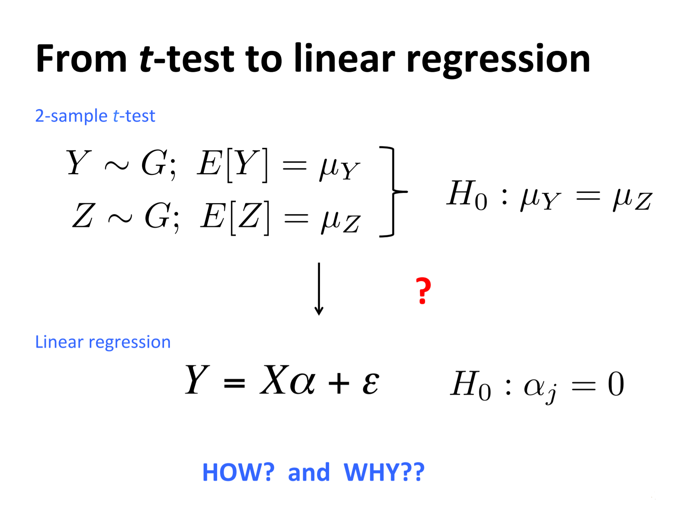
---
class: center


---
class: center

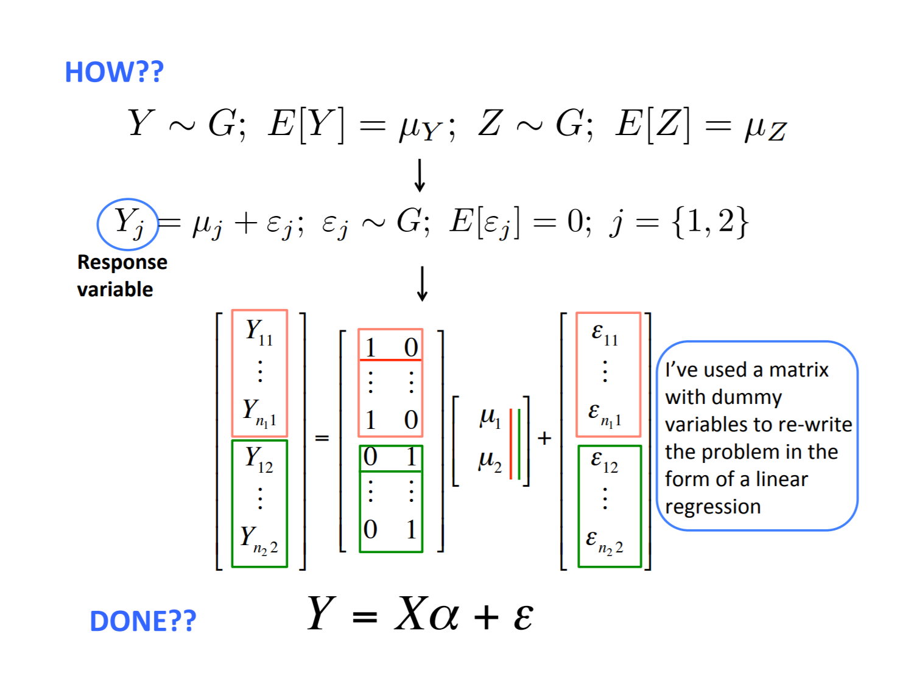
---
class: center

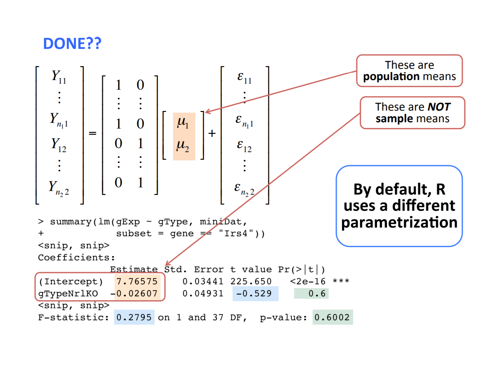
---
class: middle

```{r, include=FALSE}
altDat <- as.vector(t(prDat[c("1422248_at", "1450946_at"), ]))
altDat <- data.frame(gene = rep(c("Irs4", "Nrl"), each = nrow(prDes)),
                      gExp = altDat)

altDat <- data.frame(prDes, altDat)
```

```{r}
summary(lm(gExp ~ gType, altDat, subset = gene == "Irs4"))
```

---
class: middle
### Different ways of writing this (design matrix, parameter vector) pair correspond to different parametrizations of the model.
# $$Y = [X\alpha] + \varepsilon$$
<br> <big>
 Understanding these concepts makes it easier ...
- to interpret fitted models with confidence
- to fit models such that comparisons you care most about are directly addressed in the inferential "report"

---
class: center

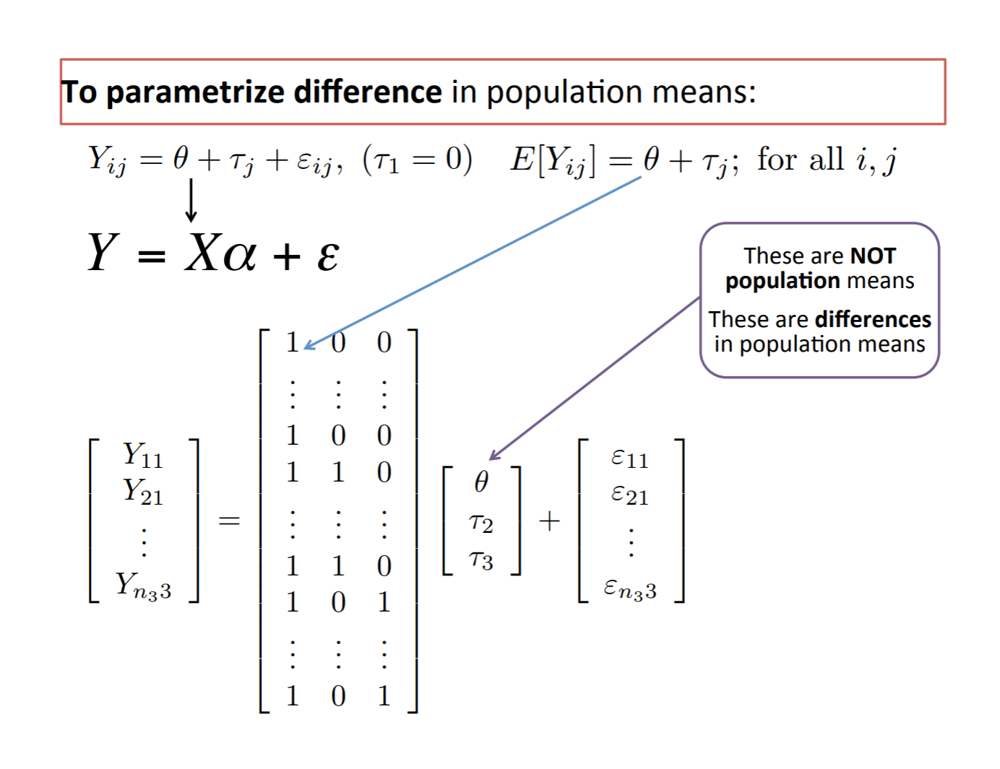
---
class: center

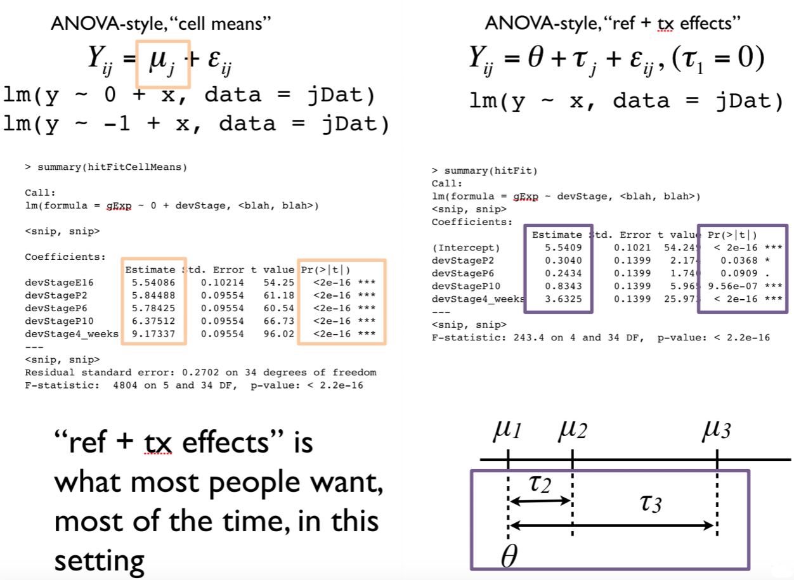
---
class: middle

``` {r}
lm12 <- summary(hitFitCellMeans)
lm12$coefficients
```

---
class: middle
``` {r}
summary(hitFit)
```
---
class: center

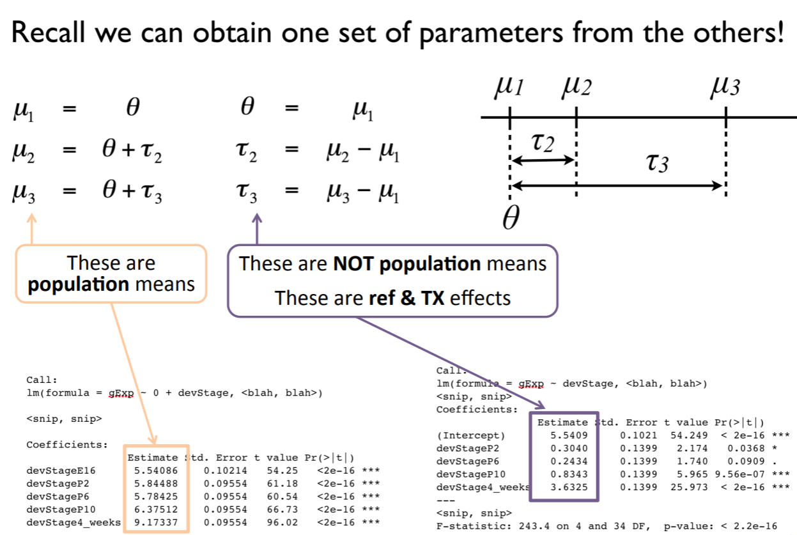
---
class: center

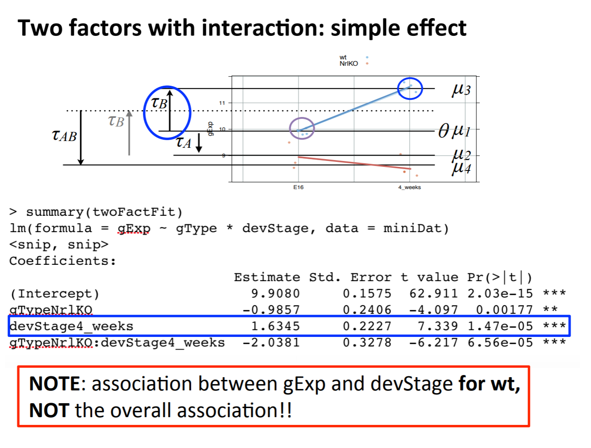
---
class: middle

``` {r, include = FALSE}
twoFactFit <- lm(formula = gExp ~ gType * devStage, data = miniDat)
```

``` {r , echo = FALSE}
summary(twoFactFit)
```
---
class: center

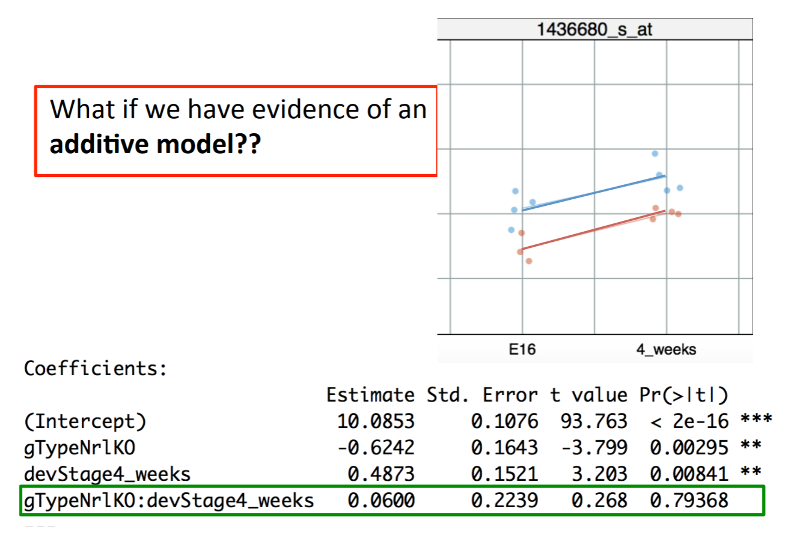
---
class: center

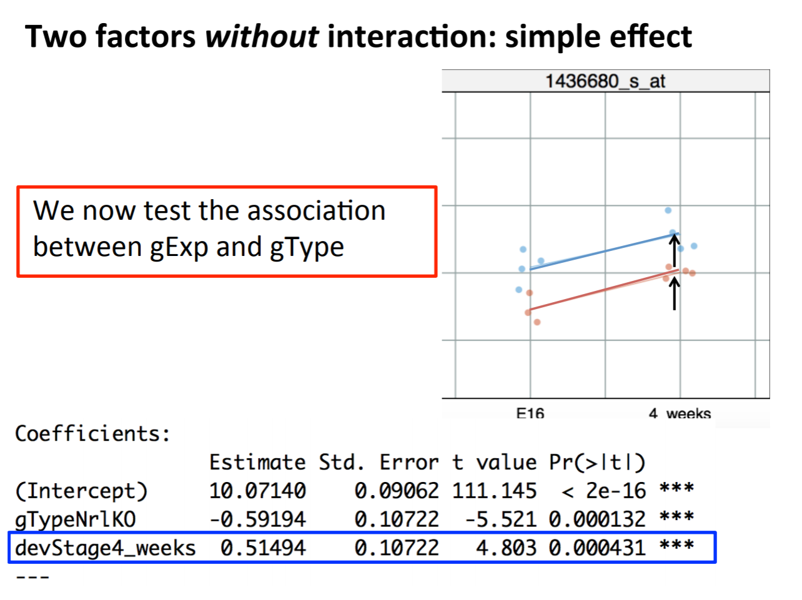
---
class: middle
## **How** do we test the **overall** association between the response and a factor?
<big>
Is it easier to use an additive model?
- Additive models are easier and smaller (fewer parameters)
- But in some applications, we need to test the interaction term.
- And it does not always test the overall association between a factor and a response.

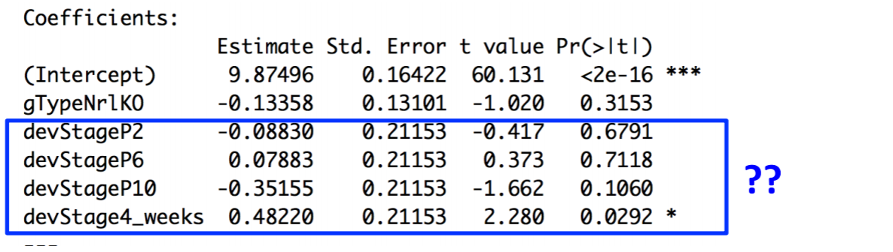

---
class: middle
## **How** do we test the **overall** association between the response and a factor?

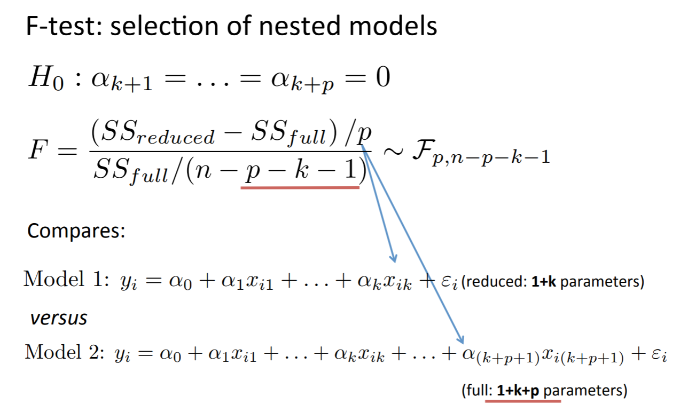
---
class: middle
## **How** do we test the **overall** association between the response and a factor?

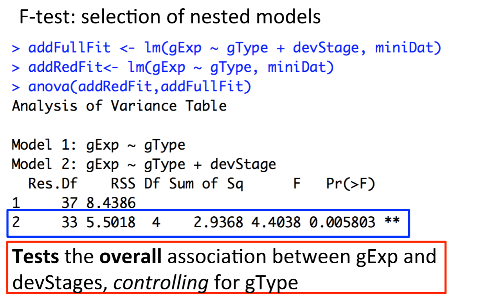
---
class: middle
``` {r}
summary(lm(formula = gExp ~ gType +devStage, data = miniDat))
```
---
Slide 19

---
Slide 20

---
class: middle
## Summary so far
<big>
- *t*-tests can be used to test the equality of **2** population means.

- ANOVA can be used to test the equality of **more than 2** population means.

- **Linear regression** provides a general framework for modelling the relationship between response variable and different type of explanatory variables.

- ***t*-tests** can be used to test the significance of *individual* coefficients.

- **F-tests** can be used to test the *simultaneous significance of multiple coefficients*. We need it to test the association between a response and categorical variable.
---
class: center

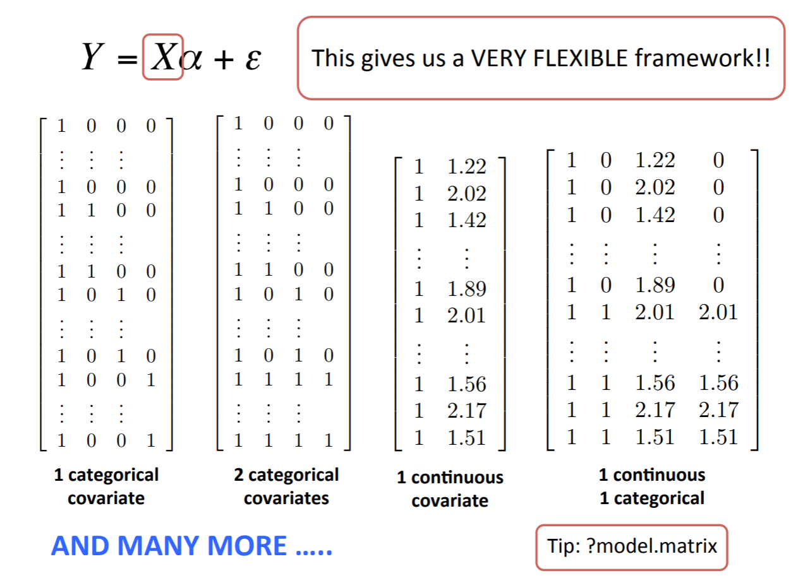
---

SLIDE 23

---

slide 24

---
class: center

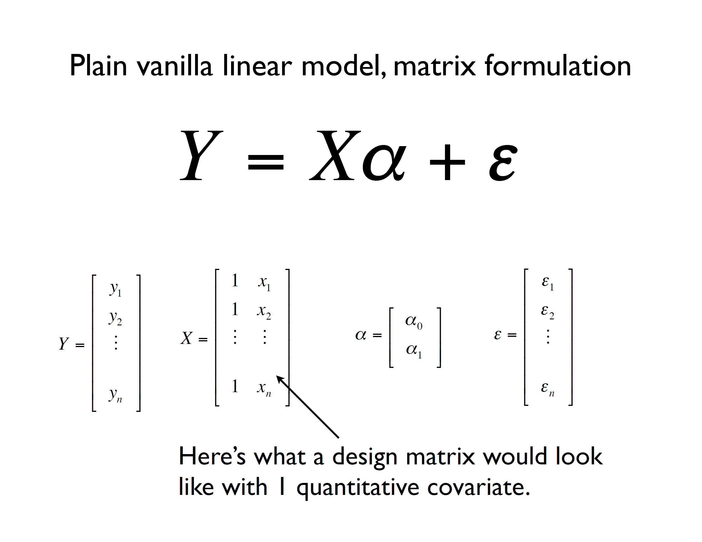
---
class: center

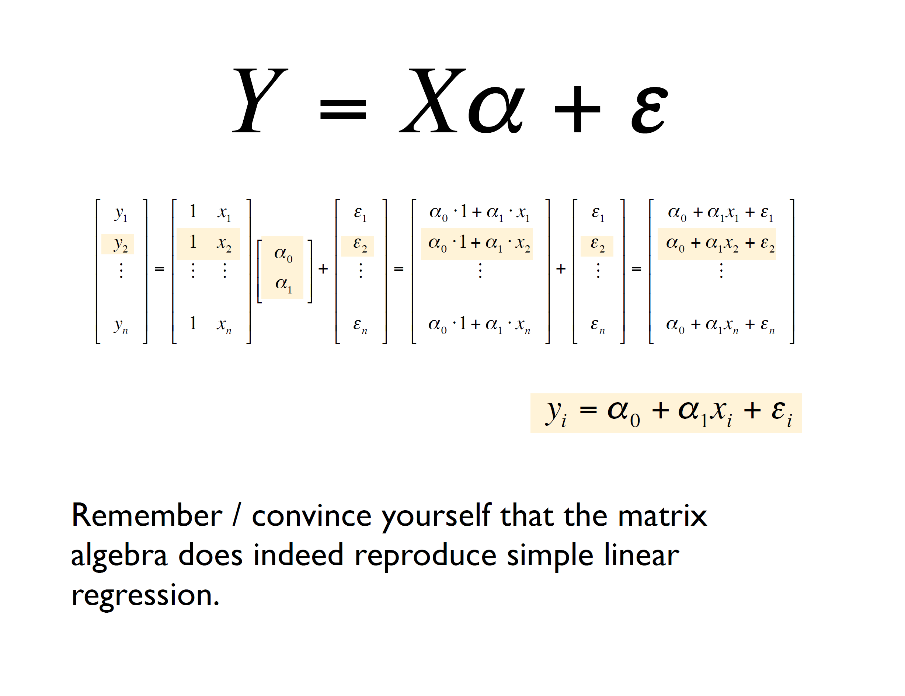
---

SLIDE 27

---

SLIDE 28

---
class: center, middle

## How do we estimate the intercept and the slope?

### Is there an optimal line?

---


