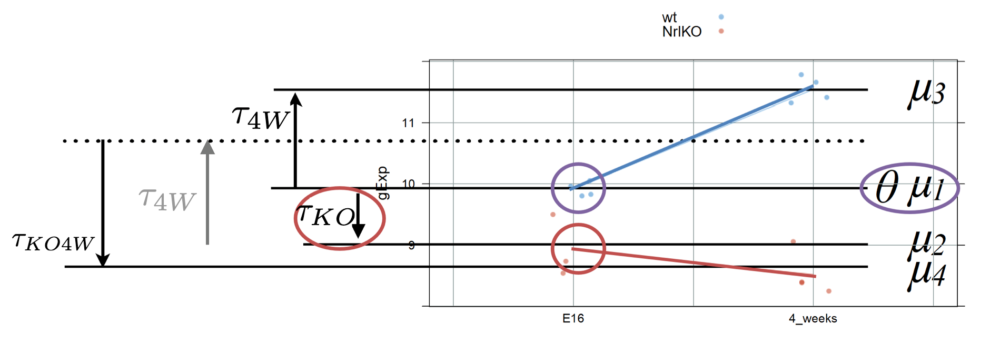
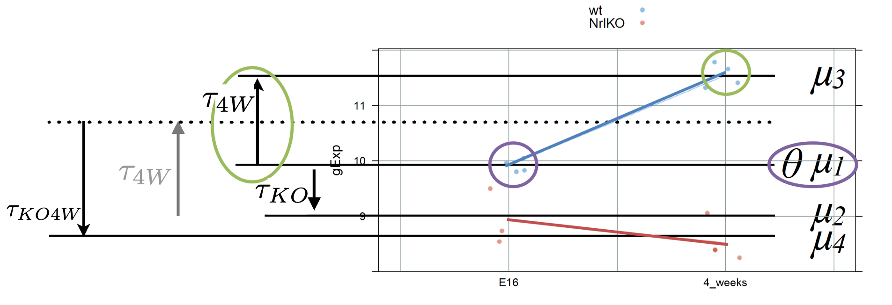
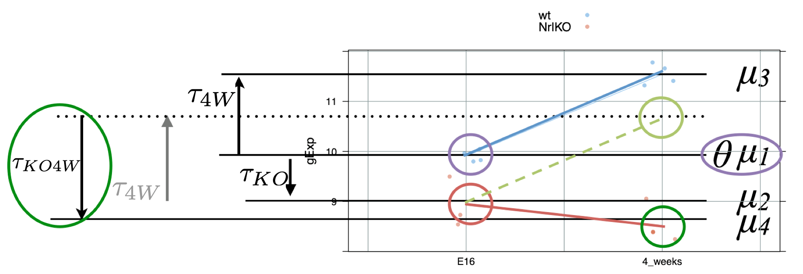

class: middle

```{r, include=FALSE}
library(lattice)
library(dplyr)
library(ggplot2)
library(ggthemes)
library(grid)
library(gridExtra)

prDes <- readRDS("data/GSE4051_design.rds")

prDat<-read.table("data/GSE4051_data.tsv",
                      sep = "\t", header = T, row.names = 1)

## I've selected this as our hit
theHit <- which(rownames(prDat) == "1440645_at") # 17843
## and this as our boring gene
theBore <- which(rownames(prDat) == "1443184_at") # 18898

keepers <- data.frame(row = c(theBore, theHit),
                       probesetID = I(rownames(prDat)[c(theBore, theHit)]))

devDat <- as.vector(t(prDat[keepers$probesetID, ]))
devDat <- data.frame(gene = rep(c("theBore", "theHit"), each = nrow(prDes)),gExp = devDat)
devDat <- data.frame(prDes, devDat)

boreDat <- filter(devDat, gene == "theBore")
hitDat <- filter(devDat, gene == "theHit")
```

# Recall from last class...

### - show how to compare means of different groups (2 or more) using a linear regression model

  - dummy variables to model the levels of a qualitative explanatory variable

### - write a linear model using matrix notation

  - understand which matrix is built by R
  
### - distinguish between conditional and marginal effects
  - $t$-tests vs $F$-tests  
---
class: middle

## **Quick review**: from $t$-test to linear regression

---
class: middle

## <font color="blue"> **HOW??** </font>
### Changing the parametrization and using dummy variables

<big>
$$
Y \sim G; \ E[Y]= \mu_Y ; \ Z \sim G; \ E[Z]= \mu_Z
$$

<center>**↓**

$$Y_{ij}=\theta+\tau_2 \times x_{ij2} + \varepsilon_{ij}; \ i=1, \dots, n; \ j={1,2}$$

<center>**↓**


.pull-left[
<br>
<br>
<br>
$$\begin{array}{l}
E[Y_{i1}] &= \theta=\mu_1 \\
E[Y_{i2}] &= \theta + \tau_2=\mu_1\ + (\mu_2 - \mu_1) = \mu_2
\end{array}$$

]

.pull-right[
```{r,echo=FALSE,out.height="150px"}
knitr::include_graphics("L7_LinearModels_files/param.png")
```
]
---
class: middle

## **Using matrix notation ...**

```{r,echo=FALSE,out.height="400px"}
knitr::include_graphics("L7_LinearModels_files/matrix_not.png")
```

### ... and similarly beyond 2 groups comparisons (ANOVA)

---
class: center


---
class: middle
##**Parametrizations**

### Different ways of writing this [design matrix, parameter vector] pair correspond to different parametrizations of the model
# $$Y = [X\alpha] + \varepsilon$$
<br> <big>
 Understanding these concepts makes it easier ...
- to interpret fitted models
- to fit models such that comparisons you care most about are directly addressed in the inferential "report"
---
class: middle

### For example: comparisons of mean expression levels between groups!
<center>
```{r,echo=FALSE,out.height="250px"}
knitr::include_graphics("L7_LinearModels_files/diff_means.png")
```
</center>
By default, `lm` estimates mean differences (with respect to a reference group):

``` {r}
summary(lm(gExp~devStage,subset(devDat,gene=="theHit")))$coeff
```
---
class: middle
# Today... more complex models

### - more than one factor

  - how to model many categorical variables and their interaction

### - continuous explanatory variables

  - the regression line
  
### - distinguish between conditional and marginal effects (cont.)
  - $t$-tests vs $F$-tests  
---
class: middle
## Increasing the complexity of the linear model ...

### What if you have two categorical variables?

  
  e.g., `gType` and `devStage` (for simplicity, let's consider only E16 and 4W)

- ANOVA is usually used to study models with one or more categorical variables

- Can we combine variables to simplify the analysis??


---
class: middle
```{r,echo=FALSE, include=FALSE}
##########################################################
## simplying devStage to first and last timepoints
##########################################################
prDes <- 
  droplevels(subset(prDes,
                    subset = devStage %in%
                      levels(devStage)[c(1, nlevels(devStage))]))
str(prDes) # 15 obs. of  4 variables
prDat <- subset(prDat, select = prDes$sidChar)

# Gene selected for illustration
(luckyGene <- which(rownames(prDat) == "1455695_at")) # 26861
twoDat <- data.frame(gExp = unlist(prDat[luckyGene, ]))
twoDat <- data.frame(prDes, twoDat)
twoDat$grp <- with(twoDat, interaction(gType, devStage))
str(twoDat)
with(twoDat, table(gType, devStage))
table(twoDat$grp)
```

## Two-way ANOVA: a linear model with interaction 

By default, `lm` assumes a <font color = "red">**reference-treatment effect**</font> parametrization. 

But, which group means are we comparing for a model with 2 factors (e.g., genotype and developmental stage)? What hypotheses are we testing?


```{r}
twoFactFit <- lm(gExp ~ gType * devStage, twoDat)
summary(twoFactFit)$coeff
```
---

class: middle

### Mathematically (a bit more difficult...)

$$Y_{ijk}=\theta + \tau_{KO} \times x_{KO,ijk}+ \tau_{4W} \times x_{4W,ijk}+ \tau_{KO4W} \times x_{KO,ijk}\times x_{4W,ijk}+ \varepsilon_{ijk}$$
Subscripts: $i$ indexes samples per group, $j=\{wt, NrlKO\}$, $k=\{E16, 4W\}$  

The names of these parameters and variables look overwhelming but think of them as just names for:

> $x_{KO,ijk}$: a dummy variable with value 1 for NrlKO genotype samples (j=NrlKO), and 0 otherwise. I call this variable $x_{KO}$

> $x_{4W,ijk}$: a different dummy variable with value 1 for 4W  samples (k=4W), and 0 otherwise. I call this variable $x_{4W}$

> $\tau_{KO}$, $\tau_{4W}$, and $\tau_{KO4W}$: parameters to model the *conditional* effects of genotype (NrlKO), development (4W), and their interaction

**Note**: in this "simple" version with 2 levels per factor we need only one dummy variable per factor: $x_{KO}$ and $x_{4W}$. 

### This model can be extended to multiple factors with multiple levels!!
---
class: middle
## What do these parameters represent??

$$Y_{ijk}=\theta + \tau_{KO} \times x_{KO,ijk}+ \tau_{4W} \times x_{4W,ijk}+ \tau_{KO4W} \times x_{KO,ijk}\times x_{4W,ijk}+ \varepsilon_{ijk}$$

model parameter | R estimate| stats
--------|---------|---------
$\theta$ | (Intercept) | reference, $E[Y_{wt,E16}]$
$\tau_{KO}$ | gTypeNrlKO | *conditional* effect of NrlKO *at* E16: $E[Y_{NrlKO,E16}]$ - $E[Y_{wt,E16}]$
$\tau_{4W}$ | devStage4_weeks | *conditional* effect of 4W *at* wt: $E[Y_{wt,4W}]$ - $E[Y_{wt,E16}]$
$\tau_{KO4W}$ | gTypeNrlKO:devStage4_weeks | *interaction* effect of NrlKO and 4W: (complicated, see later)

The math is more difficult but it is *important* to understand that `lm` estimates *conditional, not main* effects!! 

As before, comparisons are relative to a reference but now we have references in both factors: E16 and wt
---
class: middle

## Reference: wt & E16


$$Y_{ijk}=\theta + \tau_{KO} \times x_{KO,ijk}+ \tau_{4W} \times x_{4W,ijk}+ \tau_{KO4W} \times x_{KO,ijk}\times x_{4W,ijk}+ \varepsilon_{ijk}$$


For any sample $i$ in the reference group: $j=wt$ and $k=E16$, then $x_{KO}=0$ and $x_{4W}=0$ 

As before $\theta$ is the mean of the reference group: $E[Y_{wt,E16}]=\theta$


---
class: middle

## Reference: wt & E16, estimate from the data

```{r,echo=F,highlight.output = c(2)}
twoFactFit <- lm(gExp ~ gType * devStage, twoDat)
summary(twoFactFit)$coeff
```


Note that we are generally not interested in testing the hypothesis: $H_0: \theta=0$
---

class: middle
### *Conditional* genotype effect: wt *vs* NrlKO <font color="blue"> at E16 </font>


$$Y_{ijk}=\theta + \tau_{KO} \times x_{KO,ijk}+ \tau_{4W} \times x_{4W,ijk}+ \tau_{KO4W} \times x_{KO,ijk}\times x_{4W,ijk}+ \varepsilon_{ijk}$$

For any wt sample at E16: $x_{KO}=0$ and $x_{4W}=0$. Then <font color="red"> $E[Y_{wt,E16}]=\theta$ </font>

For any KO sample at E16: $x_{KO}=1$ and $x_{4W}=0$. Then <font color="red"> $E[Y_{NrlKO,E16}]=\theta + \tau_{KO}$ </font>

Then (substract expectations), $\tau_{KO}$ is the *conditional* genotype effect <font color="blue"> at E16 </font>: 

$\tau_{KO}=E[Y_{NrlKO,E16}]-E[Y_{wt,E16}]$ 


---
class: middle
### *Conditional* genotype effect: wt *vs* NrlKO <font color="blue"> at E16 </font>, from the data

```{r,echo=F,highlight.output = c(3)}
twoFactFit <- lm(gExp ~ gType * devStage, twoDat)
summary(twoFactFit)$coeff
```


---
class: middle
### *Conditional* developmental effect: E16 *vs* 4W <font color="blue"> at wt </font>

$$Y_{ijk}=\theta + \tau_{KO} \times x_{KO,ijk}+ \tau_{4W} \times x_{4W,ijk}+ \tau_{KO4W} \times x_{KO,ijk}\times x_{4W,ijk}+ \varepsilon_{ijk}$$

For any wt sample at E16: $x_{KO}=0$ and $x_{4W}=0$. Then <font color="red"> $E[Y_{wt,E16}]=\theta$ </font>

For any wt sample at 4W: $x_{KO}=0$ and $x_{4W}=1$. Then <font color="red"> $E[Y_{wt,4W}]=\theta + \tau_{4W}$ </font>

Then (substract expectations), $\tau_{4W}$ is the *conditional* development effect <font color="blue"> at wt </font>: 

$\tau_{4W}=E[Y_{wt,4W}]-E[Y_{wt,E16}]$ 


---
class: middle
### *Conditional* developmental effect: E16 *vs* 4W <font color="blue"> at wt </font>, from the data

```{r,echo=F,highlight.output = c(4)}
twoFactFit <- lm(gExp ~ gType * devStage, twoDat)
summary(twoFactFit)$coeff
```

---
class: middle
### Interaction effect: can we add up both effects??

$$Y_{ijk}=\theta + \tau_{KO} \times x_{KO,ijk}+ \tau_{4W} \times x_{4W,ijk}+ \tau_{KO4W} \times x_{KO,ijk}\times x_{4W,ijk}+ \varepsilon_{ijk}$$

Mathematically more challenging (try it!):

For any KO sample at 4w: $x_{KO}=1$ and $x_{4W}=1$. Then <font color="red"> $E[Y_{NrlKO,4W}]=\theta + \tau_{KO} + \tau_{4W} + \tau_{KO4W}$ </font>

Using the expectations from previous pages, you can show that:

$\tau_{KO4W}=(E[Y_{NrlKO,E16}]-E[Y_{wt,E16}]) + (E[Y_{NrlKO,4W}]-E[Y_{wt,4W}])$ 



---
class: middle
### Interaction effect: additive factors??, from the data

```{r,echo=F,highlight.output = c(5)}
twoFactFit <- lm(gExp ~ gType * devStage, twoDat)
summary(twoFactFit)$coeff
```


> **Interaction**: is the assocation between gene expression and genotype different at different developmental stages?
---
class: middle

---
class: middle

---
class: middle

## Let's go through some example genes to get a sense of what an interaction effect looks like.
     
     We have three parameters we'd like to interpret:
.pull-left[
> ### Main effect: genotype
### Main effect: age
### Interaction: genotype*age
]
.pull-right[
<br>

]

---
class: middle

---
class: middle

---
class: middle

---
class: middle

---
class: middle

---
class: center


---
class: middle

``` {r, include = FALSE}
twoFactFit <- lm(formula = gExp ~ gType * devStage, data = miniDat)
```

``` {r , echo = FALSE}
summary(twoFactFit)
```
---
class: center


---
class: center


---
class: middle
## **How** do we test the **overall** association between the response and a factor?
<big>
Is it easier to use an additive model?
- Additive models are easier and smaller (fewer parameters)
- But in some applications, we need to test the interaction term.
- And it does not always test the overall association between a factor and a response.


---
class: middle
## **How** do we test the **overall** association between the response and a factor?


---
class: middle
## **How** do we test the **overall** association between the response and a factor?


---
class: middle
``` {r}
summary(lm(formula = gExp ~ gType +devStage, data = miniDat))
```
---
Slide 19

---
Slide 20

---
class: middle
## Summary so far
<big>
- *t*-tests can be used to test the equality of **2** population means.

- ANOVA can be used to test the equality of **more than 2** population means.

- **Linear regression** provides a general framework for modelling the relationship between response variable and different type of explanatory variables.

- ***t*-tests** can be used to test the significance of *individual* coefficients.

- **F-tests** can be used to test the *simultaneous significance of multiple coefficients*. We need it to test the association between a response and categorical variable.
---
class: center


---

SLIDE 23

---

slide 24

---
class: center


---
class: center


---

SLIDE 27

---

SLIDE 28

---
class: center, middle

## How do we estimate the intercept and the slope?

### Is there an optimal line?

---


