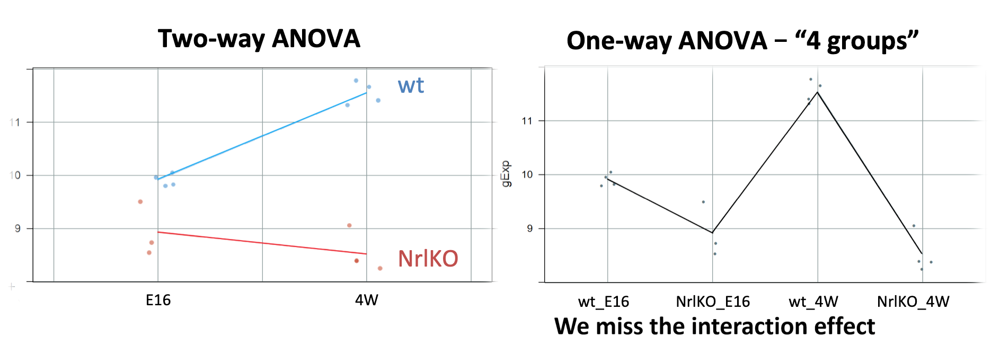

class: middle

```{r, include=FALSE}
library(lattice)
library(dplyr)
library(ggplot2)
library(ggthemes)
library(grid)
library(gridExtra)
library(latex2exp)

prDes <- readRDS("data/GSE4051_design.rds")

prDat<-read.table("data/GSE4051_data.tsv",
                      sep = "\t", header = T, row.names = 1)

## I've selected this as our hit
theHit <- which(rownames(prDat) == "1440645_at") # 17843
## and this as our boring gene
theBore <- which(rownames(prDat) == "1443184_at") # 18898

keepers <- data.frame(row = c(theBore, theHit),
                       probesetID = I(rownames(prDat)[c(theBore, theHit)]))

devDat <- as.vector(t(prDat[keepers$probesetID, ]))
devDat <- data.frame(gene = rep(c("theBore", "theHit"), each = nrow(prDes)),gExp = devDat)
devDat <- data.frame(prDes, devDat)

boreDat <- filter(devDat, gene == "theBore")
hitDat <- filter(devDat, gene == "theHit")
```

# Recall from last class...

### - show how to compare means of different groups (2 or more) using a linear regression model

  - dummy variables to model the levels of a qualitative explanatory variable

### - write a linear model using matrix notation

  - understand which matrix is built by R
  
### - distinguish between conditional and marginal effects
  - $t$-tests vs $F$-tests  
---
class: middle

## **Quick review**: from $t$-test to linear regression

---
class: middle

## <font color="blue"> **HOW??** </font>
### Changing the parametrization and using dummy variables

<big>
$$
Y \sim G; \ E[Y]= \mu_Y ; \ Z \sim G; \ E[Z]= \mu_Z
$$

<center>**↓**

$$Y_{ij}=\theta+\tau_2 \times x_{ij2} + \varepsilon_{ij}; \ i=1, \dots, n; \ j={1,2}$$

<center>**↓**


.pull-left[
<br>
<br>
<br>
$$\begin{array}{l}
E[Y_{i1}] &= \theta=\mu_1 \\
E[Y_{i2}] &= \theta + \tau_2=\mu_1\ + (\mu_2 - \mu_1) = \mu_2
\end{array}$$

]

.pull-right[
```{r,echo=FALSE,out.height="150px"}
knitr::include_graphics("L7_LinearModels_files/param.png")
```
]
---
class: middle

## **Using matrix notation ...**

```{r,echo=FALSE,out.height="400px"}
knitr::include_graphics("L7_LinearModels_files/matrix_not.png")
```

### ... and similarly beyond 2 groups comparisons (ANOVA)

---
class: center


---
class: middle
##**Parametrizations**

### Different ways of writing this [design matrix, parameter vector] pair correspond to different parametrizations of the model
# $$Y = [X\alpha] + \varepsilon$$
<br> <big>
 Understanding these concepts makes it easier ...
- to interpret fitted models
- to fit models such that comparisons you care most about are directly addressed in the inferential "report"
---
class: middle

### For example: comparisons of mean expression levels between groups!
<center>
```{r,echo=FALSE,out.height="250px"}
knitr::include_graphics("L7_LinearModels_files/diff_means.png")
```
</center>
By default, `lm` estimates mean differences (with respect to a reference group):

``` {r}
summary(lm(gExp~devStage,subset(devDat,gene=="theHit")))$coeff
```
---
class: middle
# Today... more complex models

### - more than one factor

  - how to model many categorical variables and their interaction

### - continuous explanatory variables

  - the regression line
  
### - distinguish between conditional and marginal effects (cont.)
  - $t$-tests vs $F$-tests  
---
class: middle

## Increasing the complexity of the linear model ...

### What if you have two categorical variables?

  
  e.g., `gType` and `devStage` (for simplicity, let's consider only E16 and 4W)

- ANOVA is usually used to study models with one or more categorical variables (factors)

- Can we combine levels into 4 groups to simplify the analysis??





---
class: middle
```{r,echo=FALSE, include=FALSE}
##########################################################
## simplying devStage to first and last timepoints
##########################################################
prDes <- 
  droplevels(subset(prDes,
                    subset = devStage %in%
                      levels(devStage)[c(1, nlevels(devStage))]))
str(prDes) # 15 obs. of  4 variables
prDat <- subset(prDat, select = prDes$sidChar)

# Gene selected for illustration
(luckyGene <- which(rownames(prDat) == "1455695_at")) # 26861
twoDat <- data.frame(gExp = unlist(prDat[luckyGene, ]))
twoDat <- data.frame(prDes, twoDat)
twoDat$grp <- with(twoDat, interaction(gType, devStage))
str(twoDat)
with(twoDat, table(gType, devStage))
table(twoDat$grp)

```

## Two-way ANOVA or a linear model with interaction 

Which group means are we comparing in a model with 2 factors? 

```{r,echo=FALSE,fig.height= 4, dev='svg'}
mu.hat<-twoDat %>% group_by(grp) %>% summarize(mean(gExp)) %>% as.data.frame()
lucky <- ggplot(twoDat, aes(x = devStage, y = gExp, group=gType, colour=gType)) + 
             geom_jitter(width = 0.1) +
             theme_bw() +
             theme(legend.position = "none") +
             ylim(6, 13) + stat_summary(aes(group=gType,colour=gType), fun.y=mean, geom="line",size=1.5) 

lucky +
  scale_color_manual(values = c('wt' = '#00BFC4', 'NrlKO' = '#F8766D'))+
  geom_text(aes(x = .8, y = mu.hat[1,2], label = TeX("$\\widehat{\\mu_1}$", output = "character")),colour="black", size=6,parse = TRUE)+
  geom_text(aes(x = .8, y = mu.hat[2,2], label = TeX("$\\widehat{\\mu_2}$", output = "character")), colour="black", size=6,parse = TRUE)+
  geom_text(aes(x = 2.2, y = mu.hat[3,2], label = TeX("$\\widehat{\\mu_3}$", output = "character")), colour="black", size=6, parse = TRUE)+
  geom_text(aes(x = 2.2, y = mu.hat[4,2], label = TeX("$\\widehat{\\mu_4}$", output = "character")), colour="black", size=6, parse = TRUE)
```

$$\mu_1=E[Y_{(wt,E16)}], \ \mu_2=E[Y_{(NrlKO,E16)}], 
\ \mu_3=E[Y_{(wt,4W)}], \ \mu_4=E[Y_{(NrlKO,4W)}]$$

---
class: middle
### Reference-treatment effect parametrization

By default, `lm` assumes a <font color = "red">**reference-treatment effect**</font> parametrization (let's skip the math for now...)

```{r,tidy.opts=list(width.cutoff=40)}
twoFactFit <- lm(gExp ~ gType * devStage, twoDat)
summary(twoFactFit)$coeff

means.2Fact <- as.data.frame(twoDat %>% 
          group_by(grp) %>% summarize(cellMeans=mean(gExp)))
means.2Fact <-means.2Fact %>%   mutate(txEffects=cellMeans-cellMeans[1],
          lmEst=summary(twoFactFit)$coeff[,1])
```

---
class: middle

## The reference: <font color="blue"> wt & E16 </font>

<big>
As before, comparisons are relative to a reference but in this case there is a reference level in each factor: <font color="blue">wt and E16 </font>

```{r,echo=FALSE,fig.height= 2.7, dev='svg'}
lucky +
  scale_color_manual(values = c('wt' = '#00BFC4', 'NrlKO' = '#F8766D'))+
  geom_text(aes(x = .8, y = mu.hat[1,2], label = TeX("$\\widehat{\\theta}=\\widehat{\\mu_1}$", output = "character")),colour="black", size=6, parse = TRUE) + 
  geom_point(aes(x = 1, y = mu.hat[1,2]),size=7,shape=1,colour='#00BFC4')
```

---
class: middle

## The reference: wt & E16
<big>

**Mean of reference group**: $\theta=E[Y_{wt,E16}]$ 
  
**`lm` estimate**: $\hat{\theta}$ is the sample mean of the group 

```{r,echo=FALSE,highlight.output = c(2)}
summary(twoFactFit)$coeff

means.2Fact
```

In general, one is not interested in: $H_0: \theta=0$

---
class: middle

## Conditional genotype effect: wt *vs* NrlKO <font color="blue"> at E16 </font>

<big>
And now the "treatment effects"... but note that this time effects are not marginal but *conditional* (at a given level of the other factor, e.g., at E16)

```{r,echo=FALSE,fig.height= 2.7, dev='svg'}
lucky +
  scale_color_manual(values = c('wt' = '#00BFC4', 'NrlKO' = '#F8766D'))+
  geom_text(aes(x = .7, y = abs(mu.hat[1,2]+mu.hat[2,2])/2, label = TeX("$\\widehat{\\tau_{KO}}$", output = "character")),colour="black", size=6, parse = TRUE) + 
  geom_point(aes(x = 1, y = mu.hat[1,2]),size=7,shape=1,colour='#00BFC4')+
  geom_point(aes(x = 1, y = mu.hat[2,2]),size=7,shape=1,colour='#F8766D')+
  geom_segment(aes(x=.8,y=mu.hat[1,2],xend=.8,yend=mu.hat[2,2]),colour=1,arrow = arrow(length = unit(0.1,"cm")))+
  geom_segment(aes(x=.8,y=mu.hat[2,2],xend=.8,yend=mu.hat[1,2]),colour=1,arrow = arrow(length = unit(0.1,"cm"))) #other way for double arrow??
```

---

class: middle

## Conditional genotype effect: wt *vs* NrlKO <font color="blue"> at E16 </font>

**Conditional effect of genotype at E16**: $\tau_{KO}=E[Y_{NrlKO,E16}]-E[Y_{wt,E16}]$

**`lm` estimate**: $\hat{\tau}_{KO}$ is a *difference* of sample means (see table below)

```{r,echo=F,highlight.output = c(3)}
summary(twoFactFit)$coeff

means.2Fact
```

**But**, are you interested in testing the *conditional* effect at E16: $H_0: \tau_{KO}=0$?? 

---

class: middle
### *Conditional* developmental effect: E16 *vs* 4W <font color="blue"> at wt </font>

<big>

Similar for the other factor:

```{r,echo=FALSE,fig.height= 3.5, dev='svg'}
lucky +
  scale_color_manual(values = c('wt' = '#00BFC4', 'NrlKO' = '#F8766D'))+
#circles around mean
  geom_point(aes(x = 1, y = mu.hat[1,2]),size=7,shape=1,colour='#00BFC4')+
  geom_point(aes(x = 2, y = mu.hat[3,2]),size=7,shape=1,colour='#00BFC4')+
#parameter and segments
  geom_text(aes(x = 2.2, y = abs(mu.hat[1,2]+mu.hat[3,2])/2, label = TeX("$\\widehat{\\tau_{4W}}$", output = "character")),colour="black", size=6, parse = TRUE) + 
  geom_segment(aes(x=2.1,y=mu.hat[3,2],xend=2.1,yend=mu.hat[1,2]),colour=1,arrow = arrow(length = unit(0.1,"cm")))+
  geom_segment(aes(x=2.1,y=mu.hat[1,2],xend=2.1,yend=mu.hat[3,2]),colour=1,arrow = arrow(length = unit(0.1,"cm"))) + #other way for double arrow??
  geom_segment(aes(x=1,y=mu.hat[1,2],xend=2,yend=mu.hat[1,2]),colour='grey',linetype=2) #other way for double arrow??
```

---

class: middle
### *Conditional* developmental effect: E16 *vs* 4W <font color="blue"> at wt </font>

**Conditional effect of development at wt**: $\tau_{4W}=E[Y_{wt,4W}]-E[Y_{wt,E16}]$

**`lm` estimate**: $\hat{\tau}_{4W}$ is another *difference* of sample means (see table below)

```{r,echo=F,highlight.output = c(4)}
summary(twoFactFit)$coeff

means.2Fact
```

---
class: middle

## Interaction effect

<big>

Is the effect of genotype the same at different developmental stages (or the other way around)? 

**Yes if**, there's no interaction effect, i.e., $\tau_{KO4W}=0$ 

```{r,echo=FALSE,fig.height= 3, dev='svg'}
mu.add<-mu.hat[3,2]-(mu.hat[1,2]-mu.hat[2,2])
lucky +
     scale_color_manual(values = c('wt' = '#00BFC4', 'NrlKO' = '#F8766D'))+
  #circles at means    
     geom_point(aes(x = 2, y = mu.hat[3,2]),size=7,shape=1,colour='#00BFC4')+
     geom_point(aes(x = 2, y = mu.hat[3,2]-(mu.hat[1,2]-mu.hat[2,2])),size=7,shape=1,colour='grey')+
  #parameters and segments
  #additive position
    geom_segment(aes(x=1,y=mu.hat[2,2],xend=2,yend=mu.add),colour='grey',linetype=2)+
  #tau_4W
  geom_segment(aes(x=2.1,y=mu.hat[3,2],xend=2.1,yend=mu.add),colour='grey',arrow = arrow(length = unit(0.1,"cm")))+
  geom_segment(aes(x=2.1,y=mu.add,xend=2.1,yend=mu.hat[3,2]),colour='grey',arrow = arrow(length = unit(0.1,"cm"))) +
  geom_text(aes(x = 2.2, y = abs(mu.hat[3,2]+mu.add)/2, label = TeX("$\\widehat{\\tau_{4W}}$", output = "character")),colour='grey', size=6, parse = TRUE) +
  #interaction
geom_segment(aes(x=2.1,y=mu.hat[4,2],xend=2.1,yend=mu.add),colour='blue',arrow = arrow(length = unit(0.1,"cm")))+
  geom_segment(aes(x=2.1,y=mu.add,xend=2.1,yend=mu.hat[4,2]),colour='blue',arrow = arrow(length = unit(0.1,"cm"))) +
  geom_text(aes(x = 2.2, y = abs(mu.hat[4,2]+mu.add)/2, label = TeX("$\\widehat{\\tau_{KO4W}}$", output = "character")),colour="blue", size=6, parse = TRUE) 
```

The genotype effect at E16 is $\tau_{KO}$. However, $\tau_{KO}$ does not seem to be the effect at 4W. The difference is the interaction effect!
---
## Interaction effect

$\tau_{KO4W}=(E[Y_{wt,E16}]-E[Y_{NrlKO,E16}]) - (E[Y_{wt,4W}]-E[Y_{NrlKO,4W}])$ 

```{r,echo=FALSE,highlight.output = c(5)}
summary(twoFactFit)$coeff
```

```{r,highlight.output = c(5)}
means.2Fact
((means.2Fact$cellMeans[1]-means.2Fact$cellMeans[2])-
  (means.2Fact$cellMeans[3]-means.2Fact$cellMeans[4]))
```

---
class: middle
## Summary of model parameters 

model parameter | R estimate| stats | interpretation
--------|---------|---------
$\theta$ | (Intercept) | $E[Y_{wt,E16}]$ | reference
$\tau_{KO}$ | gTypeNrlKO | $E[Y_{NrlKO,E16}] - E[Y_{wt,E16}]$ | *conditional* effect of NrlKO *at* E16
$\tau_{4W}$ | devStage4_weeks | $E[Y_{wt,4W}] - E[Y_{wt,E16}]$ | *conditional* effect of 4W *at* wt
$\tau_{KO4W}$ | gTypeNrlKO: devStage4_weeks | $E[Y_{NrlKO,4W}] - E[Y_{wt,4W}] - \tau_{KO}$  | *interaction* effect of NrlKO and 4W

It is *important* to remember that `lm` reports *conditional, not main* effects!! <font color="blue"> why?? because of the parametrization used!! </font> (see additional slides at the end)

It can also be shown that $\tau_{KO4W}=E[Y_{NrlKO,4W}]-\tau_{4W}-\tau_{KO}-\theta$ 

---
class: middle

## Let's go through some example genes to examine these parameters closer

<big>     
For our model, there are 3 hypotheses of interest:

.pull-left[
> ### $H_0: \tau_{KO}$
### $H_0: \tau_{4W}$
### $H_0: \tau_{KO4W}$
]
.pull-right[
<br>

]

Note that we may not be interested in the first two hypotheses since these are *conditional* effects (*at* a given level of a factor)
---
class: middle

### Nothing is statistically significant, very flat genes
```{r,tidy.opts=list(width.cutoff=30)}
egDat<-prDat %>% subset(row.names(prDat) %in%
       c("1442080_at","1448243_at")) %>%
       mutate(gene=c("1442080_at","1448243_at")) %>% 
       gather(sidChar, gExp,-gene) %>%
       inner_join(prDes,by="sidChar")
```

Summary of `lm` for first gene:

```{r,echo=FALSE,highlight.output = c(3:5)}
egFit <- lm(gExp ~ gType * devStage, subset(egDat,gene=="1448243_at"))
summary(egFit)$coeff
```

```{r echo=FALSE, fig.height=4, fig.width=14, dev='svg'}
plot1Dat <- filter(egDat, gene == "1442080_at")
plot2Dat <- filter(egDat, gene == "1448243_at")

plot1Lim <- ggplot(plot1Dat, aes(x = devStage, y = gExp, group=gType, colour=gType)) + 
  geom_jitter(width = 0.1) +
             labs(title = "1442080_at") +
             theme_bw() +
             theme(legend.position = "none") +
             ylim(6, 10) +  stat_summary(aes(group=gType,colour=gType), fun.y=mean, geom="line",size=1.5) +
  scale_color_manual(values = c('wt' = '#00BFC4', 'NrlKO' = '#F8766D'))

plot2Lim <- ggplot(plot2Dat, aes(x = devStage, y = gExp, group=gType, colour=gType)) + 
  geom_jitter(width = 0.1) +
             labs(title = "1448243_at") +
             theme_bw() +
             theme(legend.position = "none") +
             ylim(6, 10) +  stat_summary(aes(group=gType,colour=gType), fun.y=mean, geom="line",size=1.5) +
  scale_color_manual(values = c('wt' = '#00BFC4', 'NrlKO' = '#F8766D'))

grid.arrange(plot1Lim, plot2Lim, ncol = 2)
```

---
class: middle
### Only developmental stage is statistically significant

```{r,echo=FALSE}
egDat<-prDat %>% subset(row.names(prDat) %in%
       c("1447988_at","1438764_at")) %>%
       mutate(gene=c("1447988_at","1438764_at")) %>% 
       gather(sidChar, gExp,-gene) %>%
       inner_join(prDes,by="sidChar")
```

Summary of `lm` for first gene:

```{r,echo=FALSE,highlight.output = c(3:5)}
egFit <- lm(gExp ~ gType * devStage, subset(egDat,gene=="1447988_at"))
summary(egFit)$coeff
```

```{r echo=FALSE, fig.height=4, fig.width=14, dev='svg'}
plot1Dat <- filter(egDat, gene == "1447988_at")
plot2Dat <- filter(egDat, gene == "1438764_at")

plot1Lim <- ggplot(plot1Dat, aes(x = devStage, y = gExp, group=gType, colour=gType)) + 
  geom_jitter(width = 0.1) +
             labs(title = "1447988_at") +
             theme_bw() +
             theme(legend.position = "none") +
             ylim(6, 8) +  stat_summary(aes(group=gType,colour=gType), fun.y=mean, geom="line",size=1.5) +
  scale_color_manual(values = c('wt' = '#00BFC4', 'NrlKO' = '#F8766D'))

plot2Lim <- ggplot(plot2Dat, aes(x = devStage, y = gExp, group=gType, colour=gType)) + 
  geom_jitter(width = 0.1) +
             labs(title = "1438764_at") +
             theme_bw() +
             theme(legend.position = "none") +
             ylim(6, 8) +  stat_summary(aes(group=gType,colour=gType), fun.y=mean, geom="line",size=1.5) +
  scale_color_manual(values = c('wt' = '#00BFC4', 'NrlKO' = '#F8766D'))

grid.arrange(plot1Lim, plot2Lim, ncol = 2)
```

Note the almost parallel pattern (no significant interacction effect)
---
class: middle
### Only genotype is statistically significant

```{r,echo=FALSE}
egDat<-prDat %>% subset(row.names(prDat) %in%
       c("1447753_at","1431651_at")) %>%
       mutate(gene=c("1447753_at","1431651_at")) %>% 
       gather(sidChar, gExp,-gene) %>%
       inner_join(prDes,by="sidChar")
```

Summary of `lm` for first gene:

```{r,echo=FALSE,highlight.output = c(3:5)}
egFit <- lm(gExp ~ gType * devStage, subset(egDat,gene=="1447753_at"))
summary(egFit)$coeff
```

```{r echo=FALSE, fig.height=4, fig.width=14, dev='svg'}
plot1Dat <- filter(egDat, gene == "1447753_at")
plot2Dat <- filter(egDat, gene == "1431651_at")

plot1Lim <- ggplot(plot1Dat, aes(x = devStage, y = gExp, group=gType, colour=gType)) + 
  geom_jitter(width = 0.1) +
             labs(title = "1447753_at") +
             theme_bw() +
             theme(legend.position = "none") +
             ylim(6, 7.5) +  stat_summary(aes(group=gType,colour=gType), fun.y=mean, geom="line",size=1.5) +
  scale_color_manual(values = c('wt' = '#00BFC4', 'NrlKO' = '#F8766D'))

plot2Lim <- ggplot(plot2Dat, aes(x = devStage, y = gExp, group=gType, colour=gType)) + 
  geom_jitter(width = 0.1) +
             labs(title = "1431651_at") +
             theme_bw() +
             theme(legend.position = "none") +
             ylim(6, 7.5) +  stat_summary(aes(group=gType,colour=gType), fun.y=mean, geom="line",size=1.5) +
  scale_color_manual(values = c('wt' = '#00BFC4', 'NrlKO' = '#F8766D'))

grid.arrange(plot1Lim, plot2Lim, ncol = 2)
```

Note the almost parallel pattern (no significant interacction effect)
---
class: middle
### Development and genotype are statistically significant

```{r,echo=FALSE}
egDat<-prDat %>% subset(row.names(prDat) %in%
       c("1456930_at","1417810_a_at")) %>%
       mutate(gene=c("1456930_at","1417810_a_at"))%>%
       gather(sidChar, gExp,-gene) %>%
       inner_join(prDes,by="sidChar")
```

Summary of `lm` for first gene:

```{r,echo=FALSE,highlight.output = c(3:5)}
egFit <- lm(gExp ~ gType * devStage, subset(egDat,gene=="1456930_at"))
summary(egFit)$coeff
```

```{r echo=FALSE, fig.height=4, fig.width=14, dev='svg'}
plot1Dat <- filter(egDat, gene == "1456930_at")
plot2Dat <- filter(egDat, gene == "1417810_a_at")

plot1Lim <- ggplot(plot1Dat, aes(x = devStage, y = gExp, group=gType, colour=gType)) + 
  geom_jitter(width = 0.1) +
             labs(title = "1456930_at") +
             theme_bw() +
             theme(legend.position = "none") +
             ylim(6, 9) +  stat_summary(aes(group=gType,colour=gType), fun.y=mean, geom="line",size=1.5) +
  scale_color_manual(values = c('wt' = '#00BFC4', 'NrlKO' = '#F8766D'))

plot2Lim <- ggplot(plot2Dat, aes(x = devStage, y = gExp, group=gType, colour=gType)) + 
  geom_jitter(width = 0.1) +
             labs(title = "1417810_a_at") +
             theme_bw() +
             theme(legend.position = "none") +
             ylim(6, 9) +  stat_summary(aes(group=gType,colour=gType), fun.y=mean, geom="line",size=1.5) +
  scale_color_manual(values = c('wt' = '#00BFC4', 'NrlKO' = '#F8766D'))

grid.arrange(plot1Lim, plot2Lim, ncol = 2)
```

Note the almost parallel pattern (no significant interacction effect)
---
class: middle
### Statistically significant interaction effect

```{r,echo=FALSE,warning=FALSE}
egDat<-prDat %>% subset(row.names(prDat) %in%
       c("1434709_at","1458220_at")) %>%
       mutate(gene=c("1434709_at","1458220_at")) %>% 
       gather(sidChar, gExp,-gene) %>%
       inner_join(prDes,by="sidChar")
```

Summary of `lm` for first gene:

```{r,echo=FALSE,highlight.output = c(3:5),warning=FALSE}
egFit <- lm(gExp ~ gType * devStage, subset(egDat,gene=="1434709_at"))
summary(egFit)$coeff
```

```{r echo=FALSE, fig.height=4, fig.width=14, dev='svg'}
plot1Dat <- filter(egDat, gene == "1434709_at")
plot2Dat <- filter(egDat, gene == "1458220_at")

plot1Lim <- ggplot(plot1Dat, aes(x = devStage, y = gExp, group=gType, colour=gType)) + 
  geom_jitter(width = 0.1) +
             labs(title = "1434709_at") +
             theme_bw() +
             theme(legend.position = "none") +
             ylim(6, 9) +  stat_summary(aes(group=gType,colour=gType), fun.y=mean, geom="line",size=1.5) +
  scale_color_manual(values = c('wt' = '#00BFC4', 'NrlKO' = '#F8766D'))

plot2Lim <- ggplot(plot2Dat, aes(x = devStage, y = gExp, group=gType, colour=gType)) + 
  geom_jitter(width = 0.1) +
             labs(title = "1458220_at") +
             theme_bw() +
             theme(legend.position = "none") +
             ylim(6, 9) +  stat_summary(aes(group=gType,colour=gType), fun.y=mean, geom="line",size=1.5) +
  scale_color_manual(values = c('wt' = '#00BFC4', 'NrlKO' = '#F8766D'))

grid.arrange(plot1Lim, plot2Lim, ncol = 2)
```

Non-parallel pattern (significant interacction effect)
---
class: center


---
class: middle

``` {r, include = FALSE}
twoFactFit <- lm(formula = gExp ~ gType * devStage, data = miniDat)
```

``` {r , echo = FALSE}
summary(twoFactFit)
```
---
class: center


---
class: center


---
class: middle
## **How** do we test the **overall** association between the response and a factor?
<big>
Is it easier to use an additive model?
- Additive models are easier and smaller (fewer parameters)
- But in some applications, we need to test the interaction term.
- And it does not always test the overall association between a factor and a response.


---
class: middle
## **How** do we test the **overall** association between the response and a factor?


---
class: middle
## **How** do we test the **overall** association between the response and a factor?


---
class: middle
``` {r}
summary(lm(formula = gExp ~ gType +devStage, data = miniDat))
```
---
Slide 19

---
Slide 20

---
class: middle
## Summary so far
<big>
- *t*-tests can be used to test the equality of **2** population means.

- ANOVA can be used to test the equality of **more than 2** population means.

- **Linear regression** provides a general framework for modelling the relationship between response variable and different type of explanatory variables.

- ***t*-tests** can be used to test the significance of *individual* coefficients.

- **F-tests** can be used to test the *simultaneous significance of multiple coefficients*. We need it to test the association between a response and categorical variable.
---

class: middle

### Mathematically (a bit more difficult...)

$$Y_{ijk}=\theta + \tau_{KO} \times x_{KO,ijk}+ \tau_{4W} \times x_{4W,ijk}+ \tau_{KO4W} \times x_{KO,ijk}\times x_{4W,ijk}+ \varepsilon_{ijk}$$
Subscripts: $i$ indexes samples per group, $j=\{wt, NrlKO\}$, $k=\{E16, 4W\}$  

The names of these parameters and variables look overwhelming but think of them as just names for:

> $x_{KO,ijk}$: a dummy variable with value 1 for NrlKO genotype samples (j=NrlKO), and 0 otherwise. I call this variable $x_{KO}$

> $x_{4W,ijk}$: a different dummy variable with value 1 for 4W  samples (k=4W), and 0 otherwise. I call this variable $x_{4W}$

> $\tau_{KO}$, $\tau_{4W}$, and $\tau_{KO4W}$: parameters to model the *conditional* effects of genotype (NrlKO), development (4W), and their interaction

**Note**: in this "simple" version with 2 levels per factor we need only one dummy variable per factor: $x_{KO}$ and $x_{4W}$. 

### This model can be extended to multiple factors with multiple levels!!

---
class: center


---

SLIDE 23

---

slide 24

---
class: center


---
class: center


---

SLIDE 27

---

SLIDE 28

---
class: center, middle

## How do we estimate the intercept and the slope?

### Is there an optimal line?

---


