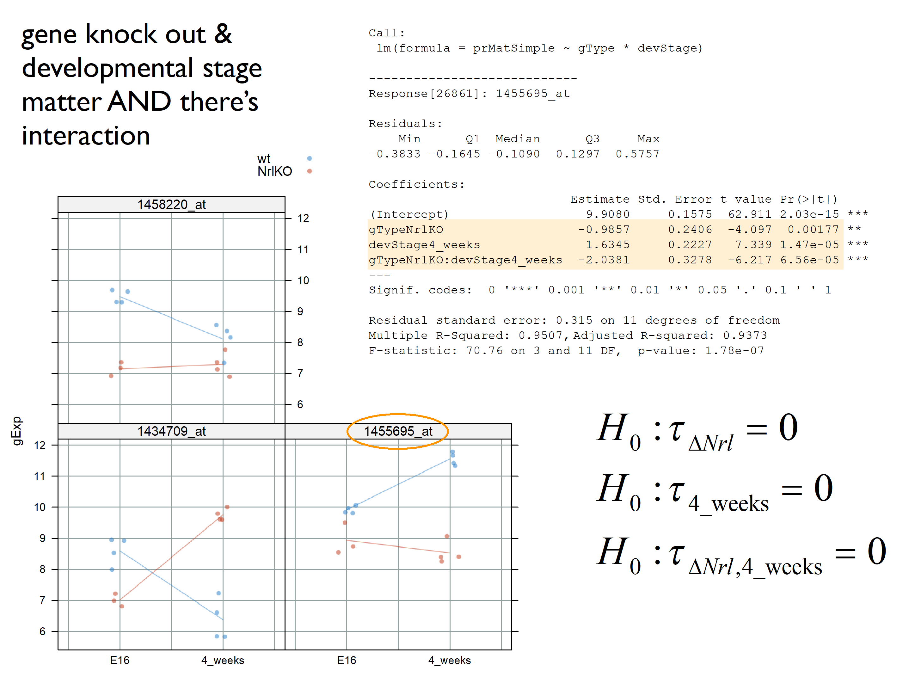

class: middle

# Recall from last class...
---

class: center, middle


---
class: center


---
class: center


---
class: middle
### Different ways of writing this (design matrix, parameter vector) pair correspond to different parametrizations of the model.
# $$Y = [X\alpha] + \varepsilon$$
<br> <big>
 Understanding these concepts makes it easier ...
- to interpret fitted models with confidence
- to fit models such that comparisons you care most about are directly addressed in the inferential "report"
---
class: middle

### Recall we can obtain one set of parameters from the others!
<center>
```{r,echo=FALSE,out.height="250px"}
knitr::include_graphics("L7_LinearModels_files/diff_means.png")
```
</center>
By default, `lm` estimates these parameters!

``` {r}
summary(lm(gExp~devStage,subset(devDat,gene=="theHit")))$coeff
```

---
class: middle
``` {r}
#summary(hitFit)
```
---
class: middle
### **Differential Expression**: Are the expression levels of these genes are generated by distributions with different locations at different developmental stages? 

### $$H_0: \mu_{E12}=\mu_{P2}=\mu_{P6}=\mu_{P10}=\mu_{4W}$$

```{r, include=FALSE}
library(lattice)
library(dplyr)
library(ggplot2)
library(ggthemes)
library(grid)
library(gridExtra)

prDes <- readRDS("data/GSE4051_design.rds")

prDat<-read.table("data/GSE4051_data.tsv",
                      sep = "\t", header = T, row.names = 1)

## I've selected this as our hit
theHit <- which(rownames(prDat) == "1440645_at") # 17843
## and this as our boring gene
theBore <- which(rownames(prDat) == "1443184_at") # 18898

keepers <- data.frame(row = c(theBore, theHit),
                       probesetID = I(rownames(prDat)[c(theBore, theHit)]))

devDat <- as.vector(t(prDat[keepers$probesetID, ]))
devDat <- data.frame(gene = rep(c("theBore", "theHit"), each = nrow(prDes)),gExp = devDat)
devDat <- data.frame(prDes, devDat)

boreDat <- filter(devDat, gene == "theBore")
hitDat <- filter(devDat, gene == "theHit")
```

```{r, echo=FALSE, fig.height= 4, dev='svg'}
boreLim <- ggplot(boreDat, aes(x = devStage, y = gExp)) + 
             geom_jitter(width = 0.2, alpha = 0.5) +
             labs(title = "theBore") +
             theme_bw() +
             theme(legend.position = "none") +
             ylim(5, 10) +
             xlab("") +
             stat_summary(aes(group=1), fun.y=mean, geom="line", colour="red")

hitLim <- ggplot(hitDat, aes(x = devStage, y = gExp)) + 
             geom_jitter(width = 0.2, alpha = 0.5) +
             labs(title = "theHit") +
             theme_bw() +
             theme(legend.position = "none") +
             ylim(5, 10) +
             ylab("") +
             xlab("") +
             stat_summary(aes(group=1), fun.y=mean, geom="line", colour="red")

grid.arrange(boreLim, hitLim, nrow = 1)
```

---
class: middle
#NEW HERE
---
class: middle
## Increasing the complexity of the linear model ...

### What if you have two categorical variables?
<Big>
  
  e.g., `gType` and `devStage` <font size=3>
    (for simplicity, let's consider only E16 and 4W)</font>

> Is the assocation between gene expression and genotype different at different developmental stages?


---
class: middle
```{r,echo=FALSE, include=FALSE}
##########################################################
## simplying devStage to first and last timepoints
##########################################################
prDes <- 
  droplevels(subset(prDes,
                    subset = devStage %in%
                      levels(devStage)[c(1, nlevels(devStage))]))
str(prDes) # 15 obs. of  4 variables
prDat <- subset(prDat, select = prDes$sidChar)

# Gene selected for illustration
(luckyGene <- which(rownames(prDat) == "1455695_at")) # 26861
twoDat <- data.frame(gExp = unlist(prDat[luckyGene, ]))
twoDat <- data.frame(prDes, twoDat)
twoDat$grp <- with(twoDat, interaction(gType, devStage))
str(twoDat)
with(twoDat, table(gType, devStage))
table(twoDat$grp)
```

## Two-way ANOVA or regression with interaction 

### What parameters are we estimating? 

### What hypotheses are we testing?

```{r}
twoFactFit <- lm(gExp ~ gType * devStage, twoDat)
summary(twoFactFit)$coeff
```
---
class: middle


```{r,echo=F,highlight.output = c(2)}
twoFactFit <- lm(gExp ~ gType * devStage, twoDat)
summary(twoFactFit)$coeff
```
---
class: middle
$$ Y_{ijk}=\theta+\tau_i+\tau_{B}$$

model parameter | R | stats
--------|---------|---------
$\theta$ | (Intercept) | $E[Y_{wt,E16}]$
$\tau_A$ | gTypeNrlKO | *conditional* effect of NrlKO *at* E16
$\tau_B$ | devStage4_weeks | *conditional* effect of 4_weeks *at* WT
$\tau_{AB}$ | gTypeNrlKO:devStage4_weeks | *interaction* effect of NrlKO and 4_weeks
---
class: middle


```{r,echo=F,highlight.output = c(3)}
twoFactFit <- lm(gExp ~ gType * devStage, twoDat)
summary(twoFactFit)$coeff
```
---
class: middle


```{r,echo=F,highlight.output = c(4)}
twoFactFit <- lm(gExp ~ gType * devStage, twoDat)
summary(twoFactFit)$coeff
```

---
class: middle


```{r,echo=F,highlight.output = c(5)}
twoFactFit <- lm(gExp ~ gType * devStage, twoDat)
summary(twoFactFit)$coeff
```

---
class: middle

---
class: middle

---
class: middle

## Let's go through some example genes to get a sense of what an interaction effect looks like.
     
     We have three parameters we'd like to interpret:
.pull-left[
> ### Main effect: genotype
### Main effect: age
### Interaction: genotype*age
]
.pull-right[
<br>

]

---
class: middle

---
class: middle

---
class: middle

---
class: middle

---
class: middle

---
class: center


---
class: middle

``` {r, include = FALSE}
twoFactFit <- lm(formula = gExp ~ gType * devStage, data = miniDat)
```

``` {r , echo = FALSE}
summary(twoFactFit)
```
---
class: center


---
class: center


---
class: middle
## **How** do we test the **overall** association between the response and a factor?
<big>
Is it easier to use an additive model?
- Additive models are easier and smaller (fewer parameters)
- But in some applications, we need to test the interaction term.
- And it does not always test the overall association between a factor and a response.


---
class: middle
## **How** do we test the **overall** association between the response and a factor?


---
class: middle
## **How** do we test the **overall** association between the response and a factor?


---
class: middle
``` {r}
summary(lm(formula = gExp ~ gType +devStage, data = miniDat))
```
---
Slide 19

---
Slide 20

---
class: middle
## Summary so far
<big>
- *t*-tests can be used to test the equality of **2** population means.

- ANOVA can be used to test the equality of **more than 2** population means.

- **Linear regression** provides a general framework for modelling the relationship between response variable and different type of explanatory variables.

- ***t*-tests** can be used to test the significance of *individual* coefficients.

- **F-tests** can be used to test the *simultaneous significance of multiple coefficients*. We need it to test the association between a response and categorical variable.
---
class: center


---

SLIDE 23

---

slide 24

---
class: center


---
class: center


---

SLIDE 27

---

SLIDE 28

---
class: center, middle

## How do we estimate the intercept and the slope?

### Is there an optimal line?

---


