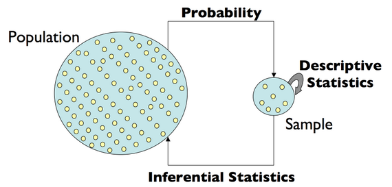
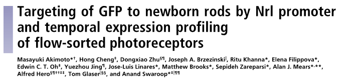
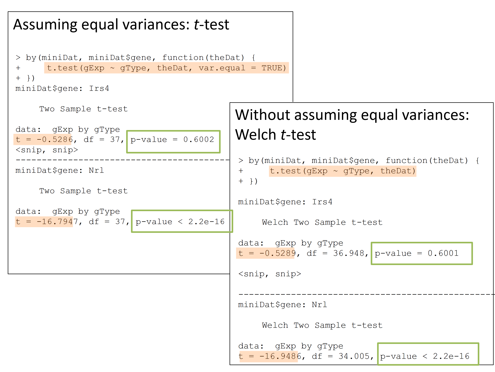
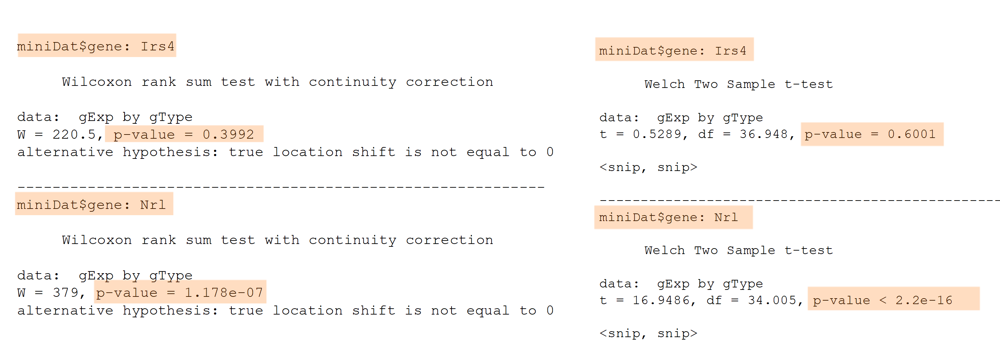
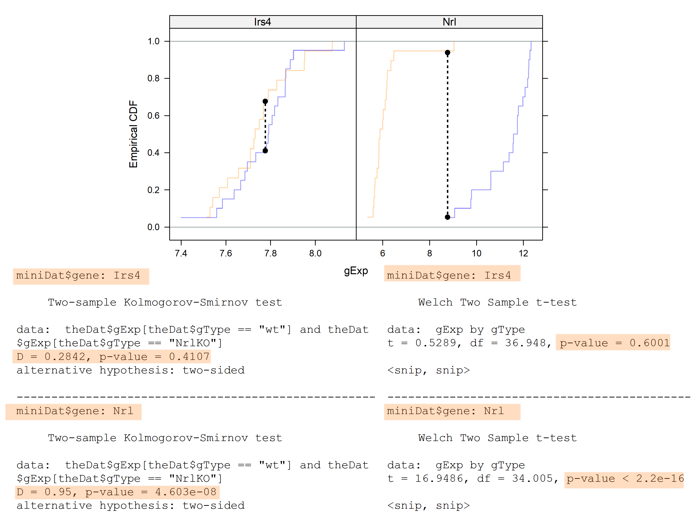

layout: true

<big>

---

<style>
div.blue { background-color:#e6f0ff; border-radius: 5px; padding: 20px;}
</style>

#  Central dogma of statistics


```{r, fig.align="center", echo = FALSE, out.width=650}
ggplot2::theme_set(ggplot2::theme_bw(base_size = 18))

```
<center><small><a href="https://www.gs.washington.edu/academics/courses/akey/56008/lecture/lecture1.pdf" style="color:grey;">Image source: Josh Akey's Lecture notes</a></small></center>

<br>We want to understand a **population** (e.g., gene behaviour) but we can only study a <font color=red>**random sample**</font> from it. 
---

#  Book and online resources

* [Modern Statistics for Modern Biology](https://www.huber.embl.de/msmb/) by Susan Holmes and Wolfgang Huber, 2019 (free online book)

* [Data Analysis for the Life Sciences](http://genomicsclass.github.io/book/) by Rafael Irizarry and Michael Love, 2015 (free online book)

* [Practical Regression and Anova using R](http://www.biostat.jhsph.edu/~iruczins/teaching/jf/faraway.html) by Julian Faraway, 2002 (free online book)

* Linear Models with R by Julian Faraway, Chapman & Hall/CRC Texts in Statistical Science, 2004 

---

#  Hypothesis Testing in Genomics


```{r, fig.align="center", echo = FALSE, out.width=600}

```

[Akimoto et al. (2006)](https://doi.org/10.1073/pnas.0508214103)

.pull-left[
- Retina presents a model system for investigating **regulatory networks** underlying neuronal differentiation.

- **Nrl** transcription factor is known to be important for Rod development
]
.pull-right[
```{r, fig.align="center", echo = FALSE, out.width=275}
knitr::include_graphics("img/cellTypes.png")
```
]


--

- <font color="red">**What happens if you delete Nrl?**

---

#  Why a Hypothesis Test?
<big>
From the [Akimoto et al. (2006) paper](https://doi.org/10.1073/pnas.0508214103): 
>"we hypothesized that Nrl is the ideal transcription factor to gain insights into gene expression changes ..."

<div class = "blue">
<b>Biological question:</b> Is the expression level of gene <ii>A</i> affected by knockout of the <i>Nrl</i> gene?
</div>
--

### We can use <font color=red>statistical inference</font> to answer this biological question!

---

#  Statistical inference

<big>
**Statistical inference**:

We observe and study a <font color=red>random sample</font> to make conclusions about a population (e.g., random sample of gene expressions from mice)


.pull-left[
**Experimental design**:
* 4 developmental stages
* 2 genotypes: Wild type (WT), Nrl Knockout (NrlKO)
* 3-4 replicates for each combination
]
.pull-right[
```{r, fig.align="right", echo = FALSE, out.width=340}
knitr::include_graphics("img/NrlKOmouse.png")
```
]
---

<big>
Let's take a look at 2 genes as an example: **Irs4 and Nrl**

<div class = "blue">
<b>Biological question:</b> Are these genes truly different in NrlKO compared to WT?
</div>

We can't answer this question in general. We can *only* study these genes in collected data:

```{r, include=FALSE}
library(dplyr)
library(ggplot2)
library(ggthemes)
library(grid)
library(gridExtra)

# jCols <- c(x = "blue", y = "orange")
# trellis.par.set(superpose.symbol = list(col = jCols),
#                 superpose.line = list(col = jCols))
jCex <- 3 

prDes <- readRDS("data/GSE4051_design.rds")
str(prDes)

prDat<-read.table("data/GSE4051_data.tsv",
                      sep = "\t", header = T, row.names = 1)
str(prDat, list.len = 10)

miniDat <- as.vector(t(prDat[c("1422248_at", "1450946_at"), ]))
miniDat <- data.frame(gene = rep(c("Irs4", "Nrl"), each = nrow(prDes)),
                      gExp = miniDat)
miniDat <- data.frame(prDes, miniDat) # ignore the warning about row names
str(miniDat)
```

```{r echo=FALSE, fig.height=3.5, dev='svg', fig.align="center"}
irsDat <- filter(miniDat, gene == "Irs4")
nrlDat <- filter(miniDat, gene == "Nrl")

irsLim <- ggplot(irsDat, aes(y = gExp, x = gType, colour = gType)) + 
             geom_point(alpha = 0.5) +
             labs(title = "Irs4 gene") +
             theme_bw() +
             theme(legend.position = "none") +
             coord_flip()
             

nrlLim <- ggplot(nrlDat, aes(y = gExp, x = gType, colour = gType)) + 
             geom_point(alpha = 0.5) +
             labs(title = "Nrl gene") +
             theme_bw() +
             theme(legend.position = "none") +
             coord_flip()

options(repr.plot.width=8, repr.plot.height=5)

grid.arrange(irsLim + ylim(5, 13), nrlLim + ylim(5, 13), ncol = 1)
```

### <font color="red"> We only observe a random sample of gene expressions.</font>


---

#  Statistical Hypothesis
<big>
** Experimental design:**
  - 2 conditions: WT *vs* NrlKO
  - random sample: we observe the expression of many genes in all mice

** Biological hypothesis:** for *some* genes, the expression levels are different between conditions.

** Statistical hypotheses:** (for each gene $g=1,...,G$)
  - H<sub>0</sub> (null hypothesis): the expression level of gene $g$ is the *same* in both conditions.
  -  <span style="color:blue">H<sub>A</sub> (alternative hypothesis): the expression level of gene $g$ is *different* between conditions.</span>
---


## Notation 

### Random variables and estimates (we can observe):

$Y_i$ : expression of gene $g$ in the WT sample $i$

$Z_i$: expression of gene $g$ in NrlKO sample $i$ 

$Y_1, Y_2,..., Y_{n_Y}$ : a <font color="red">random sample</font> of size $n_Y$

$\bar{Y}=\frac{\sum_{i=1}^{n_Y}Y_i}{n_Y}$: sample mean of gene $g$ expression from WT mice


### Population parameters (unknown/unobservable):

$\mu_Y = E[Y]$ : the (population) expected expression of gene $g$ in WT mice
---

<big>

## Is there **enough** evidence in the data to reject H<sub>0</sub>? </font>

<big>
$\color{red}{H_0: \mu_Y = \mu_Z}$

```{r echo=FALSE, fig.height=3.5, dev='svg', warning = FALSE, fig.align='center'}

irsMean <-   irsLim +
             stat_summary(geom = 'point',
                          fun.y = 'mean',
                          color = 'purple',
                          fill = 'purple',
                          shape = 17,
                          size = 2) +
             stat_summary(aes(label=paste("mean = ",round(..y..,2))), 
                          fun.y = mean, 
                          geom="text",
                          color = 'purple',
                          size=3, 
                          vjust = -1)

nrlMean <-   nrlLim +
             stat_summary(geom = 'point',
                          fun.y = 'mean',
                          color = 'purple',
                          fill = 'purple',
                          shape = 17,
                          size = 2) +
             stat_summary(aes(label=paste("mean = ",round(..y..,2))),
                          fun.y = mean, 
                          geom="text",
                          color = 'purple',
                          size=3, 
                          vjust = -1)

# Combine plots together
options(repr.plot.width=8, repr.plot.height = 3)

grid.arrange(irsMean + ylim(5, 13), nrlMean + ylim(5, 13), ncol = 1)

```

### **Statistical Inference**: random samples are used to learn about the population 
---

<small>
## What we observe: the difference between the **sample averages**: $\bar{Y}$ vs $\bar{Z}$
``` {r echo=FALSE, fig.height=2.25, dev='svg', fig.align="center"}

grid.arrange(irsMean, nrlMean, nrow = 1)

```

```{r}
theAvgs <- with(miniDat,
                 tapply(gExp, list(gType, gene), mean))
```

```{r, echo=FALSE}
round(theAvgs, 3)
```

```{r}
theDiff <- theAvgs["NrlKO", ] - theAvgs["wt", ]
```
```{r, echo=FALSE}
round(theDiff, 3)
```

---


### Is the difference between $\bar{Y}$ and $\bar{Z}$ informative to reject H<sub>0</sub>?

``` {r echo=FALSE,fig.height=3, dev='svg', fig.align="center"}

grid.arrange(irsMean, nrlMean, nrow = 1)

```

<big>
- The sample means, $\bar{Y}$ vs $\bar{Z}$, by themselves are not enough to make conclusions about the population

- What is a "large" difference? "large" relative to what?
---
class: center, middle


``` {r echo=FALSE,fig.height=3, dev='svg', fig.align="center"}

set.seed(20200117)
artDat <- data.frame("gExp" = pmax(c(rnorm(50, mean = 6.09, sd = 3), rnorm(50, mean = 11.24, sd = 3)), 0), 
                     "gType" = factor(c(rep("wt", times = 50), rep("NrlKO" , times = 50))))
levels(artDat$gType) <- rev(levels(artDat$gType))

artMean <- ggplot(artDat, aes(y = gExp, x = gType, colour = gType)) + 
             geom_point(alpha = 0.5) +
             labs(title = "Artificial gene") +
             theme_bw() +
             theme(legend.position = "none") +
             coord_flip() +
             stat_summary(geom = 'point',
                          fun.y = 'mean',
                          color = 'purple',
                          fill = 'purple',
                          shape = 17,
                          size = 2) +
             stat_summary(aes(label=paste("mean = ",round(..y..,2))),
                          fun.y = mean, 
                          geom="text",
                          color = 'purple',
                          size=3, 
                          vjust = -1)

# Combine plots together

grid.arrange(artMean, nrlMean, nrow = 1)
```


.pull-left[
### What can we use to interpret the size of the mean difference?
]
.pull-right[
### $$\frac{\bar{Y}-\bar{Z}}{??}$$
]
---
class: center, middle
### What can we use to interpret the size of the mean difference?

.pull-left[
### "large" relative to the observed variation
]
.pull-right[
### $\frac{\bar{Y}-\bar{Z}}{\sqrt{Var(\bar{Y}-\bar{Z})}}$
]

``` {r echo=FALSE,fig.height=3, dev='svg'}
# Combine plots together
grid.arrange(artMean, nrlMean, nrow = 1)
```
---

## Quantifying observed variation

<small>

* Recall that if $Var(Y_i)=\sigma_Y^2$, then $Var(\bar{Y})=\frac{\sigma_Y^2}{n_Y}$

* Assume that the random variables within each group are *independent and identically distributed* (iid), and that the groups are independent. More specifically, that
  1. $Y_1, Y_2,..., Y_{n_Y}$ are iid, 
  2. $Z_1, Z_2,..., Z_{n_Z}$ are iid, and
  3. $Y_i, Z_j$ are independent. Then, it follows that
$$ Var(\bar{Z}-\bar{Y})=\frac{\sigma_Z^2}{n_Z}+\frac{\sigma_Y^2}{n_Y}$$
* If we also assume equal population variances:</big> $\sigma_Z^2=\sigma_Y^2=\sigma^2$, then
$$Var(\bar{Z}-\bar{Y})=\frac{\sigma_Z^2}{n_Z}+\frac{\sigma_Y^2}{n_Y}=\sigma^2\left[\frac{1}{n_Z}+\frac{1}{n_Y}\right]$$
### But how can we calculate population variance $\sigma$ if it is **unknown**?
---


### ...using the sample variances (combined, somehow)!
```{r echo=FALSE, fig.height=3, dev='svg', fig.align="center"}
grid.arrange(irsMean  + ylim(5, 13), nrlMean + ylim(5, 13), ncol = 2)
```

``` {r}
theVars <- with(miniDat,
                 tapply(gExp, list(gType, gene), var))
```
.pull-left[

```{r, echo = FALSE}
round(theVars, 3)
```
]
.pull-right[
<small> $$\text{e.g., for Nrl: } \hat{\sigma}_Y^2 = S_Y^2=\frac{1}{n_Y}\sum_{i=1}^{n_Y}(Y_i-\bar{Y})^2=1.224$$
]
---


### Plug these sample variances into your chosen formula for the variance of the difference of sample means


Assuming <b>equal</b> variance of Y's and Z's

$$\hat{\sigma}_{\text{pooled}}^2=S_Y^2\frac{n_Y-1}{n_Y+n_Z-2}+S_Z^2\frac{n_z-1}{n_Y+n_Z-2}$$
$$\hat{V}(\bar{Z_n}-\bar{Y_n})=\hat{\sigma}_{\text{pooled}}^2\left[\frac{1}{n_Y}+\frac{1}{n_Z}\right]$$
<br>
Assuming <b>unequal</b> variance of Y's and Z's
$$\hat{V}(\bar{Z_n}-\bar{Y_n})=\hat{\sigma}_{\bar{Z}_n-\bar{Y}_n}^2=\frac{S_Y^2}{n_Y}+\frac{S_Z^2}{n_Z}$$

> Note: the 'hat' (^) is used to distinguish an 'estimate' from a 'parameter'.

---


```{r, include=FALSE}
## compute difference of sample averages
(theAvgs <- with(miniDat,
                 tapply(gExp, list(gType, gene), mean)))

(theDiff <- theAvgs["NrlKO", ] - theAvgs["wt", ])

## compute sample variances
(theVars <- with(miniDat,
                 tapply(gExp, list(gType, gene), var)))

## compute estimated variance of zbar - ybar
(nY <- with(miniDat, sum(gType == "wt" & gene == "Nrl")))
(nZ <- with(miniDat, sum(gType == "NrlKO" & gene == "Nrl")))

## assuming unequal true variance
(s2DiffWelch <- colSums(theVars / c(nY, nZ)))

## assuming equal true variance
(s2Pooled <- colSums(theVars * c((nY - 1) / (nY + nZ - 2),
                                 (nZ - 1) / (nY + nZ - 2))))

(s2Diff <- s2Pooled * (1/nY + 1/nZ))

(welchStat <- theDiff / sqrt(s2DiffWelch))

by(miniDat, miniDat$gene, function(theDat) {
  ## to be compatible with the direction of the test, as I've described in
  ## lecture slides, I need to reverse order of levels of gType factor
  theDat$gType <- factor(theDat$gType, rev(levels(theDat$gType)))
  t.test(gExp ~ gType, theDat)
})

(tstStat <- theDiff / sqrt(s2Diff))

by(miniDat, miniDat$gene, function(theDat) {
  theDat$gType <- factor(theDat$gType, rev(levels(theDat$gType)))
  t.test(gExp ~ gType, theDat, var.equal = TRUE)
})
```


##  The Test Statistic:  <small> $T=\frac{\bar{Z}_n-\bar{Y}_n}{\hat{\sigma}_{\bar{Z}_n-\bar{Y}_n}}$</small>

<small>

Assuming equal variances:
```{r}
tstStat <- theDiff / sqrt(s2Diff)
```
```{r, echo=FALSE}
round(tstStat, 3)
```
Without assuming equal variances:
```{r}
welchStat <- theDiff / sqrt(s2DiffWelch)
```
```{r, echo=FALSE}
round(welchStat, 3)
```
### Can we now say that the observed differences are 'big'?

The difference is about half a standard deviation for Irs4 and ~16 standard deviations for Nrl. 

---

class:middle

### The test statistic T is a <font color=red>random variable</font> because it's based on our <font color=red>random sample</font>.

### We need a measure of its **uncertainty** to determine how big T is:
> ### If we were to repeat the experiment many times, what's the probability of observing a value of T **as extreme** as the one we observed?

### We need to have a probability distribution!
### However, this is unknown to us so we need to **make more assumptions**.
---


### Theory now tells us specific **null distributions** for these test statistics, depending on your assumptions.

Let's call the unknown probability distributions F and G $(Y_i \sim F, \text{ and } Z_i \sim G)$

### $\large\Rightarrow$ Willing to assume that F and G are normal distributions?

.pull-left[
###  2-sample *t*-test: 
 <center> (equal variances)
$$T\sim t_{n_Y+n_Z-2}$$
]
.pull-right[
###  Welch test:
<center> (unequal variances)
$$T\sim t_{<something\,ugly>}$$
]

--

<br>
### $\large\Rightarrow$ Unwilling to assume that F and G are normal distributions? But you feel that n<sub>Y</sub> and n<sub>Z</sub> are large enough?

Then the t-distributions above or even a normal distribution are decent approximations.

---


## Student's *t*-distribution
### Recall that T is a **random variable**. Under certain assumptions, we can prove that T follows a *t*-distribution.


```{r, fig.align="center", echo = FALSE, out.width=400}
knitr::include_graphics("img/tdist.png")
```


where df = degrees of freedom.
---

#  Hypothesis testing

### 1. Formulate your hypothesis as a statistical hypothesis: $$H_0: \mu_Y = \mu_Z \text{ vs } H_A: \mu_Y \neq \mu_Z$$
### 2a. Define a **test statistic**: 2-sample *t*-test
### 2b. Compute the <font color=red>observed value</font> for the test statistic:

```{r}
tstStat <- theDiff / sqrt(s2Diff)
```
```{r, echo=FALSE}
round(tstStat, 3)
```

---

### 3. Compute the probability of seeing a test statistic at least as extreme as that observed, under the **null sampling distribution** (this is the definition of the p-value) 


``` {r, echo=FALSE}
by(miniDat, miniDat$gene, function(theDat) {
  theDat$gType <- factor(theDat$gType, rev(levels(theDat$gType)))
  t.test(gExp ~ gType, theDat, var.equal = TRUE)$p.value})
```

.pull-left[
### In other words, assuming that H<sub>0</sub> is true: 
For Irs4, the probability of seeing a test statistic as extreme as that observed $(t = -0.53)$ is pretty high $(p = 0.6)$.

But for Nrl, the probability of seeing a test statistic as extreme as that observed $(t = -16.8)$ is extremely low $(p=6.76 \times 10^{-19})$

]
.pull-right[
```{r echo=FALSE, fig.height=5.5, fig.width=9.5, dev='svg', warning = FALSE, fig.align='center'}

# function modified from webr package to plot tail area of t-test
plot.test=function(x,...){
     lim <- 4
     if (abs(x$statistic) > 4){
       lim <- abs(x$statistic)
     }

     tests=c("Welch Two Sample t-test"," Two Sample t-test")
     if(!(x$method %in% tests)) {
          cat("Currently, ",x$method," is not supported")
          return(invisible(0))
     }
     (degf=x[[2]])
     statName=tolower(attr(x$statistic,"names"))
     statName
     alpha=1-attr(x$conf.int,"conf.level")
     
     alternative<-x$alternative
     (newalpha=alpha)
     if(alternative=="two.sided") newalpha=alpha/2

     qF=function(...){
          eval(parse(text=paste0("q",statName,"(...)")))
     }
     dF=function(...){

               eval(parse(text=paste0("d",statName,"(...)")))
     }
     x0 <- seq(-lim,lim,length=1000)
     if(x[[1]]>lim) {
       x0=c(x0,x[[1]])
     } else if(x[[1]] < -lim) {
       x0=c(x[[1]],x0)
     }
     x0
     y0=dF(x0,df=degf)
     y0
     
     x1=seq(min(lim+1, qF(p=1-x$p.value/2,df=degf)),lim,length=50)
     y1=dF(x1,df=degf)
     x2=seq(-lim,max(-lim - 1, qF(p=x$p.value/2, df=degf)),length=50)
     y2=dF(x2,df=degf)
     
     data=data.frame(x=x0,y=y0)
     data
     data1=data.frame(x=x1,y1=y1)
     data2=data.frame(x=x2,y1=y2)
     x
     label=paste0(sprintf("%9s",attr(x$statistic,"names"))," = ",
                   sprintf("%.03f",x$statistic))
     if(length(degf)==2) {
          label=c(label,paste0("num df=",degf[1],", denom df=",degf[2]))
     } else {
          label=c(label,paste0(sprintf("%9s","df")," = ",sprintf("%.0f",degf)))
     }

     if(x[[3]]>=0.00001) {
          label=c(label,paste0(sprintf("%9s","p")," = ",sprintf("%.5f",x[[3]])))
     } else {
          label=c(label,paste0(sprintf("%9s","p")," < 0.00001"))
     }
     label=stringr::str_pad(label,19,side="left")

     label=stringr::str_c(label,collapse="\n")
     label
     p2<-ggplot(data,aes_string(x="x",y="y"))+geom_line()+theme_bw()
     if(alternative!="less")  p2<-p2+geom_area(data=data1,aes(x1,y1),fill="red",alpha=0.5)
     if(alternative!="greater")  p2<-p2+ geom_area(data=data2,aes(x2,y2),fill="red",alpha=0.5)
     p2
     if(abs(x$statistic)>lim) {
          hjust=1
     } else if(x$statistic>0) {
          hjust=-0.1
     } else hjust=0.1
     
     ypoint=dF(x$statistic,df=degf)
     ypoint
     xpoint=qF(p=1-newalpha,df=degf)
     xpoint2=qF(p=newalpha,df=degf)
    
     p2<-p2+geom_vline(xintercept=x[[1]], color="blue", linetype="dashed")
     p2<-p2+ annotate(geom="label",x=Inf,y=Inf,label=label,vjust=1.1,hjust=1.1)

     p2<-p2+labs(title=x$method,x=paste0(statName," statistic"),y="Probability Density")+theme(plot.title=element_text(hjust=0.5))

     p2
}


tres <- by(miniDat, miniDat$gene, function(theDat) {
  theDat$gType <- factor(theDat$gType, rev(levels(theDat$gType)))
  t.test(gExp ~ gType, theDat, var.equal = TRUE)
})


p1 <- plot.test(tres[[1]]) + ggtitle("Irs4") +
  theme(axis.title=element_text(size=20),
        plot.title = element_text(size = 30),
        legend.text=element_text(size=18))
p2 <- plot.test(tres[[2]]) + ggtitle("Nrl")+
  theme(axis.title=element_text(size=20),
        plot.title = element_text(size = 30),
        legend.text=element_text(size=18))

grid.arrange(p1, p2, nrow=1)

```
]

---


### 4. Make a decision about significance of results, based on a pre-specified value (alpha, significance level)


The significance level $\alpha$ is usually set at 0.05. However, this value is arbitrary and usually depends on the study.

Using $\alpha=0.05$, since the p-value for the Irs4 test is greater than 0.05, we conclude that there is not <font color=red>*enough*&nbsp; evidence </font> in the data to claim that Irs4 has a differential expression in WT compared to Nrl models. 

We do not reject H<sub>0</sub>!

---
class: center


```{r, fig.align="center", echo = FALSE, out.width=850}

```

---


## What is a p-value?

> Likelihood of obtaining a test statistic at least <font color=green> as extreme as the one observed</font>, given that the null hypothesis is true (we are making a conditional probability statement)

## What is a p-value <font color=red>NOT</font>?

- Not the probability that the <font color=red>null hypothesis is true</font>

- Not the probability that the <font color=red>finding is a “fluke”</font>

- Not the probability of <font color=red>falsely rejecting the null</font>

- Does not <font color=red>indicate the size or importance</font> of observed effects. 

*[Credit to Dr. Fowler, UW]*
---

<big>
## "Genome-wide" testing of differential expression
- In genomics, we often perform thousands of statistical tests (e.g., a *t*-test per gene)

- The distribution of p-values across all tests provide good diagnostics/insights.

- Is it uniform (should be in most experiments) and if not, is the departure from uniform expected based on biological knowledge?

--
### Different kinds of *t*-tests:
- One sample *or* **two samples**
- One-sided *or* **two sided**
- Paired *or* **unpaired**
- **Equal variance** *or* unequal variance

---


# Types of Errors in Hypothesis Testing

```{r, fig.align="center", echo = FALSE, out.width=675}
knitr::include_graphics("img/hypError.png")
```

<br>
$$ \alpha = P(\text{Type I Error}), \text{   } \beta = P(\text{Type II Error}), \text{   Power} = 1- \beta$$ 
---

# $H_0$: "*Innocent until proven guilty*"

<big>

* The default state is $H_0 \rightarrow$ we only reject if we have enough evidence

* If $H_0$: Innocent and $H_A$: Guilty, then

    * Type I Error $(\alpha)$: Wrongfully convict innocent (*False Positive*)
    
    * Type II Error $(\beta)$: Fail to convict criminal (*False Negative*)

---


>What if you don't wish to assume the underlying data is normally distributed **AND** you aren't sure your samples are large enough to invoke CLT?


## What are alternatives to the *t*-test?


<big>
First, one could use the t test statistic but use a **bootstrap approach** to compute its p-value. We will cover this later on.

Alternatively, there are *non-parametric* tests that are available here:

- **Wilcoxon rank sum test**, aka Mann Whitney, uses ranks to test differences in population means.

- **Kolmogorov-Smirnov test** uses the empirical CDF to test differences in population cumulative distributions.

---


# Wilcoxon rank sum test

<big>
Rank all data, ignoring the **grouping** variable

**Test statistic** = sum of the ranks for one group (optionally, subtract the minimum possible which is $\frac{n_Y(n_Y+1)}{2}$)

(Alternative but equivalent formulation based on the number of $y_i, z_i$ pairs for which $y_i \geq z_i$)

Null distribution of such statistics can be worked out or approximated.

---

```{r, fig.align="center", echo = FALSE, out.width=850}

```


```{r echo=FALSE, fig.height=2.5, dev='svg', fig.align="center"}
options(repr.plot.width=8, repr.plot.height=3)

grid.arrange(irsLim, nrlLim, ncol = 2)
```
---


# Kolmogorov-Smirnov test (two sample)

<big>

**Null hypothesis**: F = G, i.e. the distributions are the same

Estimate each CDF with the empirical CDF (ECDF)

$$\hat{F}(x)=\frac{1}{n}\sum_{i=1}^n{I[x_i\leq{x}]}$$

**Test statistic** is the maximum of the absolute difference between the ECDFs

$$max|\hat{F}(x)-\hat{G}(x)|$$

Null distribution does not depend on F, G (!)
<br>(I'm suppressing a detail here.)

---


```{r, fig.align="center", echo = FALSE, out.width=800}

```

---


# Discussion and questions ...
<big>

What if you are unsure whether your sample size is large enough? Outliers with small samples could be problematic

Which test result should one report ... the 2-sample *t*-test, the Wilcoxon, or the KS?

Treat p-values as one type of evidence that you should incorporate with others. 

It is worrisome when methods that are equally appropriate and defensible give very different answers.

