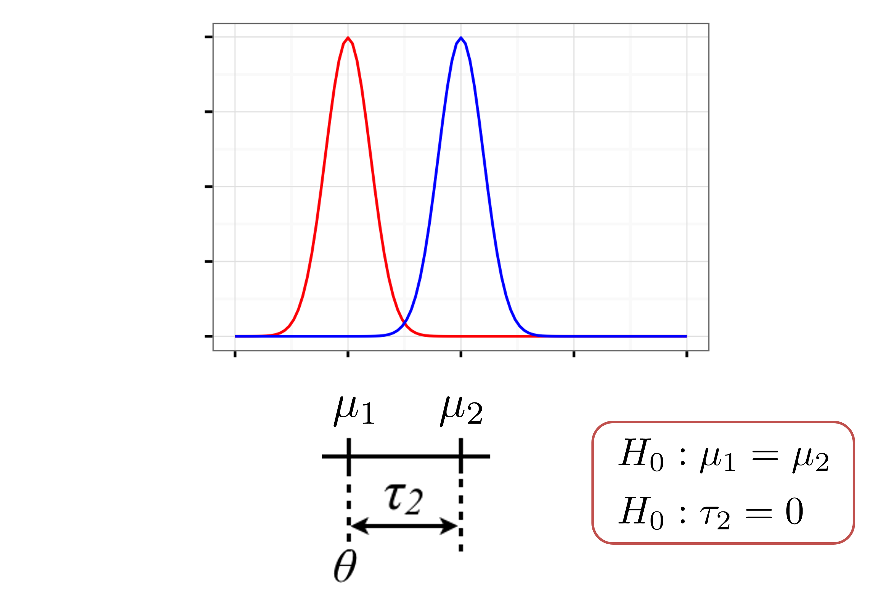
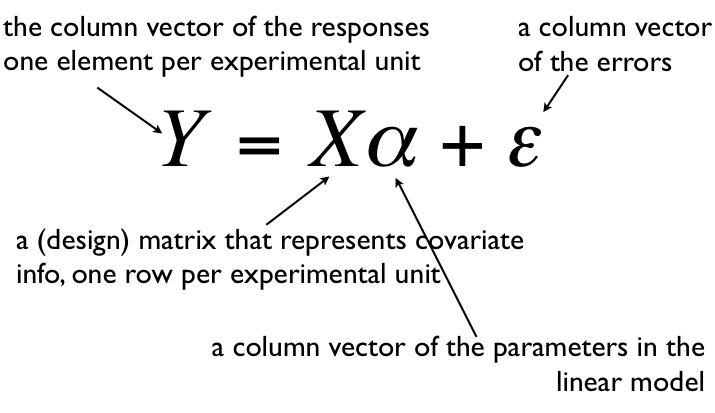
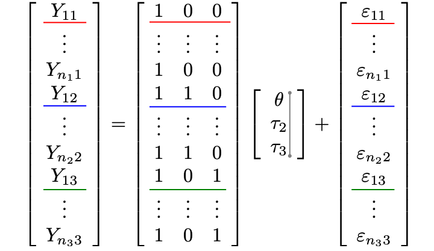

class: middle, center
### <font color="red"> Recap: Are these genes truly different in NrlKO compared to WT?</font>

### H<sub>0</sub>: the expression level of gene $g$ is the same in both conditions.

### Is there **enough** evidence in the data to reject H<sub>0</sub>?

```{r, include=FALSE}
library(dplyr)
library(ggplot2)
library(ggthemes)
library(grid)
library(gridExtra)
library(lattice)
library(latticeExtra)

jCols <- c(x = "blue", y = "orange")
trellis.par.set(superpose.symbol = list(col = jCols),
                superpose.line = list(col = jCols))
jCex <- 3 

prDes <- readRDS("data/GSE4051_design.rds")
str(prDes)

prDat<-read.table("data/GSE4051_data.tsv",
                      sep = "\t", header = T, row.names = 1)
str(prDat, list.len = 10)

miniDat <- as.vector(t(prDat[c("1422248_at", "1450946_at"), ]))
miniDat <- data.frame(gene = rep(c("Irs4", "Nrl"), each = nrow(prDes)),
                      gExp = miniDat)
miniDat <- data.frame(prDes, miniDat) # ignore the warning about row names
miniDat$gType <- factor(miniDat$gType, rev(levels(miniDat$gType)))
str(miniDat)
```

```{r echo=FALSE, fig.height=3.5, fig.width=9, dev='svg'}
irsDat <- filter(miniDat, gene == "Irs4")
nrlDat <- filter(miniDat, gene == "Nrl")

irsLim <- ggplot(irsDat, aes(x = gExp, y = gType, colour = gType)) + 
             geom_point(alpha = 0.5) +
             labs(title = "Irs4 Gene Expression") +
             
             theme(legend.position = "none") +
             xlim(5, 15)

nrlLim <- ggplot(nrlDat, aes(x = gExp, y = gType, colour = gType)) + 
             geom_point(alpha = 0.5) +
             labs(title = "Nrl Gene Expression") +
             
             theme(legend.position = "none") +
             xlim(5, 15)

options(repr.plot.width=8, repr.plot.height=5)

grid.arrange(irsLim, nrlLim, ncol = 2)
```

---

## **Statistics**: use a random sample to learn about the population


.pull-left[
### <center>**Population** (Unknown)
$$Y \sim F$$
$$Z \sim G$$
$$E[Y] = \mu_Y$$
$$E[Z] = \mu_Z$$
$$H_0: \mu_Y = \mu_Z$$

$$H_A: \mu_Y \neq \mu_Z$$

]
.pull-right[
### <center> **Sample** (Observed, with randomness)

$$Y_1, Y_2, ..., Y_{n_Y}$$

$$Z_1, Z_2, ..., Z_{n_Z}$$
$$\hat{\mu}_Y = \bar{Y} = \frac{\sum_{i=1}^{n_Y} Y_i}{n_Y}$$
$$T = \frac{\bar{Y}-\bar{Z}}{\sqrt{Var(\bar{Y}-\bar{Z}))}}$$
]


---

# Summary: Hypothesis testing

### 1. Formulate scientific hypothesis as a <font color = "red">statistical hypothesis</font> $(H_0 \text{ vs } H_A)$

### 2. Define a <font color = "red">test statistic</font> to test $H_0$ and compute its <font color=red>observed value</font>. For example:
<small>
- 2-sample *t*-test
- Welch *t*-test (unequal variance)
- Wilcoxon rank-sum test
- Kolmogorov-Smirnov test
</small>

### 3. Compute the probability of seeing a test statistic as extreme as that observed, under the <font color = "red">null sampling distribution</font> (p-value) 
### 4. Make a decision about the <font color = "red">significance</font> of the results, based on a pre-specified value ( $\alpha$, significance level)
---

## We can run these tests in R 

### Example: use the `t.test` function to test $H_0$ using a classical 2-sample *t*-test with equal variance.
.smaller[
``` {r}
miniDat %>% 
  subset(gene=="Irs4") %>%
  t.test(gExp ~ gType, data=., var.equal = TRUE)
```
]
---

# Today...

### 1. Show how to compare means of different groups (2 or more) using a linear regression model

  - 'dummy' variables to model the levels of a qualitative explanatory variable

### 2. Write a linear model using matrix notation

  - understand which matrix is built by R
  
### 3. distinguish between conditional and marginal effects
  - $t$-tests vs $F$-tests  
  
---

# $H_0: \mu_1 = \mu_2$

### 2-sample t-test (with equal variance)
```{r, eval=FALSE, echo = TRUE}
t.test(gExp ~ gType, data=miniDat, subset = gene=="Irs4",
       var.equal = TRUE)
```
### (one-way) Analysis of Variance (ANOVA)
```{r, eval=FALSE, echo = TRUE}
summary(aov(gExp ~ gType, data=miniDat, subset = gene=="Irs4"))
```
### Linear regression model
```{r, eval=FALSE, echo = TRUE}
summary(lm(gExp ~ gType, data=miniDat, subset = gene == "Irs4"))
```
---

# All three methods give the same result!

.pull-left[
.smaller[
## 2-sample t-test (with equal variance)

```{r, eval=TRUE, echo = FALSE, tidy=TRUE, linewidth=37, highlight.output = 5:6}
t.test(gExp ~ gType, data=miniDat, subset = gene=="Irs4", var.equal = TRUE)
```
]]
.pull-right[
.smaller[
## (one-way) Analysis of Variance (ANOVA)
```{r, eval=TRUE, echo = FALSE, tidy=TRUE, linewidth=37, highlight.output=2}
summary(aov(gExp ~ gType, data=miniDat, subset = gene=="Irs4"))
```
## Linear regression model
```{r, eval=TRUE, echo = FALSE, linewidth=37, output.lines=c(11:16), highlight.output=6}
summary(lm(gExp ~ gType, data=miniDat, subset = gene == "Irs4"))
```
]]


---

```{r, fig.align="center", echo = FALSE, out.width=800}
knitr::include_graphics("img/t_aov_lm_res.png")
```

---

## *t*-test *vs* linear regression: <font color = "red">why the same results?</font>

.smaller[
``` {r}
irs4Dat <- subset(miniDat,gene=="Irs4")
ttest.irs4<-t.test(gExp ~ gType, irs4Dat, var.equal = TRUE)
list("t value"=ttest.irs4$stat,"p-value"=ttest.irs4$p.value)
```


```{r}
lm.irs4 <- summary(lm(gExp ~ gType, irs4Dat))
list("t value"=lm.irs4$coeff[2,3],"p-value"=lm.irs4$coeff[2,4])
```
]

---

## *t*-test vs linear regression: <font color = "red">where's the line?</font>

```{r echo=FALSE, fig.width=10, fig.height= 4, fig.align="center"}
irsDat <- filter(miniDat, gene == "Irs4")
nrlDat <- filter(miniDat, gene == "Nrl")

irsLim <- ggplot(irsDat, aes(x = gExp, y = gType, colour = gType)) + 
             geom_point(alpha = 0.5) +
             labs(title = "Irs4") +
             theme(legend.position = "none") +
             xlim(5, 15)

nrlLim <- ggplot(nrlDat, aes(x = gExp, y = gType, colour = gType)) + 
             geom_point(alpha = 0.5) +
             labs(title = "Nrl") +
             theme(legend.position = "none") +
             xlim(5, 15)

grid.arrange(irsLim, nrlLim, ncol = 2)
```
> Note that the $y$-axis in these plots is not numerical, thus a line in this space does not have any mathematical meaning. 

### Why can we run a $t$-test with a <font color = "red">linear</font> regression model?
---

# From *t*-test to linear regression
Let's change the notation to give a common framework to all methods

$$Y \sim G; \; E[Y] = \mu_Y$$
 <center> **↓** </center>

$$Y = \mu_Y + \varepsilon_Y; \; \varepsilon_Y \sim G; \; E[\varepsilon_Y] = 0$$ 

We can use a subindeces to distinguish observations from each group, i.e., 

<font size=5> $$Y_{ij} = \mu_j + \varepsilon_{ij};\; \; \varepsilon_{ij} \sim G_j; \; \;E[\varepsilon_{ij}] = 0;$$ </font>
<br>
where $j = \textrm{\{wt, NrlKO}\}$ or $j=\textrm{\{1, 2}\}$ identifies the groups; 
and $i=1, \ldots, n_j$ identifies the observations within each group
<br>

 > For example: $Y_{11}$ is the first observation in group 1 or WT
 
---

# Cell-means model

The goal is to test 

 $$H_0 : \mu_1 = \mu_2$$

using data from the model

<font size=5> $$Y_{ij} = \mu_j + \varepsilon_{ij};\; \; \varepsilon_{ij} \sim G; \; \;E[\varepsilon_{ij}] = 0;$$</font>
<br>
where $j = \textrm{\{wt, NrlKO}\}$ or $j=\textrm{\{1, 2}\}$; and $i=1, \ldots, n_j$.
<br>

> For simplicity, we assume a common distribution $G$ for all groups

--

<br>
### Note that the population means are given by $E[Y_{ij}] = \mu_j$, i.e., the model is written with a <font color = "red">cell-means</font> $(\mu_j)$ parametrization
---

# Recall: sample mean estimator of population mean 

Note that for each group, the <font color = "red">population</font> mean is given by 
 $$E[Y_{ij}] = \mu_j,$$ 

* A natural **estimator** of the population mean is the <font color = "red">**sample mean**</font>

* Classical hypothesis testing methods use the group sample means as estimators

* See, for example, the `t.test` function in R:

```{r}
ttest.irs4$estimate
```
---

## However, the `lm` function reports other estimates, <font color = "red">why?</font>  

```{r, tidy = FALSE}
(means.irs4<-as.data.frame(irs4Dat %>% group_by(gType) %>%
                             summarize(meanGroups=mean(gExp,digits=6))))
```

```{r}
lm.irs4$coefficients[,1]
```
<center> **↓**
<br>
.pull-left[
`(Intercept)` is the <font color = "red">sample mean</font> of NrlKO group 
]
.pull-right[
but `gTypewt` is <font color = "red">not</font> the sample mean of the WT group
]
---


## Parametrizations: which parameters should we use to write the model?

By default, the `lm` does not use the cell-means parametrization 
The goal is to *compare* the means, not to study each in isolation


Let's reformulate from <font color=red>**cell-means**</font> $(\mu_j)$:  $$Y_{ij} = \mu_j + \varepsilon_{ij};\; \; \varepsilon_{ij} \sim G; \; \;E[\varepsilon_{ij}] = 0;$$

**<center>↓</center>**

to <font color = "red">**reference-treatment effect**</font> $(\theta,\tau_j)$: $$Y_{ij} = \theta+\tau_j + \varepsilon_{ij};\; \; \tau_1=0, \; \; \varepsilon_{ij} \sim G; \; \;E[\varepsilon_{ij}] = 0;$$

--

* Note that for each group, the population mean is given by $E[Y_{ij}] = \theta+\tau_j=\mu_j,$
and $\tau_2=\mu_2-\mu_1=E[Y_{i2}] -E[Y_{i1}]$ *compares* the means

* $\tau_1$ must be set to zero, since group 1 is the *reference* group
---


## Relation between parametrizations

```{r, fig.align="center", echo = FALSE, out.width=800}

```

---

### `lm` reports the sample mean of the <font color = "red">reference</font> group (NrlKO): $\hat\theta$

### and the <font color = "red">treatment effect</font>, i.e., difference between the sample means of both groups: $\hat\tau_2$
 
```{r,tidy=TRUE, tidy.opts=list(width.cutoff=35)}
lm.irs4$coefficients[,1]
data.frame(meanWT=means.irs4[1,2],
        meanDiff=diff(means.irs4$meanGroups))
```

---

## We still haven't answered our question ... where's the line?? 

<Big> 
$$Y_{ij} = \theta+\tau_j + \varepsilon_{ij};\; \; \tau_1=0, \; \; \varepsilon_{ij} \sim G; \; \;E[\varepsilon_{ij}] = 0;$$

```{r,echo=FALSE,fig.width=7, fig.height= 4, fig.align='center'}
nrlLim
```
---

# <font color="red">Dummy</font> variables

Let's re-write our model using <font color="red">dummy</font> (or indicator) variables:

$$Y_{ij} = \theta+\tau_j + \varepsilon_{ij};\; \; \tau_1=0, \; \; \varepsilon_{ij} \sim G; \; \;E[\varepsilon_{ij}] = 0;$$
**<center>↓</center>**

$$Y_{ij} = \theta+\tau_2 \times x_{ij} + \varepsilon_{ij};\; \; x_{ij}=\bigg\{\begin{array}{l} 
1\text{ if } j=2\\
0 \text{ otherwise}\\
\end{array}$$

--

> Note that $Y_{i1} = \theta + \varepsilon_{i1}$, because $x_{i1}=0$ 
> and $Y_{i2} = \theta + \tau_2+ \varepsilon_{i2}$, because $x_{i2}=1$ (for all $i$)

The second form is written as a <font color="red">linear</font> ( $y=a + bx +\varepsilon$ ) regression, with a special (<font color="red">dummy</font>) explanatory variable <font color="red"> $x_{ij}$ </font> 
---


  
### Using dummy variables to model our categorical variables `gtype` we can perform a  <font color = "red">2-sample *t*-test</font> with a linear model

$$Y_{ij} = \theta+\tau_2 \times x_{ij} + \varepsilon_{ij};\; \; x_{ij}=\bigg\{\begin{array}{l}
1 \text{ if } j=2\\
0 \text{ if } j=1\\
\end{array}$$

.pull-left[
``` {r}
list("t value"=ttest.irs4$stat,
     "p-value"=ttest.irs4$p.value)
```
]
.pull-right[
```{r}
list("t value"=lm.irs4$coeff[2,3],
     "p-value"=lm.irs4$coeff[2,4])
```
]

---

## Beyond 2-groups comparisons: difference of means

```{r,echo=FALSE, out.width="700", fig.align="center"}
knitr::include_graphics("img/more_2_groups.png")
```

---


  
## Dummy variables can be used to model one *or more* categorical variables with 2 *or more* levels!

### <font color = "red">2-sample *t*-test</font> using a linear model

$$Y_{ij} = \theta+\tau_2 \times x_{ij} + \varepsilon_{ij};\; \; x_{ij}=\bigg\{\begin{array}{l}
1 \text{ if } j=2\\
0 \text{ if } j=1\\
\end{array}$$

### <font color = "red">1-way ANOVA with many levels</font> $^{(*)}$ using a linear model
$$Y_{ij} = \theta+\tau_2 \times x_{ij2} + \tau_3 \times x_{ij3} +\varepsilon_{ij};\; \; x_{ij2}=\bigg\{\begin{array}{l}
1\text{ if } j=2\\
0 \text{ otherwise}\\
\end{array}; \; x_{ij3}=\bigg\{\begin{array}{l}
1\text{ if } j=3\\
0 \text{ otherwise}\\
\end{array}$$

### This is why R can estimate all of them with `lm()`
<small>
$^{(*)}$ in general, *yet* another parametrization can be used to present ANOVA 
---


## <font color = "red">t-test</font> 
  > Special case of <font color = "red">ANOVA</font>, but with ANOVA you can compare **more than two groups** and **more than one factor**.
    
## <font color = "red">ANOVA</font> 

  > Special case of <font color = "red">linear regression</font>, but with linear regression you can include **quantitative variables** in the model. 
  
## <font color = "red">Linear regression</font> 

  > Provides a unifying framework to model the association between a response **many quantitative and qualitative variables**. 
 
### <font color = "red">In R</font>: all can be computed using the `lm()` function. 
---

# Linear models using matrix notation

```{r,echo=FALSE, out.width="700", fig.align="center"}

```

### It will become handy to write our model using matrix notation
---

<Big>

Let's form an $X$  matrix for a 3-groups comparison: 

$$Y_{ij} = \theta+\tau_2 \times x_{ij2} + \tau_3 \times x_{ij3} +\varepsilon_{ij}$$
<div style= "float:right; position: relative; top: -25px;">
```{r,echo=FALSE, out.width="600", fig.align="right"}

```
</div>

Note that $x_{ij2}$ and $x_{ij3}$ become the 2nd and 3rd columns of $X$:

* $x_{i12}=x_{i13}=0$ for the reference group

* $x_{i22}=1$ for the 2nd group 

* $x_{i33}=1$ for the 3rd group


---

<div style= "top: -15px;">
```{r,echo=FALSE,out.width="700", fig.align="center"}

```
</div>

 <font color = "red"> $Y_{i1}= 1 \times \theta + 0 \times \tau_2 + 0 \times \tau_3 + \varepsilon_{i1} =\theta + \varepsilon_{i1}$

 <font color = "blue"> $Y_{i2}= 1 \times \theta + 1 \times \tau_2 + 0 \times \tau_3 + \varepsilon_{i2}=\theta + \tau_2+\varepsilon_{i2}$

 <font color = "green"> $Y_{i3}= 1 \times \theta + 0 \times \tau_2 + 1 \times \tau_3 + \varepsilon_{i3}=\theta + \tau_3+\varepsilon_{i3}$

<font color = "black">
$$\; Y_{ij} = \theta +\tau_2 \times x_{ij2} + \tau_3 \times x_{ij3} + \varepsilon_{ij}$$

---


```{r,echo=FALSE, fig.align="center", out.width=650}

```

### Note that the model is still written with a reference-treatment parametrization (difference of means)


$E[Y_{i1}]=\theta$
<br>

$E[Y_{i2}]=\theta+\tau_2 \; \rightarrow \tau_2=E[Y_{i2}]-E[Y_{i1}]=\mu_2-\mu_1$
<br>

$E[Y_{i3}]=\theta+\tau_3 \; \rightarrow \tau_3=E[Y_{i3}]-E[Y_{i1}]=\mu_3-\mu_1$

---


### <font color = "red">Linear regression</font> can include **quantitative & qualitative covariates**. 


```{r,echo=FALSE, out.width="625", fig.align="center"}

```

> <font color="red">Linear</font> in the parameters $\alpha$: $X$ can contain $x^2$, $log(x)$, etc.

---

## How it works in practice using <font color=red>lm()</font> in R

<big>

## $$Y = X\alpha + \varepsilon$$ 
<center> **↓**
<br>

```
lm(y ~ x, data = yourData)
```
</center>
.pull-left[
<font color = red> y ~ x: </font> formula, 
<br><font color = red>y</font> numeric, 
<br><font color = red>x</font> numeric and/or factor
]

.pull-right[
<font color = red> yourData: </font> data.frame in which x and y are to be found (optional but recommended)
]
<br>
### <center> By default, R uses a ref-tx parametrization but you can control that!
---

# Special `factor` class in R 

## $$Y=X\alpha+\varepsilon$$
- ### Mathematically, $X$ is a numeric matrix
- ### If your data contains categorical variables (e.g., `gType`), you need to set them as **factors**
> especially important if your categorical variables are encoded numerically (`lm` will automaticlaly treat character variables as factors)!
- ### R creates appropriate dummy variables for factors!

```{r}
str(irs4Dat$gType)
```
---


### Under the hood, R creates a numeric $X$:

.smaller[
```{r,tidy=TRUE, tidy.opts=list(width.cutoff=45)}
model.matrix(gExp ~ gType, irs4Dat) %>% head(10)
irs4Dat$gType %>% head(10)
```
]

---

## Beyond 2-group comparisons in our case study:

### <font color="red"> Is the expression of gene A the same at all developmental stages?</font>

$$H_0 : \mu_{E16} = \mu_{P2} = \mu_{P6} = \mu_{P10} = \mu_{4W}$$
<center>
```{r, include=FALSE}
library(lattice)

prDes <- readRDS("data/GSE4051_design.rds")

prDat<-read.table("data/GSE4051_data.tsv",
                      sep = "\t", header = T, row.names = 1)

## I've selected this as our hit
theHit <- which(rownames(prDat) == "1440645_at") # 17843
## and this as our boring gene
theBore <- which(rownames(prDat) == "1443184_at") # 18898

keepers <- data.frame(row = c(theBore, theHit),
                       probesetID = I(rownames(prDat)[c(theBore, theHit)]))

devDat <- as.vector(t(prDat[keepers$probesetID, ]))
devDat <- data.frame(gene = rep(c("geneA", "geneB"), each = nrow(prDes)),gExp = devDat)
devDat <- data.frame(prDes, devDat)

boreDat <- filter(devDat, gene == "geneA")
hitDat <- filter(devDat, gene == "geneB")
```

```{r, echo=FALSE, fig.width=12.5, fig.height=4, dev='svg', fig.align="center"}
boreLim <- ggplot(boreDat, aes(x = devStage, y = gExp)) + 
             geom_jitter(width = 0.2, alpha = 0.5) +
             labs(title = "geneA") +
             theme(legend.position = "none") +
             ylim(5, 10) +
             xlab("") +
             stat_summary(aes(group=1), fun.y=mean, geom="line", colour="red")

hitLim <- ggplot(hitDat, aes(x = devStage, y = gExp)) + 
             geom_jitter(width = 0.2, alpha = 0.5) +
             labs(title = "geneB") +
             theme(legend.position = "none") +
             ylim(5, 10) +
             ylab("") +
             xlab("") +
             stat_summary(aes(group=1), fun.y=mean, geom="line", colour="red")

grid.arrange(boreLim, hitLim, nrow = 1)
```


<small>
Note: 4W = 4_weeks

---

### The <font color="red">sample</font> means: $\hat\mu_{E16}, \; \hat\mu_{P2}, \; \hat\mu_{P6}, \; \hat\mu_{P10}, \; \hat\mu_{4W}$
``` {r}
with(devDat, tapply(gExp, list(devStage, gene), mean))
```

```{r, echo=FALSE, fig.height= 3, dev='svg', fig.align="center", fig.width=10}
grid.arrange(boreLim, hitLim, nrow = 1)
```
---

## "geneB" with significant time ("treatment") effect

``` {r,echo=FALSE,results="hide"}
means.dev <- as.data.frame(devDat %>% subset(gene=="geneB") %>% group_by(devStage) %>% summarize(cellMeans=mean(gExp)))
means.dev %>% mutate(txEffects=cellMeans-cellMeans[1])
```
<div style= "top: -50px;">
```{r, echo=FALSE, fig.align="center", out.width=750}

```
</div>

--

### Can you guess the size of the $X$ matrix??
> How many dummy variables do we need?

---

## "geneB" with significant time ("treatment") effect

``` {r,echo=FALSE,highlight.output = c(3:6)}
means.dev <- as.data.frame(devDat %>% subset(gene=="geneB") %>% group_by(devStage) %>% summarize(cellMeans=mean(gExp)))
means.dev %>% mutate(txEffects=cellMeans-cellMeans[1])
```

### We need 4 dummy variables to estimate and test 4 time differences (between 5 time points): 
> $x_{P2}$: P2 vs E16, 
> $x_{P6}$: P6 vs E16,
> $x_{P10}$: P10 vs E16, 
> $x_{4W}$: 4W vs E16

--

### Mathematically:

$$Y_{ij}=\theta+\tau_{P2} \times x_{ijP2}+\tau_{P6} \times x_{ijP6}+\tau_{P10} \times x_{ijP10}+\tau_{4W} \times x_{ij4W}+\varepsilon_{ij}$$
<font size=3>
*Notation*: $x_{ijk}$, where $i$ is an index for the observation, $j$ for the level of `devStage`, and $k$ for the name of the dummy variable
---

### Under the hood, R creates a numeric $X$:

.smaller2[
```{r,tidy=TRUE, tidy.opts=list(width.cutoff=60), results="show"}
model.matrix(gExp ~ devStage, irs4Dat) %>% head(16)
```
]

---

.smaller2[
```{r,highlight.output = c(2)}
summary(lm(gExp~devStage,subset(devDat,gene=="geneB")))$coeff

means.dev %>% mutate(txEffects=cellMeans-cellMeans[1])
```
]

.pull-left[
<font size=5>
$H_0: \theta=0$ or $H_0: \mu_{E16}=0$

**Estimate**: $\hat\theta=\hat\mu_{E16}=\bar{Y}_{\cdot E16}$
]

.pull-right[
> we are not usually interested in testing this hypothesis: baseline mean = 0
]

---

.smaller2[
```{r,highlight.output = c(3)}
summary(lm(gExp~devStage,subset(devDat,gene=="geneB")))$coeff

means.dev %>% mutate(txEffects=cellMeans-cellMeans[1])
```
]

.pull-left[
<font size=5>
$H_0: \tau_{P2}=0$ or $H_0: \mu_{P2}=\mu_{E16}$

**Estimate**: $\hat{\tau}_{P2}=\hat{\mu}_{P2}-\hat{\mu}_{E16}=\bar{Y}_{\cdot P2}-\bar{Y}_{\cdot E16}$
]
.pull-right[
> we *are* usually interested in testing this hypothesis: change from E16 to 2 days old = 0
]
---

.smaller2[
```{r,highlight.output = c(6)}
summary(lm(gExp~devStage,subset(devDat,gene=="geneB")))$coeff

means.dev %>% mutate(txEffects=cellMeans-cellMeans[1])
```
]

.pull-left[
<font size=5>
$H_0: \tau_{4W}=0$ or $H_0: \mu_{4W}=\mu_{E16}$

**Estimate**: $\hat\tau_{4W}=\hat\mu_{4W}-\hat\mu_{E16}=\bar{Y}_{\cdot 4W}-\bar{Y}_{\cdot E16}$
]

.pull-right[
> we *are* usually interested in testing this hypothesis: change from E16 to 4 weeks old = 0
]
---


```{r, echo=FALSE, fig.height= 2.5, fig.width=7, fig.align="center"}
hitLim
```


```{r, echo=FALSE, fig.align="center", out.width=975}

```


---

<big>
  <font size = 5>$$Y = X \alpha + \varepsilon$$</font>
    $$\alpha = (\theta, \tau_{P2}, \tau_{P6}, \tau_{P10}, \tau_{4W})$$
      
### <center> We generally test two types of null hypotheses:
<small>
.pull-left[
<center>
$$H_0: \tau_j = 0$$
vs
$$H_0: \tau_j \neq 0$$
for each *j* <font color="red">individually</font>
          
e.g., Is gene A differencially expressed 2 days after birth?
$$H_0: \tau_{P2}=0$$
          ]
    
.pull-right[
<center>
$$H_0: \tau_j = 0$$
        vs
$$H_0: \tau_j \neq 0$$
for all *j* <font color="red">at the same time</font>
        
e.g., Is gene A significantly affected by time (`devStage`)?
        
$$H_0: \tau_{P2}=\tau_{P6}=\tau_{P10}=\tau_{4W}=0$$
        ]
---

### Two types of null hypotheses in R:

```{r,echo=FALSE, out.width="750", fig.align="center"}
    knitr::include_graphics("img/one_more_H0.png")
```
    
---

    
## *F*-test and overall significance of one or more covariates
<big>
  - the *t*-test in linear regression allows us to test single hypotheses:
      $$H_0 : \tau_j = 0$$
      $$H_A : \tau_j \neq 0$$
  - but we often like to test multiple hypotheses *simultaneously*: 
      $$H_0 : \tau_{P2} = \tau_{P6} = \tau_{P10} = \tau_{4W}=0\textrm{ [AND statement]}$$
      $$H_A : \tau_j \neq 0 \textrm{ for some j [OR statement]}$$ the *F*-test allows us to test such compound tests
---

## To conclude

### 1. We can use different parametrizations to write statistical models
From <font color=red>**cell-means**</font> $(\mu_j)$:  $Y_{ij} = \mu_j + \varepsilon_{ij};\; \; \varepsilon_{ij} \sim G; \; \;E[\varepsilon_{ij}] = 0;$

to <font color = "red">**reference-treatment effect**</font> $(\theta,\tau_j)$: (used by default by `lm`)
$$Y_{ij} = \theta+\tau_j + \varepsilon_{ij};\; \; \tau_1=0, \; \; \varepsilon_{ij} \sim G; \; \;E[\varepsilon_{ij}] = 0;$$

### 2. We can compare group means  (2 or more) using a linear model
  - <font color=red>**dummy variables**</font> (e.g., $x_{ijP2}$) to model the levels of a qualitative explanatory variables
  $$Y_{ij}=\theta+\tau_{P2} \times x_{ijP2}+\tau_{P6} \times x_{ijP6}+\tau_{P10} \times x_{ijP10}+\tau_{4W} \times x_{ij4W}+\varepsilon_{ij}$$
  - qualitative variables need to be set as "factors" in the data --> R creates the dummy variables

---
class:middle

### 3. We can write a linear model using matrix notation: 
<font size =5>

$$Y = X \alpha + \varepsilon$$

### 4. <font color = "red">Linear models</font> can include **quantitative & qualitative covariates**. 

```{r,echo=FALSE,out.width="410", fig.align="center"}

```

### 5. We use different tests to distinguish between single and joint hypotheses:
  - $t$-tests vs $F$-tests
  