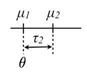
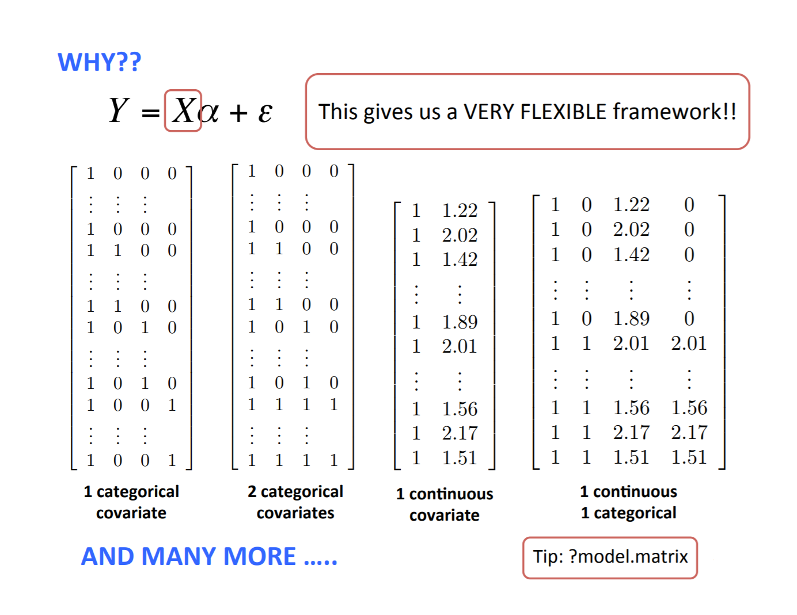
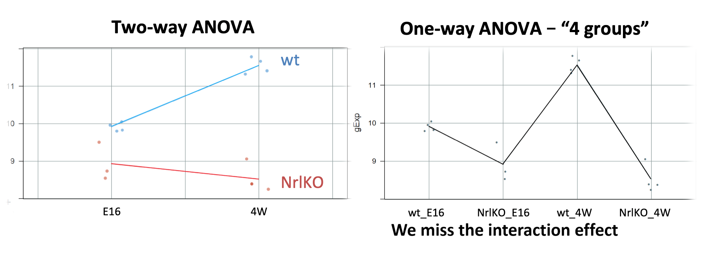

layout: true

<big>

```{r, include = FALSE}
knitr::opts_chunk$set(tidy = FALSE, tidy.opts=list(width.cutoff=80), fig.retina=3)
ggplot2::theme_set(ggplot2::theme_bw(base_size = 20))
ggplot2::update_geom_defaults("point", list(size = 3))
```

```{r wrap-hook, include=FALSE}
library(knitr)
hook_output = knit_hooks$get('output')
knit_hooks$set(output = function(x, options) {
  # this hook is used only when the linewidth option is not NULL
  if (!is.null(n <- options$linewidth)) {
    x = knitr:::split_lines(x)
    # any lines wider than n should be wrapped
    if (any(nchar(x) > n)) x = strwrap(x, width = n)
    x = paste(x, collapse = '\n')
  }
  
  lines <- options$output.lines
   if (is.null(lines)) {
     return(hook_output(x, options))  # pass to default hook
   }
   x <- unlist(strsplit(x, "\n"))
   if (length(lines)==1) {        # first n lines
     if (length(x) > lines) {
       # truncate the output
       x <- c(head(x, lines))
     }
   } else {
     x <- c(x[lines])
   }
   # paste these lines together
   x <- paste(c(x, ""), collapse = "\n")

  hook_output(x, options)
})


```


---


```{r, include=FALSE}
library(lattice)
library(dplyr)
library(ggplot2)
library(ggthemes)
library(grid)
library(gridExtra)
library(latex2exp)
library(tidyr)
library(broom)

options(lifecycle_disable_warnings = TRUE)

prDes <- readRDS("data/GSE4051_design.rds")
levels(prDes$devStage)[levels(prDes$devStage)=="4_weeks"] <- "4W"

prDat<-read.table("data/GSE4051_data.tsv",
                      sep = "\t", header = T, row.names = 1)

## I've selected this as our hit
theHit <- which(rownames(prDat) == "1440645_at") # 17843
## and this as our boring gene
theBore <- which(rownames(prDat) == "1443184_at") # 18898

keepers <- data.frame(row = c(theBore, theHit),
                       probesetID = I(rownames(prDat)[c(theBore, theHit)]))

devDat <- as.vector(t(prDat[keepers$probesetID, ]))
devDat <- data.frame(gene = rep(c("geneA", "geneB"), each = nrow(prDes)),gExp = devDat)
devDat <- data.frame(prDes, devDat)

boreDat <- filter(devDat, gene == "geneA")
hitDat <- filter(devDat, gene == "geneB")
```

# Recall from last class...

<big>

### 1. show how to compare means of different groups (2 or more) using a linear regression model

  - dummy variables to model the levels of a qualitative explanatory variable

### 2. write a linear model using matrix notation

  - understand which matrix is built by R
  
### 3. distinguish between single and multiple hypotheses 
  - $t$-tests vs $F$-tests  
  
---

# <center> Do we think that the expression levels at different developmental stages are generated by distributions with different location (mean)? Or a single common distribution? 

```{r, include=FALSE}
library(lattice)

prDes <- readRDS("data/GSE4051_design.rds")

prDat<-read.table("data/GSE4051_data.tsv",
                      sep = "\t", header = T, row.names = 1)

## I've selected this as our hit
theHit <- which(rownames(prDat) == "1440645_at") # 17843
## and this as our boring gene
theBore <- which(rownames(prDat) == "1443184_at") # 18898

keepers <- data.frame(row = c(theBore, theHit),
                       probesetID = I(rownames(prDat)[c(theBore, theHit)]))

devDat <- as.vector(t(prDat[keepers$probesetID, ]))
devDat <- data.frame(gene = rep(c("geneA", "geneB"), each = nrow(prDes)),gExp = devDat)
devDat <- data.frame(prDes, devDat)

boreDat <- filter(devDat, gene == "geneA")
hitDat <- filter(devDat, gene == "geneB")
```

```{r, echo=FALSE, fig.width=12.5, fig.height=4, fig.align="center"}
boreLim <- ggplot(boreDat, aes(x = devStage, y = gExp)) + 
             geom_jitter(width = 0.2, alpha = 0.5) +
             labs(title = "geneA") +
             theme(legend.position = "none") +
             ylim(5, 10) +
             xlab("") +
             stat_summary(aes(group=1), fun.y=mean, geom="line", colour="red")

hitLim <- ggplot(hitDat, aes(x = devStage, y = gExp)) + 
             geom_jitter(width = 0.2, alpha = 0.5) +
             labs(title = "geneB") +
             theme(legend.position = "none") +
             ylim(5, 10) +
             ylab("") +
             xlab("") +
             stat_summary(aes(group=1), fun.y=mean, geom="line", colour="red")

grid.arrange(boreLim, hitLim, nrow = 1)
```

---

## **Quick review**: from $t$-test to linear regression
<big>

### **2-sample t-test**

$$
Y \sim F; \ E[Y]= \mu_Y ; \ Z \sim G; \ E[Z]= \mu_Z
$$
$$ H_0: \mu_Y = \mu_Z$$

<center><big><big> ↓? </big></big></center>

### **Linear regression**

$$ Y = X\alpha + \epsilon; \text{ }\hspace{1em} H_0: \alpha_j = 0$$

<center>
## <font color="blue"><b>HOW? WHY?</b></font>

---

## <font color="blue"> **HOW??** </font>: Cell means model using dummy variables 


$$
Y \sim F; \ E[Y]= \mu_Y ; \ Z \sim G; \ E[Z]= \mu_Z
$$
<center>**↓**

$$Y_{ij}= \mu_1 x_{ij1} + \mu_2 x_{ij2} + \varepsilon_{ij}; \ i=1, \dots, n; \ j={1,2}$$
$$x_{ij1}=\bigg\{\begin{array}{l} 
1\text{ if } j=1\\
0 \text{ otherwise}\\
\end{array}, \hspace{1em} x_{ij2}=\bigg\{\begin{array}{l} 
1\text{ if } j=2\\
0 \text{ otherwise}\\
\end{array}$$

<center>**↓**


.pull-left[
<br>
<br>
<br>
$$\begin{array}{l}
E[Y_{i1}] &= \mu_1 \\
E[Y_{i2}] &= \mu_2
\end{array}$$

]

.pull-right[
```{r,echo=FALSE,out.width="300"}
knitr::include_graphics("img/cellmeans_designmat.png")
```
]


---

## <font color="blue"> **HOW??** </font>: Changing the parametrization to reference-treatment using dummy variables

$$
Y \sim F; \ E[Y]= \mu_Y ; \ Z \sim G; \ E[Z]= \mu_Z
$$
<center>**↓**

$$Y_{ij}=\theta+ \tau_1 x_{ij1} + \tau_2 x_{ij2} + \varepsilon_{ij}; \ i=1, \dots, n; \ j={1,2}; \tau_1=0$$
$$x_{ij1}=\bigg\{\begin{array}{l} 
1\text{ if } j=1\\
0 \text{ otherwise}\\
\end{array}, \hspace{1em} x_{ij2}=\bigg\{\begin{array}{l} 
1\text{ if } j=2\\
0 \text{ otherwise}\\
\end{array}$$

<center>**↓**


.pull-left[
<br>
<br>
<br>
$$\begin{array}{l}
E[Y_{i1}] &= \theta=\mu_1 \\
E[Y_{i2}] &= \theta + \tau_2=\mu_1\ + (\mu_2 - \mu_1) = \mu_2
\end{array}$$

]

.pull-right[
```{r,echo=FALSE,out.width="150"}

```
]

---

## <font color="blue"> **HOW??** </font>: Changing the parametrization and using dummy variables

$$
Y \sim F; \ E[Y]= \mu_Y ; \ Z \sim G; \ E[Z]= \mu_Z
$$
<center>**↓**

$$Y_{ij}=\theta+ \tau_2 x_{ij2} + \varepsilon_{ij}; \ i=1, \dots, n; \ j={1,2}$$
$$x_{ij2}=\bigg\{\begin{array}{l} 
1\text{ if } j=2\\
0 \text{ otherwise}\\
\end{array}$$

<center>**↓**


.pull-left[
<br>
<br>
<br>
$$\begin{array}{l}
E[Y_{i1}] &= \theta=\mu_1 \\
E[Y_{i2}] &= \theta + \tau_2=\mu_1\ + (\mu_2 - \mu_1) = \mu_2
\end{array}$$

]

.pull-right[
```{r,echo=FALSE,out.width="150"}

```
]

---

## **Using matrix notation ...**

.pull-left[
```{r,echo=FALSE,out.width="600", align="center"}
knitr::include_graphics("img/matrix_not.png")
```
]
.pull-right[

* $x_{ij2}$ is the second column of design matrix $X$

* $x_{112} = 0$ and $x_{122} = 1$

<font color="red">Red</font>
$$Y_{11} = 1*\theta + 0*\tau_2 + \epsilon_{11} =\theta + \epsilon_{11}$$

<font color="blue">Blue</font>
$$Y_{12} = 1*\theta + 1*\tau_2 + \epsilon_{12} = \theta + \tau_2 + \epsilon_{12}$$
* Tip: examine design matrix in R with `model.matrix()`

]

### ... and similarly beyond 2 group comparisons (ANOVA)

---
class: center

```{r,echo=FALSE,out.width="750", align="center"}

```

---

# **Parametrizations**

## Different ways of writing this [design matrix, parameter vector] pair correspond to different parametrizations of the model
# $$Y = [X\alpha] + \varepsilon$$
<br> <big>
 Understanding these concepts makes it easier ...
- to interpret fitted models
- to fit models such that comparisons you care most about are directly addressed in the inferential "report"
---


## For example: comparisons of mean expression levels between groups!
<center>
```{r,echo=FALSE,out.width="500"}
knitr::include_graphics("img/diff_means.png")
```
</center>
By default, `lm` estimates group mean differences (with respect to a reference group):

```{r}
summary(lm(gExp~devStage,subset(devDat,gene=="geneB")))$coeff
```
---

# We can tell R to use the cell-means parametrization

Write the formula as `Y ~ 0 + x` in the `lm` call to remove the intercept $(\theta)$ parameter and fit cell means parameters instead.

```{r}
summary(lm(gExp~0+devStage,subset(devDat,gene=="geneB")))$coeff
```

Now, the *t*-test column of the output represents the test of whether each group mean is equal to zero

---

## Recall that we can obtain one set of parameters from the other!

```{r,echo=FALSE,out.width="800", fig.align="center"}

```

---

# Today... more complex models

### 1. more than one factor with multiple levels

  - how to model many categorical variables and their interaction

### 2. distinguish between simple and main effects 
  - `lm` vs `anova` tests
  
### 3. nested models 
  - $t$-tests vs $F$-tests  
  
### 4. continuous explanatory variables

  - the regression line
  

---

## Increasing the complexity of the linear model ...

### What if you have *two* categorical variables?

  
  e.g., `gType` and `devStage` (for simplicity, let's consider only E16 and 4W)

- ANOVA is usually used to study models with one or more categorical variables (factors)

- Can we combine levels into 4 groups to simplify the analysis??

```{r,echo=FALSE,out.width="800", fig.align="center"}

```


---

```{r,echo=FALSE, include=FALSE}
##########################################################
## simplying devStage to first and last timepoints
##########################################################
prDes <- 
  droplevels(subset(prDes,
                    subset = devStage %in%
                      levels(devStage)[c(1, nlevels(devStage))]))
str(prDes) # 15 obs. of  4 variables
prDat <- subset(prDat, select = prDes$sidChar)

# Gene selected for illustration
(luckyGene <- which(rownames(prDat) == "1455695_at")) # 26861
twoDat <- data.frame(gExp = unlist(prDat[luckyGene, ]))
twoDat <- data.frame(prDes, twoDat)
twoDat$grp <- with(twoDat, interaction(gType, devStage))
str(twoDat)
with(twoDat, table(gType, devStage))
table(twoDat$grp)

```

## Two-way ANOVA or a linear model with interaction 

Which group means are we comparing in a model with 2 factors? 

```{r,echo=FALSE,fig.height= 4, fig.align="center"}
mu.hat<-twoDat %>% group_by(grp) %>% summarize(mean(gExp)) %>% as.data.frame()
lucky <- ggplot(twoDat, aes(x = devStage, y = gExp, group=gType, colour=gType)) + 
             geom_jitter(width = 0.1) +
             ylim(6, 13) + stat_summary(aes(group=gType,colour=gType), fun.y=mean, geom="line",size=1.5) 

lucky +
  scale_color_manual(values = c('wt' = '#00BFC4', 'NrlKO' = '#F8766D'))+
  geom_text(aes(x = .8, y = mu.hat[1,2], label = TeX("$\\widehat{\\mu_1}$", output = "character")),colour="black", size=6,parse = TRUE)+
  geom_text(aes(x = .8, y = mu.hat[2,2], label = TeX("$\\widehat{\\mu_2}$", output = "character")), colour="black", size=6,parse = TRUE)+
  geom_text(aes(x = 2.2, y = mu.hat[3,2], label = TeX("$\\widehat{\\mu_3}$", output = "character")), colour="black", size=6, parse = TRUE)+
  geom_text(aes(x = 2.2, y = mu.hat[4,2], label = TeX("$\\widehat{\\mu_4}$", output = "character")), colour="black", size=6, parse = TRUE) + theme_bw(base_size = 20)
```

$$\mu_1=E[Y_{(wt,E16)}], \ \mu_2=E[Y_{(NrlKO,E16)}], 
\ \mu_3=E[Y_{(wt,4W)}], \ \mu_4=E[Y_{(NrlKO,4W)}]$$

---

# Reference-treatment effect parametrization

<big>

* By default, `lm` assumes a <font color = "red">**reference-treatment effect**</font> parametrization 

* Mathematically, we need *more* dummy variables, see [math handout](source/SupportingMaterial/math_handout.html) for more details

```{r,tidy.opts=list(width.cutoff=40)}
twoFactFit <- lm(gExp ~ gType * devStage, twoDat)
```

```{r,echo=FALSE}
summary(twoFactFit)$coeff
```

---

## Cell-means and treatment effects in the two-way model - why do we need more dummy variables?

```{r,tidy.opts=list(width.cutoff=40)}
table(twoDat$grp)
```
```{r,tidy.opts=list(width.cutoff=40), highlight.output=5}
(means.2Fact <- as.data.frame(twoDat %>% 
          group_by(grp) %>% 
          summarize(cellMeans=mean(gExp))) %>%
          mutate(txEffects=cellMeans-cellMeans[1],
                 lmEst=summary(twoFactFit)$coeff[,1]))
```

---

# What is the reference group here?

<big>
<center><font color="blue"> wt & E16 </font></center>

As before, comparisons are relative to a reference but in this case there is a reference level *in each factor*: <font color="blue">wt and E16 </font>

```{r,echo=FALSE,fig.width= 7.5, fig.height=4.5, fig.align="center"}
lucky +
  scale_color_manual(values = c('wt' = '#00BFC4', 'NrlKO' = '#F8766D'))+
  geom_text(aes(x = .8, y = mu.hat[1,2], label = TeX("$\\widehat{\\theta}=\\widehat{\\mu_1}$", output = "character")),colour="black", size=6, parse = TRUE) + 
  geom_point(aes(x = 1, y = mu.hat[1,2]),size=7,shape=1,colour='#00BFC4')  + 
  theme_bw(base_size = 20)
```

---

# The reference: wt & E16

**Mean of reference group**: $\theta=E[Y_{wt,E16}]$ 
  
**`lm` estimate**: $\hat{\theta}$ is the sample mean of the group 

```{r,echo=FALSE,highlight.output = c(2)}
summary(twoFactFit)$coeff

means.2Fact
```

In general, one is not interested in: $H_0: \theta=0$

---

## Simple genotype effect: wt *vs* NrlKO <font color="blue"> at E16 </font>

<big>
And now the "treatment effects"... 

> **Important**: effects are not marginal but *conditional* effects (<font color="blue">at a given level </font> of the other factor, e.g., at E16), usually called **simple effects**

```{r,echo=FALSE,fig.align="center", fig.width= 8, fig.height=4}
lucky +
  scale_color_manual(values = c('wt' = '#00BFC4', 'NrlKO' = '#F8766D'))+
  geom_text(aes(x = .7, y = abs(mu.hat[1,2]+mu.hat[2,2])/2, label = TeX("$\\widehat{\\tau_{KO}}$", output = "character")),colour="black", size=6, parse = TRUE) + 
  geom_point(aes(x = 1, y = mu.hat[1,2]),size=7,shape=1,colour='#00BFC4')+
  geom_point(aes(x = 1, y = mu.hat[2,2]),size=7,shape=1,colour='#F8766D')+
  geom_segment(aes(x=.8,y=mu.hat[1,2],xend=.8,yend=mu.hat[2,2]),colour=1,arrow = arrow(length = unit(0.1,"cm"))) + 
  theme_bw(base_size = 20)
```

---

class: middle

## Simple genotype effect: wt *vs* NrlKO <font color="blue"> at E16 </font>

**Effect of genotype at E16**: $\tau_{KO}=E[Y_{NrlKO,E16}]-E[Y_{wt,E16}]$

**`lm` estimate**: $\hat{\tau}_{KO}$ is the *difference* of sample respective means (check below)

```{r,echo=F,highlight.output = c(3)}
summary(twoFactFit)$coeff

means.2Fact
```

**But**, do you want to test the *conditional* effect at E16: $H_0: \tau_{KO}=0$?? 

---

## Simple developmental effect: E16 *vs* 4W <font color="blue"> in wt </font>

<big>

Similarly, for the other factor:

```{r,echo=FALSE,fig.height= 4.5, fig.width=8, fig.align="center"}
lucky +
  scale_color_manual(values = c('wt' = '#00BFC4', 'NrlKO' = '#F8766D'))+
#circles around mean
  geom_point(aes(x = 1, y = mu.hat[1,2]),size=7,shape=1,colour='#00BFC4')+
  geom_point(aes(x = 2, y = mu.hat[3,2]),size=7,shape=1,colour='#00BFC4')+
#parameter and segments
  geom_text(aes(x = 2.2, y = abs(mu.hat[1,2]+mu.hat[3,2])/2, label = TeX("$\\widehat{\\tau_{4W}}$", output = "character")),colour="black", size=6, parse = TRUE) + 
  geom_segment(aes(x=2.1,y=mu.hat[1,2],xend=2.1,yend=mu.hat[3,2]),colour=1,arrow = arrow(length = unit(0.1,"cm"))) + #other way for double arrow??
  geom_segment(aes(x=1,y=mu.hat[1,2],xend=2,yend=mu.hat[1,2]),colour='grey',linetype=2)
```

---

## Simple developmental effect: E16 *vs* 4W <font color="blue"> at wt </font>

**Effect of development in wt**: $\tau_{4W}=E[Y_{wt,4W}]-E[Y_{wt,E16}]$

**`lm` estimate**: $\hat{\tau}_{4W}$ is the *difference* of respective sample means (check below)

```{r,echo=F,highlight.output = c(4)}
summary(twoFactFit)$coeff

means.2Fact
```

---

# Interaction effect

Is the effect of genotype the same at different developmental stages? (or is the development effect the same for both genotypes?)

**Yes if**, there's no interaction effect, i.e., $\tau_{KO4W}=0$ 

```{r,echo=FALSE,fig.height= 3.75, fig.width=8, fig.align="center"}
mu.add<-mu.hat[3,2]-(mu.hat[1,2]-mu.hat[2,2])
lucky +
     scale_color_manual(values = c('wt' = '#00BFC4', 'NrlKO' = '#F8766D'))+
  #circles at means    
     geom_point(aes(x = 2, y = mu.hat[3,2]),size=7,shape=1,colour='#00BFC4')+
     geom_point(aes(x = 2, y = mu.hat[3,2]-(mu.hat[1,2]-mu.hat[2,2])),size=7,shape=1,colour='grey')+
  #parameters and segments
  #additive position
    geom_segment(aes(x=1,y=mu.hat[2,2],xend=2,yend=mu.add),colour='grey',linetype=2)+
  #tau_4W
  geom_segment(aes(x=2.1,y=mu.hat[3,2],xend=2.1,yend=mu.add),colour='grey',arrow = arrow(length = unit(0.1,"cm")))+
  geom_text(aes(x = 2.2, y = abs(mu.hat[3,2]+mu.add)/2, label = TeX("$\\widehat{\\tau_{4W}}$", output = "character")),colour='grey', size=6, parse = TRUE) +
  #interaction
  geom_segment(aes(x=2.1,y=mu.add,xend=2.1,yend=mu.hat[4,2]),colour='blue',arrow = arrow(length = unit(0.1,"cm"))) +
  geom_text(aes(x = 2.2, y = abs(mu.hat[4,2]+mu.add)/2, label = TeX("$\\widehat{\\tau_{KO4W}}$", output = "character")),colour="blue", size=6, parse = TRUE) 
```

The genotype effect at E16 is $\tau_{KO}$. However, $\tau_{KO}$ does not seem to be the effect at 4W. The difference is the interaction effect!
---
## Interaction effect


$\tau_{KO4W}=(E[Y_{NrlKO,4W}]-E[Y_{wt,4W}])-(E[Y_{NrlKO,E16}]-E[Y_{wt,E16}])$ 

<small>

```{r,echo=FALSE,highlight.output = c(5)}
summary(twoFactFit)$coeff
```

```{r,highlight.output = c(5)}
means.2Fact
```

```{r,highlight.output}
((means.2Fact$cellMeans[4]-means.2Fact$cellMeans[3])-
    (means.2Fact$cellMeans[2]-means.2Fact$cellMeans[1]))
```

---

## Summary of model parameters: with interaction 

model parameter | R estimate| stats | interpretation
--------|---------|---------
$\theta$ | (Intercept) | $E[Y_{wt,E16}]$ | reference
$\tau_{KO}$ | gTypeNrlKO | $E[Y_{NrlKO,E16}] - E[Y_{wt,E16}]$ | *conditional* effect of NrlKO *at* E16
$\tau_{4W}$ | devStage4_weeks | $E[Y_{wt,4W}] - E[Y_{wt,E16}]$ | *conditional* effect of 4W *at* wt
$\tau_{KO4W}$ | gTypeNrlKO: devStage4_weeks | $E[Y_{NrlKO,4W}] - E[Y_{wt,4W}] - \tau_{KO}$  | *interaction* effect of NrlKO and 4W

It is *important* to remember that `lm` reports *simple, not main* effects!! <font color="blue"> why?? because of the parametrization used!! </font> (see see [math handout](source/SupportingMaterial/math_handout.html))

It can also be shown that $\tau_{KO4W}=E[Y_{NrlKO,4W}]-\tau_{4W}-\tau_{KO}-\theta$ (see previous slide)

---
class: middle

### Let's examine these parameters closer and some examples

<big>     
For our model, `lm` tests 4 hypotheses:

.pull-left[
> ### $H_0: \theta=0$
### $H_0: \tau_{KO}=0$
### $H_0: \tau_{4W}=0$
### $H_0: \tau_{KO4W}=0$
]
.pull-right[
<br>
```{r,echo=FALSE,out.width="400", fig.align="center"}

```

]

We may not be interested in these hypotheses, e.g., $\tau_{KO}$ and $\tau_{4W}$ are *conditional* effects *at* a given level of a factor (*simple effects*)
---

## Example 1: nothing is statistically significant, very flat genes 
```{r,tidy.opts=list(width.cutoff=30), echo = FALSE}
egDat<-prDat %>% subset(row.names(prDat) %in%
       c("1442080_at","1448243_at")) %>%
       tibble::rownames_to_column(var = "gene")%>% 
       gather(sidChar, gExp,-gene) %>%
       inner_join(prDes,by="sidChar")
```


```{r echo=FALSE, fig.height=6, fig.width=14, warning=FALSE,message=FALSE}
plot1Dat <- filter(egDat, gene == "1442080_at")
plot2Dat <- filter(egDat, gene == "1448243_at")

plot1Lim <- ggplot(plot1Dat, aes(x = devStage, y = gExp, group=gType, colour=gType)) + 
  geom_jitter(width = 0.1) +
             labs(title = "1442080_at") +
             theme(legend.position = "none") +
             ylim(6, 10) +  stat_summary(aes(group=gType,colour=gType), fun.y=mean, geom="line",size=1.5) +
  scale_color_manual(values = c('wt' = '#00BFC4', 'NrlKO' = '#F8766D'))

plot2Lim <- ggplot(plot2Dat, aes(x = devStage, y = gExp, group=gType, colour=gType)) + 
  geom_jitter(width = 0.1) +
             labs(title = "1448243_at") +
             ylim(6, 10) +  stat_summary(aes(group=gType,colour=gType), fun.y=mean, geom="line",size=1.5) +
  scale_color_manual(values = c('wt' = '#00BFC4', 'NrlKO' = '#F8766D'))

library(cowplot)
leg <- get_legend(plot2Lim)
plot_grid(plot1Lim, plot2Lim + theme(legend.position = "none"), leg, 
             rel_widths=c(1,1,0.3), ncol = 3)
```

---

## Example 1: nothing is statistically significant, very flat genes 


Summary of `lm` for the gene in the left plot on previous slide:

```{r,highlight.output = c(3:5)}
multFit <- lm(gExp ~ gType * devStage, subset(egDat,gene=="1448243_at"))
summary(multFit)$coeff
```

---

## Example 2: statistically significant interaction effect: non-parallel 

```{r,echo=FALSE,warning=FALSE}
egDat<-prDat %>% subset(row.names(prDat) %in%
       c("1434709_at","1458220_at")) %>%
       tibble::rownames_to_column(var = "gene")%>% 
       gather(sidChar, gExp,-gene) %>%
       inner_join(prDes,by="sidChar")%>% 
       mutate(grp=interaction(gType, devStage))
```


```{r echo=FALSE, fig.height=6, fig.width=14}
plot1Dat <- filter(egDat, gene == "1434709_at")
plot2Dat <- filter(egDat, gene == "1458220_at")

#cell-means for plot
mu.hat1<-plot1Dat %>% group_by(grp) %>% summarize(mean(gExp)) %>% as.data.frame()

plot1Lim <- ggplot(plot1Dat, aes(x = devStage, y = gExp, group=gType, colour=gType)) + 
  geom_jitter(width = 0.1) +
             labs(title = "1434709_at") +
             ylim(5, 11) +  stat_summary(aes(group=gType,colour=gType), fun.y=mean, geom="line",size=1.5) +
  scale_color_manual(values = c('wt' = '#00BFC4', 'NrlKO' = '#F8766D'))+
  geom_segment(aes(x=1,y=mu.hat1[1,2],xend=1,yend=mu.hat1[2,2]),colour=1,arrow = arrow(length = unit(0.3,"cm")))+
  geom_segment(aes(x=2,y=mu.hat1[3,2],xend=2,yend=mu.hat1[4,2]),colour=1,arrow = arrow(length = unit(0.3,"cm"))) + theme(legend.position = "none")

plot2Lim <- ggplot(plot2Dat, aes(x = devStage, y = gExp, group=gType, colour=gType)) + 
  geom_jitter(width = 0.1) +
             labs(title = "1458220_at") +
             ylim(5, 11) +  stat_summary(aes(group=gType,colour=gType), fun.y=mean, geom="line",size=1.5) +
  scale_color_manual(values = c('wt' = '#00BFC4', 'NrlKO' = '#F8766D'))

leg <- get_legend(plot2Lim)
plot_grid(plot1Lim, plot2Lim + theme(legend.position = "none"), leg, 
             rel_widths=c(1,1,0.3), ncol = 3)
```

---

## Example 2: statistically significant interaction effect: non-parallel 

Summary of `lm` for the gene in the left plot on previous slide:

```{r,echo=TRUE,highlight.output = c(3:5),warning=FALSE}
multFit <- lm(gExp ~ gType * devStage, subset(egDat,gene=="1434709_at"))
summary(multFit)$coeff
```

When the interaction effect is significant, the *simple* effects may not agree: compare the genotype effect @E16 with that @4W!

*Main* effects (overall): does genotype have an effect on gene expression? we can't answer this question! <font color="blue"> it depends (on the level of devStage)! </font> (more later) 

---

## Example 3: BALANCED & only genotype @E16 is statistically significant

For simplicity here, I've added a random observation in the NrlKO.E16 group (close to its mean) to have a *balanced* design 
> In *unbalanced* designs the *main* effects are a *weighted* average of the simple effects, and the weights are not easy to interpret (beyond the scope of this course but worth noting the issue!)

<small>

```{r,tidy.opts=list(width.cutoff=50),}
egDat<-prDat %>% subset(row.names(prDat) %in%
       c("1447753_at","1431651_at")) %>%
       tibble::rownames_to_column(var = "gene")%>% 
       gather(sidChar, gExp,-gene) %>%
       inner_join(prDes,by="sidChar") %>% 
       mutate(grp=interaction(gType, devStage))

#duplicate sample 6 and add noise to gExp of genes
set.seed(123)
egDat <-egDat %>% subset(sidChar=="Sample_6") %>%
       mutate(sidChar="Sample_r",sidNum="r",
       gExp=gExp+rnorm(2,0,.1)) %>% rbind(egDat) %>% 
       arrange(grp)
```
---

## Example 3: only genotype @E16 is statistically significant: parallel and flat

```{r echo=FALSE, fig.height=4.5, fig.width=14}
plot1Dat <- filter(egDat, gene == "1447753_at")
plot2Dat <- filter(egDat, gene == "1431651_at")

#cell-means for plot 1
mu.hat1<-plot1Dat %>% group_by(grp) %>% summarize(mean(gExp)) %>% as.data.frame()

plot1Lim <- ggplot(plot1Dat, aes(x = devStage, y = gExp, group=gType, colour=gType)) + 
  geom_jitter(width = 0.1) +
             labs(title = "1447753_at") +
             theme(legend.position = "none") +
             ylim(6, 7.1) +  stat_summary(aes(group=gType,colour=gType), fun.y=mean, geom="line",size=1.5) +
  scale_color_manual(values = c('wt' = '#00BFC4', 'NrlKO' = '#F8766D'))+
  geom_segment(aes(x=1,y=mu.hat1[1,2],xend=1,yend=mu.hat1[2,2]),colour=1,arrow = arrow(length = unit(0.3,"cm")))

plot2Lim <- ggplot(plot2Dat, aes(x = devStage, y = gExp, group=gType, colour=gType)) + 
  geom_jitter(width = 0.1) +
             labs(title = "1431651_at") +
             ylim(6, 7.1) +  stat_summary(aes(group=gType,colour=gType), fun.y=mean, geom="line",size=1.5) +
  scale_color_manual(values = c('wt' = '#00BFC4', 'NrlKO' = '#F8766D'))

leg <- get_legend(plot2Lim)
plot_grid(plot1Lim, plot2Lim + theme(legend.position = "none"), leg, 
             rel_widths=c(1,1,0.3), ncol = 3)
```


* The interaction effect is not significant (almost parallel pattern).

* The effect of developmental stage is not significant for WT (almost flat pattern).  

---


## Example 3: only genotype @E16 is statistically significant: parallel

```{r, highlight.output = 3}
multFit <- lm(gExp ~ gType * devStage, subset(egDat,gene=="1447753_at"))
summary(multFit)$coeff
```

```{r,echo=FALSE,highlight.output = 3}
multFit <- summary(multFit)$coeff
multEst<-multFit[,1]
```


* There is a genotype effect at E16

* There may be a genotype effect *regardless* of the developmental stage (*main* effect). However, that hypothesis is *not* tested here!!  

* How do we test a *main effect*??  
---

# **How** do we test the *main* effects?

The main effect measures the *overall* association between the response and a factor. They are the (weighted) average of an effect over the levels of the other factor

> **Note**: a significant interaction means that the effect of a factor depends on the level of the other one. Thus, main effects may mask interesting results!


```{r echo=FALSE, fig.height=4, fig.align="center"}
plot1Lim
```

---

# Main effects

<big>

`anova()` can be used to test the main effects:

$$H_0: ((E[Y_{KO,E16}]-E[Y_{wt,E16}])+(E[Y_{KO,4W}]-E[Y_{wt,4W}]))/2=0$$
> for unbalanced experiments $H_0: w_1 \text{effect}_{E16}+ w_2 \text{effect}_{4W}=0$ 

---

# Main effects

```{r,highlight.output = c(4:5)}
tidy(anova(lm(gExp ~ gType * devStage, plot1Dat)))
```

As we suspected in slide #35, there is a significant genotype effect for this gene (1447753_at), i.e., its mean expression changes in NrlKO group (compared to wt), on average over developmental stages.

<small>
$^*$ Note: `anova` uses type II sums of squares, which follows the principle of marginality, thus order matters in unbalanced designs!

---

# Main & interaction effects: important notes

- A **significant interaction effect** means that the effect of one factor depends on the levels of the other one. 
  - e.g., the effect of genotype depends on developmental stage

- **Main effects**: are the (weighted) average of an effect over the levels of the other factor. 

- A **non-significant main effect** means that, on average, there's no evidence of a factor's effect
  - e.g, no evidence of a genotype effect, on average over both developmental stages

- **Note of caution**: if the interaction is significant, it is possible that one or both simple effects are significant but the average effect (i.e., the main effect) is not. This is because the effect of a factor *depends on* the level of the other one!

---
# Additive models

- In some applications, we need to/want to test the interaction term

- However, additive models are easier and smaller

- If there are no statistical or theoretical grounds to include the interaction term, additive models are preferred 

- Additive effects: $E[Y_{NrlKO,4W}]-E[Y_{wt,E16}]=\tau_{KO}+\tau_{4W}$

```{r}
addFit <- summary(lm(formula = gExp ~ gType +devStage,plot1Dat))$coeff
addFit
```

<small>
$^*$ gene=1447753_at in table

---

# **Additive models** and balanced designs

- In an additive model, the parameters are **average effects**, over the levels of the other factor. Now, same as in anova()!!

> Note the agreement!! This is gone in unbalanced designs since weights are computed differently! <font color=blue> try!!</font>

- TypeIII sum of squares are required for agreement in unbalanced designs (use `car::Anova`), beyond our scope

---

# Parameters in additive models represent main effects

<small>

```{r,tidy.opts=list(width.cutoff=40),highlight.output =c(3)}
summary(lm(formula = gExp ~ gType + devStage, plot1Dat))$coeff
```

```{r,tidy.opts=list(width.cutoff=40)}
summary(lm(formula = gExp ~ gType + devStage, plot1Dat))$coeff[2,3]^2
```

```{r,highlight.output=c(4)}
tidy(anova(lm(gExp ~ gType + devStage, plot1Dat)))
```
---

```{r echo=FALSE, fig.height=4, fig.width=10, fig.align="center"}
#cell-means for plot 1
addEst<-addFit[,1]

plot1Lim <- plot1Lim +
  geom_segment(aes(x=2,y=mu.hat1[3,2],xend=2,yend=mu.hat1[4,2]),colour=1,arrow = arrow(length = unit(0.3,"cm")))
  
plotAdd <- ggplot(plot1Dat, aes(x = devStage, y = gExp, group=gType, colour=gType)) + 
  geom_jitter(width = 0.1) +
             labs(title = "Additive") +
             theme(legend.position = "none") +
             ylim(6, 7.1) +  
  #equal slope regression lines (not mathematical meaning)
  geom_segment(aes(x = 1, xend = 2, y = addEst[1] + addEst[3], yend = addEst[1] + 2* addEst[3]), color='#00BFC4',size=1.5)+
  geom_segment(aes(x = 1, xend = 2, y = addEst[1] + addEst[2] + addEst[3], yend = addEst[1] + addEst[2] + 2* addEst[3]), color='#F8766D',size=1.5)+
  scale_color_manual(values = c('wt' = '#00BFC4', 'NrlKO' = '#F8766D'))+
#parallel lines
geom_segment(aes(x=1,y=addEst[1] + addEst[3],xend=1,yend=addEst[1] + addEst[2]+ addEst[3]),colour=1,arrow = arrow(length = unit(0.3,"cm")))+
  geom_segment(aes(x=2,y=addEst[1]+ 2*addEst[3],xend=2,yend=addEst[1] + addEst[2]+ 2*addEst[3]),colour=1,arrow = arrow(length = unit(0.3,"cm")))

plot_grid(plot1Lim, plotAdd, leg, 
             rel_widths=c(1,1,0.3), ncol = 3)
```

<small>
```{r}
multEst
addEst 
```
---
# Factors with multiple levels

We can generalize the regression model to factors with more levels (e.g., E16, P2, P10 and 4W): we just add more dummy variables (and parameters)!

> With interaction

```{r,echo=FALSE}
summary(lm(gExp~gType*devStage,hitDat))$coef
```

Note that all the `devStage` parameters are still *simple* effects, but we now have more: one for each level compared to the reference

---

# Factors with multiple levels (cont.)
<big>

> Without interaction: additive

```{r,echo=FALSE}
summary(lm(gExp~gType+devStage,hitDat))$coef
```

Parameters are now *main* effects (on average over the levels of the other factor) but we have more!

<font color="blue"> Is developmental stage a significant effect? </font> We haven't tested that!!
---

# Simultaneous hypotheses again

### We generally test two types of null hypotheses:
      
.pull-left[
<center>
$$H_0: \tau_j = 0$$
vs
$$H_0: \tau_j \neq 0$$
for each *j* <font color="red">individually</font>
          
e.g., Is gene A differentially expressed 2 days after birth compared to E16?
$$H_0: \tau_{P2}=0$$
          ]
    
.pull-right[
<center>

$$H_0: \tau_j = 0$$
        vs
$$H_0: \tau_j \neq 0$$
for all *j* <font color="red">at the same time</font>
        
e.g., Is gene A significantly affected by time (`devStage`)?
        
$$H_0: \tau_{P2}=\tau_{P6}=\tau_{P10}=\tau_{4W}=0$$
        ]
---
class: middle
    
## *F*-test and overall significance: a deja vu 
<big>
  - the *t*-test in linear regression allows us to test single hypotheses. Those are given in the summary of `lm`
      $$H_0 : \tau_i = 0$$
      $$H_A : \tau_j \neq 0$$
  - but we often like to test multiple hypotheses *simultaneously*: 
      $$H_0 : \tau_{P2} = \tau_{P6} = \tau_{P10} = \tau_{4W}=0\textrm{ [AND statement]}$$
      $$H_A : \tau_j \neq 0 \textrm{ for at least one j [OR statement]}$$ the *F*-test allows us to test such compound tests
      
---

# Overall effects: compound tests

### With interaction

> $H_0: \tau_{KO}=0$ (1 df) <br>
> $H_0: \tau_{P2}=\tau_{P6}=\tau_{P10}=\tau_{4W}=0$ (at wt!, 4 df)
> $H_0: \tau_{KOP2}=\tau_{KOP6}=\tau_{KOP10}=\tau_{KO4W}=0$ (4 df)

```{r}
tidy(anova(lm(gExp~gType*devStage,hitDat)))
```

Tests of overall effects of a factor controlling for the other one
---


## Overall effects: compound tests (cont.)

### Without interaction

> $H_0: \tau_{KO}=0$ (1 df) <br>
$H_0: \tau_{P2}=\tau_{P6}=\tau_{P10}=\tau_{4W}=0$ (on average!, 4 df)

```{r}
tidy(anova(lm(gExp~gType+devStage,hitDat)))
```
Tests of overall effects of a factor controlling for the other one

<small>
The $t$-test in `lm` and the $F$-test (1 df) in `anova` for gType are not equivalent here due to unbalancedness (order matters)
---

# Nested models: These examples are just special cases of nested models 
For example: does development have a significant effect on gene expression?

<font color=blue> Compare the models with and without `devStage`!!  

<font color=black>

**Model 1**: gExp~gType

**Model 2**: gExp~gType + devStage

Mathematically:

**Model 1**: $Y_{ijk}=\theta + \tau_{KO}x_{KO,ijk} + \varepsilon$

**Model 2**: $Y_{ijk}=\theta + \tau_{KO}x_{KO,ijk} + \tau_{P2}x_{P2,ijk}+\tau_{P6}x_{P6,ijk}+\tau_{P10}x_{P10,ijk}+\tau_{4W}x_{4W,ijk}+ \varepsilon$
 
 $$H_0: \tau_{P2}=\tau_{P6}=\tau_{P10}=\tau_{4W}=0$$

 The $x_{DD,ijk}$ are dummy variables (see [math handout](source/SupportingMaterial/math_handout.html))
 
---
# More general!

```{r,echo=FALSE,out.width="750", fig.align="center"}

```

---

## Nested models in R

<small>

```{r}
addReduced <- lm(gExp ~ gType, data = hitDat)
addFull <- lm(gExp ~ gType+devStage, data = hitDat)
anova(addReduced,addFull)
tidy(anova(addFull))
```

---

## Another special case: goodness of fit!

Compare the full *vs* the intercept-only models (compound test)!
$$H_0: \tau_{KO}=\tau_{P2}=\tau_{P6}=\tau_{P10}=\tau_{4W}=0, \ (5 \text{ df})$$


```{r,echo=FALSE}
addReduced<- lm(gExp ~ 1, data = hitDat)
anova(addReduced,addFull)
```

```{r}
summary(addFull)$fstatistic # also given in the summary of lm
```

---


## Goodness of fit also given in output of `lm`

<small>
```{r, highlight.output=21, output.lines=c(2:22)}
summary(addFull)
```

---

## Summary

- ** *t*-tests** can be used to test the equality of **2** population means

- **ANOVA** can be used to test the equality of **more than 2** population means simultaneously (main effects)

- **Linear regression** provides a general framework for modelling the relationship between a response and different type of explanatory variables

  - *t*-tests are used to test the significance of *simple effects* (*individual* coefficients)

  - *F*-tests are used to test the significance of *main effects* (*simultaneously* multiple coefficients) 

- *F*-tests are used to compare nested models
  - e.g., *overall* effects or *goodness of fit* 


