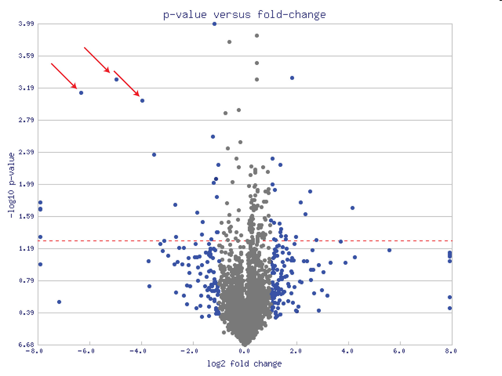
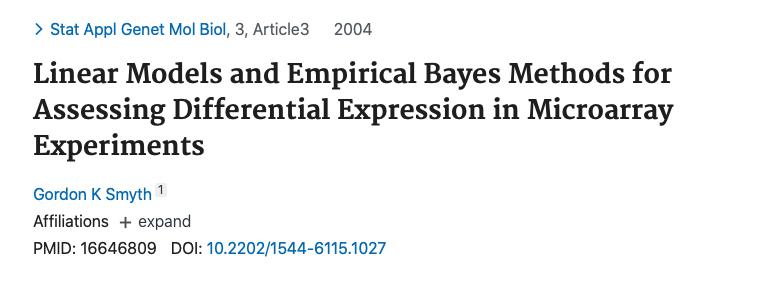
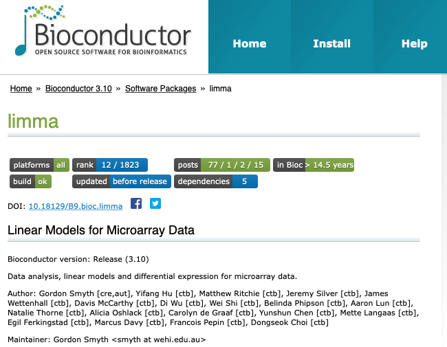
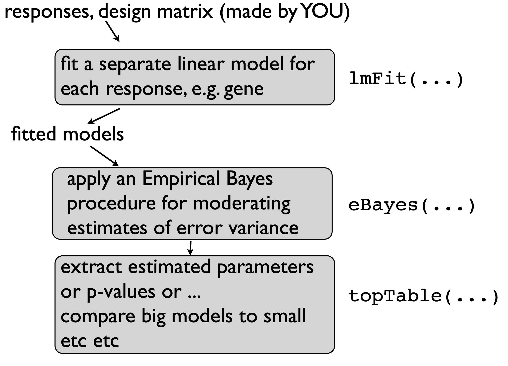

layout: true

<big>

<style>
div.blue { background-color:#e6f0ff; border-radius: 5px; padding: 20px;}
</style>

```{r, include = FALSE}
knitr::opts_chunk$set(tidy = FALSE, tidy.opts=list(width.cutoff=80), fig.retina=3)
ggplot2::theme_set(ggplot2::theme_bw(base_size = 20))
ggplot2::update_geom_defaults("point", list(size = 3))
```

```{r wrap-hook, include=FALSE}
library(knitr)
hook_output = knit_hooks$get('output')
knit_hooks$set(output = function(x, options) {
  # this hook is used only when the linewidth option is not NULL
  if (!is.null(n <- options$linewidth)) {
    x = knitr:::split_lines(x)
    # any lines wider than n should be wrapped
    if (any(nchar(x) > n)) x = strwrap(x, width = n)
    x = paste(x, collapse = '\n')
  }
  
  lines <- options$output.lines
   if (is.null(lines)) {
     return(hook_output(x, options))  # pass to default hook
   }
   x <- unlist(strsplit(x, "\n"))
   if (length(lines)==1) {        # first n lines
     if (length(x) > lines) {
       # truncate the output
       x <- c(head(x, lines))
     }
   } else {
     x <- c(x[lines])
   }
   # paste these lines together
   x <- paste(c(x, ""), collapse = "\n")

  hook_output(x, options)
})


```


---

# Summary so far

<big>

* *t* tests can be used to test the equality of 2 population means

* ANOVA can be used to test the equality of more than 2 population means

* Linear regression provides a general framework for modeling the relationship between a response variable and different types of explanatory variables

  * *t* tests can be used to test the significance of *individual* coefficients
  
  * *F* tests can be used to test the simultaneous significance of *multiple* coefficients (e.g. multiple levels of a single categorical factor)
  
---

# What if we represent Age as a continuous variable?

```{r, include=FALSE}
library(lattice)
library(dplyr)
library(ggplot2)
library(ggthemes)
library(grid)
library(gridExtra)
library(latex2exp)
library(tidyr)
library(broom)

options(lifecycle_disable_warnings = TRUE)

prDes <- readRDS("data/GSE4051_design.rds")
levels(prDes$devStage)[levels(prDes$devStage)=="4_weeks"] <- "4W"

prDat<-read.table("data/GSE4051_data.tsv",
                      sep = "\t", header = T, row.names = 1)
## I've selected this as our hit
theHit <- which(rownames(prDat) == "1456341_a_at") # 17843
## and this as our boring gene
theBore <- which(rownames(prDat) == "1441811_x_at") # 18898

keepers <- data.frame(row = c(theBore, theHit),
                       probesetID = I(rownames(prDat)[c(theBore, theHit)]))

devDat <- as.vector(t(prDat[keepers$probesetID, ]))
devDat <- data.frame(gene = rep(c("geneA", "geneB"), each = nrow(prDes)),gExp = devDat)
devDat <- data.frame(prDes, devDat)

# add pseudo age variable to data frame
devDat$Age <- ifelse(devDat$devStage == "E16", -4,
                 ifelse(devDat$devStage == "P2", 2, 
                     ifelse(devDat$devStage == "P6", 6, 
                        ifelse(devDat$devStage == "P10", 10, 28))))


```


```{r, echo=FALSE, fig.width=14, fig.height=3.25, fig.align="center", warning=FALSE, message = FALSE}
boreLimC <- ggplot(devDat %>% filter(gene == "geneA"), 
                  aes(x = Age, y = gExp)) + 
             geom_point(alpha = 0.7) +
             labs(title = "geneA") +
             theme(legend.position = "none") +
             ylim(5, 10) +
             xlab("Age (days)") +
             stat_summary(aes(group=1), fun.y=mean, geom="line", colour="grey")

hitLimC <- ggplot(devDat %>% filter(gene == "geneB"), 
                 aes(x = Age, y = gExp)) + 
             geom_point(alpha = 0.7) +
             labs(title = "geneB") +
             ylim(5, 10) +
             ylab("") +
             xlab("Age (days)") +
             stat_summary(aes(group=1), fun.y=mean, geom="line", colour="grey")
```

```{r, echo=FALSE, fig.width=14, fig.height=7, fig.align="center", warning=FALSE, message = FALSE}
boreLim <- ggplot(devDat %>% filter(gene == "geneA"), 
                  aes(x = devStage, y = gExp)) + 
             geom_jitter(width = 0.2, alpha = 0.7) +
             theme(legend.position = "none") +
             ylim(5, 10) +
             xlab("Developmental Stage") +
             stat_summary(aes(group=1), fun.y=mean, geom="line", colour="grey")

hitLim <- ggplot(devDat %>% filter(gene == "geneB"), 
                 aes(x = devStage, y = gExp)) + 
             geom_jitter(width=0.2, alpha = 0.7) +
             ylim(5, 10) +
             ylab("") +
             xlab("Developmental Stage") +
             stat_summary(aes(group=1), fun.y=mean, geom="line", colour="grey")

library(cowplot)
plot_grid(boreLimC, hitLimC, boreLim, hitLim, nrow=2, rel_heights = c(1,0.9))
```

---

# Linear model with Age as continuous covariate

```{r, echo=FALSE, fig.width=14, fig.height=4.5, fig.align="center", warning=FALSE, message = FALSE}

boreLimC <- ggplot(devDat %>% filter(gene == "geneA"), 
                  aes(x = Age, y = gExp)) + 
             geom_point(alpha = 0.7) +
             labs(title = "geneA") +
             theme(legend.position = "none") +
             ylim(5, 10) +
             xlab("Age (days)") +
             geom_smooth(method='lm', se = FALSE)

hitLimC <- ggplot(devDat %>% filter(gene == "geneB"), 
                 aes(x = Age, y = gExp)) + 
             geom_point(alpha = 0.7) +
             labs(title = "geneB") +
             ylim(5, 10) +
             ylab("") +
             xlab("Age (days)")+
             geom_smooth(method='lm', se = FALSE)

plot_grid(boreLimC, hitLimC + theme(legend.position = "none"), nrow=1)

```

* Linear looks reasonable for gene A, but not so much for gene B

* For now, assume linear is reasonable

---

# Plain vanilla linear model (Matrix formulation)

$$\huge \mathbf{Y = X \boldsymbol\alpha + \boldsymbol\varepsilon}$$

For 1 continuous/quantitative covariate:

$$\mathbf{Y} = \begin{bmatrix}
  y_{1} \\
  y_{2} \\
  \vdots \\
  y_{n} \\
\end{bmatrix}, \hspace{1em}
\mathbf{X} = \begin{bmatrix}
  1 & x_{1} \\
  1 & x_{2} \\
  \vdots & \vdots \\
  1 & x_{n} \\
\end{bmatrix}, \hspace{1em}
\boldsymbol\alpha = \begin{bmatrix}
  \alpha_{0} \\
  \alpha_{1} \\
\end{bmatrix}, \hspace{1em}
\boldsymbol\varepsilon=\begin{bmatrix}
  \varepsilon_{1} \\
  \varepsilon_{2} \\
  \vdots \\
  \varepsilon_{n} \\
\end{bmatrix}$$

* $\alpha_0=$ the intercept (expected value of $y$ when $x$ is equal to zero)

* $\alpha_1=$ the slope (expected change in $y$ for every one-unit increase in $x$)

---


$$\huge \mathbf{Y = X \boldsymbol\alpha + \boldsymbol\varepsilon}$$

Remember / convince yourself that the matrix algebra does indeed reproduce simple linear regression:
$$\begin{bmatrix}
  y_{1} \\
  y_{2} \\
  \vdots \\
  y_{n} \\
\end{bmatrix}=\begin{bmatrix}
  1 & x_{1} \\
  1 & x_{2} \\
  \vdots & \vdots \\
  1 & x_{n} \\
\end{bmatrix}\begin{bmatrix}
  \alpha_{0} \\
  \alpha_{1} \\
\end{bmatrix}+\begin{bmatrix}
  \varepsilon_{1} \\
  \varepsilon_{2} \\
  \vdots \\
  \varepsilon_{n} \\
\end{bmatrix}=\begin{bmatrix}
  1*\alpha_0 + x_{1}*\alpha_{1} \\
  1*\alpha_0 + x_{2}*\alpha_{1} \\
   \vdots \\
  1*\alpha_0 + x_{n}*\alpha_{1} \\
\end{bmatrix}+\begin{bmatrix}
  \varepsilon_{1} \\
  \varepsilon_{2} \\
  \vdots \\
  \varepsilon_{n} \\
\end{bmatrix}$$

$$=\begin{bmatrix}
  \alpha_0 + x_{1}\alpha_{1} + \varepsilon_{1} \\
  \alpha_0 + x_{2}\alpha_{1} + \varepsilon_{2}\\
   \vdots \\
  \alpha_0 + x_{n}\alpha_{1} + \varepsilon_{n} \\
\end{bmatrix}$$
$$\Rightarrow y_i = \alpha_0 + x_i\alpha_1 + \varepsilon_i$$
---


```{r, echo=FALSE, fig.width=6, fig.height=3.5, fig.align="center", warning=FALSE, message = FALSE}
boreLimC
```
<small>
```{r, output.lines=c(9:18), highlight.output=3}
summary(lm(gExp ~ Age, data=devDat %>% filter(gene == "geneA")))
```
$H_0: \alpha_0 = 0$ (whether intercept is zero - usually, not of interest)
---

```{r, echo=FALSE, fig.width=6, fig.height=3.5, fig.align="center", warning=FALSE, message = FALSE}
boreLimC
```
<small>
```{r, output.lines=c(9:18), highlight.output=4}
summary(lm(gExp ~ Age, data=devDat %>% filter(gene == "geneA")))
```
$H_0: \alpha_1 = 0$ (tests association between gene expression and age)

---

# How do we estimate the intercept and slope? 

### Is there an *optimal* line?

```{r, output.lines=c(9:18), highlight.output=c(3:4)}
summary(lm(gExp ~ Age, data=devDat %>% filter(gene == "geneA")))
```

---

# Which one is the **best** line?

```{r, echo=FALSE, fig.width=8, fig.height=4.5, fig.align="center", warning=FALSE, message = FALSE}
set.seed(12)
int <- summary(lm(gExp ~ Age, data=devDat %>% filter(gene == "geneA")))$coef[1,1]
slp <- summary(lm(gExp ~ Age, data=devDat %>% filter(gene == "geneA")))$coef[2,1]

boreLimC +
  geom_abline(intercept = int + rnorm(1, sd=0.5), slope = slp + rnorm(1,sd=2e-2), colour = "red", cex=1) +
  geom_abline(intercept = int + rnorm(1, sd=0.5), slope = slp + rnorm(1,sd=2e-2), colour = "green", cex=1) +
  geom_abline(intercept = int + rnorm(1, sd=0.5), slope = slp + rnorm(1,sd=2e-2), colour = "purple", cex=1) +
  geom_abline(intercept = int + rnorm(1, sd=0.5), slope = slp + rnorm(1,sd=2e-2), colour = "orange", cex=1)
```

---

# Ordinary Least Squares

```{r, echo=FALSE, fig.width=8, fig.height=4.5, fig.align="center", warning=FALSE, message = FALSE}
d=devDat %>% filter(gene == "geneA")
fit <- lm(gExp ~ Age, data=d)

d$predicted <- predict(fit)   # Save the predicted values
d$residuals <- residuals(fit) # Save the residual values

boreLimC +
  geom_segment(data=d[19,], aes(xend = Age, yend = predicted), colour="red", cex=1.5) +
  annotate("text", label="Error", x=8.25,y=d[19,]$gExp+0.25, colour = "red", cex=8)
  
```

**Ordinary Least Squares (OLS)** regression: parameter estimates minimize the sum of squared errors

**Error**: vertical $(y)$ distance between the fitted line and the real observation 

---

# OLS interactive demo

<big>

* Visual representation of the squared errors in OLS: [http://setosa.io/ev/ordinary-least-squares-regression/](http://setosa.io/ev/ordinary-least-squares-regression/)

* The squares of the errors are represented by the square areas in the second plot
  * select different lines by changing the intercept and slope
  * see how the squares of the errors change
  * which line minimizes the sum of these areas? OLS answers this question

* Move a point in the first plot; observe how sensitive the OLS estimation is

---

# OLS Estimator for Simple Linear Regression (1 covariate)

* Mathematically: $\varepsilon_i$ represents the error 
$$y_i = \alpha_0 + \alpha_1x_i + \varepsilon_i,  i = 1, ..., n$$

* We want to find the line (i.e. an intercept and slope) such that the sum of squared errors is minimized
$$S(\alpha_0, \alpha_1)= \sum_{i=1}^n (y_i - \alpha_0 - \alpha_1 x_i)^2$$

    * $S(\alpha_0, \alpha_1)$ is called an *objective function*
    
    * $\varepsilon_i=y_i - \alpha_0 - \alpha_1 x_i$ is the error 
---

# OLS Estimator for Multiple Linear Regression (p covariates)

* Mathematically:  
$$S(\alpha_0, \alpha_1, \alpha_2, ..., \alpha_p) = \sum_{i=1}^n (y_i - \alpha_0 - \alpha_1 x_{1i} - \alpha_2 x_{2i} - ... - \alpha_p x_{pi})^2$$
$$=(\mathbf{y}-\mathbf{X}\boldsymbol\alpha)^T(\mathbf{y}-\mathbf{X}\boldsymbol\alpha)$$

* We need to find values of $\boldsymbol\alpha=(\alpha_0, \alpha_1, ..., \alpha_p)$ that minimize the sum of squares:
$$\frac{\partial S}{\partial\alpha_0}=\begin{bmatrix}
  \frac{\partial S}{\partial\alpha_0} \\
  \frac{\partial S}{\partial\alpha_1} \\
  \vdots\\
  \frac{\partial S}{\partial\alpha_p} \\
\end{bmatrix}=\begin{bmatrix}
  0 \\
  0 \\
  \vdots\\
  0 \\
\end{bmatrix}$$
---

# Properties of OLS regression 

**Regression model**: $\mathbf{Y = X \boldsymbol\alpha + \boldsymbol\varepsilon}$

**OLS estimator**: $\hat{\boldsymbol\alpha} =(\mathbf{X}^T\mathbf{X})^{-1}\mathbf{X}^T\mathbf{y}$

Assumptions: 

1. $\boldsymbol\varepsilon$ are iid (implies constant variance)

2. $\boldsymbol\varepsilon$ have mean zero

If $\boldsymbol\varepsilon$ are iid **Normal**, then OLS estimator is also MLE (Maximum Likelihood Estimator)

**Fitted/predicted values**: $\hat{\mathbf{y}} = \mathbf{X} \hat{\boldsymbol\alpha}$

$$= \mathbf{X} (\mathbf{X}^T\mathbf{X})^{-1}\mathbf{X}^T\mathbf{y} = \mathbf{H}\mathbf{y}$$ 
where $\mathbf{H}=\mathbf{X} (\mathbf{X}^T\mathbf{X})^{-1}\mathbf{X}^T$ is called the "hat matrix"

---

# Properties of OLS regression (cont'd)


**Residuals**: (note NOT the same as errors $\varepsilon$) $$\hat{\boldsymbol\varepsilon} = \mathbf{y} - \hat{\mathbf{y}} = \mathbf{y} -  \mathbf{X} \hat{\boldsymbol\alpha}$$ 

**Estimated error variance**: $$\hat{\sigma}^2 =  \frac{1}{n-p} \hat{\boldsymbol\varepsilon}^T \hat{\boldsymbol\varepsilon}$$

**Estimated covariance matrix of** $\hat{\boldsymbol\alpha}$: $$\hat{V}(\hat{\boldsymbol\alpha}) = \hat{\sigma}^2(\mathbf{X}^T\mathbf{X})^{-1}$$

**Estimated standard errors for estimated regression coefficients**: 
$\hat{se}(\hat{\alpha}_j)$, obtained by taking the square root of the diagonal elements of $\hat{V}(\hat{\boldsymbol\alpha})$

---

# Inference in Regression (normal iid errors)

<big>

How to test $H_0: \alpha_j = 0$?

With a *t* statistic! 

Under $H_0$, 

$$\frac{\hat{\alpha_j}}{\hat{se}(\hat{\alpha}_j)} \sim t_{n-p}$$

So a *p* value is obtained by computing a tail probability for the observed value of $\hat{\alpha_j}$ from a $t_{n-p}$ distribution

---

# Inference - what if we don't assume Normality of errors?

--
<big>

How to test $H_0: \alpha_j = 0$?

With a *t* statistic! 

Under $H_0$, <font color="red"> asymptotically (by CLT)</font>

$$\frac{\hat{\alpha_j}}{\hat{se}(\hat{\alpha}_j)} \sim t_{n-p}$$

So a *p* value is obtained by computing a tail probability for the observed value of $\hat{\alpha_j}$ from a $t_{n-p}$ distribution

---

# Diagnostics: `plot(lm(y~x))`

```{r, echo=FALSE, fig.width=12, fig.height=7, fig.align="center", warning=FALSE, message = FALSE}
par(mfrow=c(2,2))
plot(lm(gExp ~ Age, data=devDat %>% filter(gene == "geneA")), ask=FALSE)
```

---

# **Linear** regression 

* The nature of the regression function $f(x|\boldsymbol\alpha)$ is one of the defining characteristics of a regression model

    * $f$ is linear in $\boldsymbol\alpha \Rightarrow$ **linear model**
    
    * $f$ is not linear in $\boldsymbol\alpha \Rightarrow$ **nonlinear model**
    
* For example, consider nonlinear parametric regression: 

$$ y_i = \frac{1}{1 + e^{(\phi - x_i)/\eta}} + \varepsilon$$

* We just did simple linear regression (a linear model): $y_i = \alpha_0 + \alpha_1x_i + \varepsilon_i$

* What we could do instead: polynomial regression (also a linear model) $$y_i = \alpha_0 + \alpha_1x_i + \alpha_2x_i^2 + \varepsilon_i$$

---

# Polynomial regression 

```{r, echo=FALSE}
## and this as our boring gene
theBore <- which(rownames(prDat) == "1427275_at") # 18898

keepers <- data.frame(row = c(theBore),
                       probesetID = I(rownames(prDat)[c(theBore)]))

geneC <- as.vector(t(prDat[keepers$probesetID, ]))
geneC <- data.frame(gene = rep(c("geneC"), each = nrow(prDes)),gExp = geneC)
geneC <- data.frame(prDes, geneC)

# add pseudo age variable to data frame
geneC$Age <- ifelse(geneC$devStage == "E16", -4,
                 ifelse(geneC$devStage == "P2", 2, 
                     ifelse(geneC$devStage == "P6", 6, 
                        ifelse(geneC$devStage == "P10", 10, 28))))
```

```{r}
quadfit <- lm(gExp ~ Age + I(Age^2), data=geneC)
summary(quadfit)
```

---

# Polynomial regression 

```{r, echo=FALSE, fig.width=8, fig.height=5.5, fig.align="center", warning=FALSE, message = FALSE}

boreLimC <- ggplot(geneC, 
                  aes(x = Age, y = gExp)) + 
             geom_point(alpha = 0.7) +
             labs(title = "geneC") +
             theme(legend.position = "none") +
             ylim(5, 10) +
             xlab("Age (days)") + 
             stat_smooth(method="lm", se=FALSE, fill=NA,
                formula=y ~ poly(x, 2),colour="blue")

boreLimC
```
Note that **this is a linear model**, because it is linear in the $\alpha_j$ 

---

# Putting it all together (continuous + categorical variables)

<small><small><small>
```{r}
summary(lm(gExp ~ Age*gType, data=devDat %>% filter(gene=="geneA")))
```

---

# Interaction between continuous and categorical variables

$$y_{ij} = \alpha_{0} + \tau_{1}x_{ij}^{dummy} + \tau_2 x_{ij}^{Age} + \tau_3 x_{ij}^{dummy}x_{ij}^{Age}$$

where $j \in \{ wt, NrlKO\}$, $i = 1,2,...,n_j$, and $x^{dummy}_{ij}$ is 1 for $j=NrlKO$ and 0 for $j=wt$

The "intercept" for the knockouts is: $\alpha_0 + \tau_1$

The slope for the knockouts is: $\tau_2 + \tau_3$

---


# Interaction between continuous and categorical variables

```{r, echo=FALSE, fig.width=8, fig.height=5.5, fig.align="center", warning=FALSE, message = FALSE}

ggplot(devDat %>% filter(gene=="geneA"), 
                  aes(x = Age, y = gExp, colour=gType)) + 
             geom_point(alpha = 0.7) +
             labs(title = "geneA") +
             ylim(5, 10) +
             xlab("Age (days)") + 
             stat_smooth(method="lm", se=FALSE)

```

---

# Interaction between continuous and categorical variables

<big>

```{r}
summary(lm(gExp ~ Age*gType, data=devDat %>% filter(gene=="geneA")))$coef
```

`(Intercept)`: Intercept of wt line

`Age`: slope of wt line

`gTypeNrlKO`: difference in intercepts (KO vs wt)

`Age:gTypeNrlKO`: difference in slopes (KO vs wt)

---

# Nested models

As always, you can assess the relevance of several terms at once -- such as everything involving genotype -- with an F test

```{r}
anova(lm(gExp ~ Age*gType, data=devDat %>% filter(gene=="geneA")),
      lm(gExp ~ Age, data=devDat %>% filter(gene=="geneA")))
```

It's not clear that genotype affects the intercept or the slope

---

# F tests in regression
<big>

| Model | Example | # params (df) | RSS |
| ----- | ------- | ------------- | ---- |
| small | gExp ~ Age | $p_{small}=2$ | $RSS_{small}$ |
| big | gExp ~ Age * gType | $p_{small}=4$ | $RSS_{big}$|

<small>

$$\text{big: } y_{ij}  = \alpha_{0} + \tau_{1}x_{ij}^{dummy} + \tau_2 x_{ij}^{Age} + \tau_3 x_{ij}^{dummy}x_{ij}^{Age}$$

$$\text{small: } y_{ij}  = \alpha_{0} + \tau_2 x_{ij}^{Age}$$

<big>
$$F = \frac{\frac{RSS_{small}-RSS_{big}}{p_{big}-p_{small}}}{\frac{RSS_{big}}{n-p_{big}}} \sim {\tiny{H_0}} \text{  } F_{p_{big}-p_{small},\text{ } n-{p_{big}}}$$


---
# Linear regression summary

* linear model framework is extremely general 

* one extreme (simple): two-sample common variance t-test

* another extreme (flexible): a polynomial, potentially different for each level of some factor

    * dichotomous variable? OK!
    
    * categorical variable? OK!
    
    * quantitative variable? OK!
    
    * various combinations of the above? OK!
    
* Don't be afraid to build models with more than 1 covariate

---

# What about the other 29 thousand probesets??

```{r, echo=TRUE}
str(prDat)
```

---

# Linear regression of many genes


$$\huge \mathbf{Y}_g = \mathbf{X}_g \boldsymbol\alpha_g + \boldsymbol\varepsilon_g$$
<big>

* The g in the subscript reminds us that we'll be fitting a model like this *for each gene g*

* Most of the time, the design matrices $\mathbf{X}_g$ are, in fact, the same for all g. This means, we can just use $\mathbf{X}$

* Note the residual degrees of freedom $$d_g = d = n - \text{dimension of } \boldsymbol\alpha = n-p$$

---

# Linear regression of many genes (cont'd)

Data model:
$$\mathbf{Y}_g = \mathbf{X} \boldsymbol\alpha_g + \boldsymbol\varepsilon_g$$
Unknown error variance:
$$Var(\boldsymbol\varepsilon_g) = \sigma^2_g$$
Estimated error variance:
$$\hat{\sigma}^2_g = s^2_g = \frac{1}{n-p}\hat{\boldsymbol\varepsilon_g}^T\hat{\boldsymbol\varepsilon_g}$$
Estimated variance of parameter estimates:
$$\hat{Var}(\hat{\boldsymbol\alpha}) =  (\mathbf{X}^T\mathbf{X})^{-1}  s^2_g = V s^2_g$$
$V$ is the "unscaled covariance", and is the same for all genes! 

---

class: middle 
### So far, nothing is new - these are the "regular" *t* statistics for gene *g* and parameters *j*:

$$t_{gj} = \frac{\hat{\alpha}_{gj}}{s_g \sqrt{v_j}} \sim t_d \text{ under } H_0$$

But there are so many of them!

---

## Observed (i.e. empirical) issues with the "standard" *t*-test approach for assessing differential expression 

```{r,echo=FALSE,out.width="600", fig.align="center"}

```

---

class: middle 

## Observed (i.e. empirical) issues with the "standard" *t*-test approach for assessing differential expression 

<big>
<center>
<div class = "blue">
Some genes with very <b>small p-values</b> (large -log10 p-values) are not <b>biologically meaningful</b> (small effect size)
</div>

---

# How do we end up with small p-values but subtle effects?

<big>

$$\large t_{gj} = \frac{\hat{\alpha}_{gj}}{SE(\hat{\alpha}_{gj})} = \frac{\hat{\alpha}_{gj}}{s_g \sqrt{v_j}} \sim t_d \text{ under } H_0$$
--

* Small variance estimate $s_g$ leads to large *t* statistic $\rightarrow$ small *p*-value

--

* Estimates of variance from small sample sizes tend to under-estimate the true variance!

--

* This has led to the development of specialized methodology for assessing genome-wide differential expression 

---

# Empirical Bayesian techniques: `limma`

.pull-left[
```{r,echo=FALSE,out.width="500", fig.align="center"}

```

[Smyth 2004](https://pubmed.ncbi.nlm.nih.gov/16646809-linear-models-and-empirical-bayes-methods-for-assessing-differential-expression-in-microarray-experiments/)
]
.pull-right[
```{r,echo=FALSE,out.width="500", fig.align="center"}

```
]

---

# eBayes: limma

<big>

* **Borrows information** from all genes to get a better estimate of the variance

* Efficiently fits many regression models **without replicating unnecessary calculations**!

* Arranges output in a convenient way to ease further analysis, visualization, and interpretation

---

# Empirical Bayes

<big>

.pull-left[
Shrinkage = borrowing information across all genes
```{r,echo=FALSE,out.width="450", fig.align="center"}

```
]
.pull-right[
* **Empirical**: observed

* **Bayesian**: incorporate 'prior' information

* Intuition: estimate prior information from data; shrink/nudge all estimates toward the consensus 
]

---

# Practically

<big>

* Gene by gene (no shrinkage): 

  * `lm(y ~ x)` for each gene
  
  * For example, `by(myDat, gene, lm(y ~ x))`
 
* All genes at once, using `limma`: 

  * `lmFit(myDat, desMat)`
  
  * `desMat` is a specially formated design matrix (more on this later)
  
---

class: middle

##'Industrial scale' model fitting is good, because computations involving just the design matrix $\mathbf{X}$ are not repeated 30K unnecessarily 

* **OLS estimator**: $$\hat{\boldsymbol\alpha} =(\mathbf{X}^T\mathbf{X})^{-1}\mathbf{X}^T\mathbf{y}$$

* **Fitted/predicted values**: $$\hat{\mathbf{y}} = \mathbf{X} (\mathbf{X}^T\mathbf{X})^{-1}\mathbf{X}^T\mathbf{y} = \mathbf{H}\mathbf{y}$$ 

---

class: middle 

# How can we better estimate the SE?

<big> 
$$\large t_{gj} = \frac{\hat{\alpha}_{gj}}{SE(\hat{\alpha}_{gj})} = \frac{\hat{\alpha}_{gj}}{s_g \sqrt{v_j}} \sim t_d \text{ under } H_0$$
<div class="blue">
<center> Small variance estimate leads to large t statistic, which leads to small p-value
</div>

---

# Modeling in `limma` 

limma assumes that 

$$\hat{\alpha}_{gj} \,|\,\alpha_{gj}, \sigma_g^2 \sim N(\alpha_{gj}, v_j\sigma_g^2)$$
$$s^2_g \,|\, \sigma_g^2 \sim \frac{\sigma_g^2}{d}\chi^2_d$$ 
which assumes the usual result about ordinary $t$-statistics:


$$\large t_{gj} = \frac{\hat{\alpha}_{gj}}{SE(\hat{\alpha}_{gj})} = \frac{\hat{\alpha}_{gj}}{s_g \sqrt{v_j}} \sim t_d \text{ under } H_0$$

So far, nothing new...

---

# Modeling in `limma` (cont'd)

<big>

* limma imposes a hierarchical model, which describes how the gene-wise $\alpha_{gj}$'s and $\sigma^2_g$'s vary *across the genes*

* this is done by assuming a *prior distribution* for those quantities

* **gene-specific variances** $\sigma^2_g$: an inverse Chi-square prior with mean $s_0^2$ and $d_0$ degrees of freedom

$$\frac{1}{\sigma^2_g} \sim \frac{1}{d_0s_0^2} \chi^2_{d_0}$$
--

* this should feel funny compared to previous lectures - $\sigma^2_g$ is no longer a **fixed** quantity! (i.e. this is **Bayesian**)

---

# OK, but how does this help us get a better estimate of the variance?

* The *posterior* (updated based on prior) mean for gene-specific variance:

$$\tilde{s}^2_g = \frac{d_0s_0^2 + ds^2_g}{d_0 + d}$$
where $d_0$ and $s_0^2$ need to be estimated

--

* How to think about it: a weighted mean of the prior (indirect evidence) and the observed (direct evidence) gene-specific variances:

$$\tilde{s}^2_g = \frac{d_0}{d_0 + d}s_0^2 + \frac{d}{d_0 + d}s^2_g$$
--

* More simply: "shrinking" the observed gene-specific variance towards the "typical" variance implied by the prior

---

# Moderated *t*-statistic

<big>

* plug in this posterior mean estimate to obtain a 'moderated' *t*-statistic:


$$\large \tilde{t}_{gj} = \frac{\hat{\alpha}_{gj}}{\tilde{s}_g \sqrt{v_j}}$$
* Under limma assumptions, we know the null distribution for the moderated *t*-statistic:
$$\tilde{t}_{gj} \sim t_{d_0+d} \text{ under } H_0$$


<div style= "float:right;position: relative;">
```{r,echo=FALSE,out.width="200"}

```
</div>

* This is how limma is a hybrid of frequentist (*t*-statistic) and Bayesian (hierarchical model) approaches

---

# Side-by-side comparison of key quantities and results

<big>
<center>

|  | "plain vanilla"  | limma |
| ---- | :----------------: | :-----: |
| Estimated gene-wise <br>residual variance: | ${s}_g^2 =  \frac{1}{n-p} \hat{\boldsymbol\varepsilon}^T \hat{\boldsymbol\varepsilon}$ | $\tilde{s}^2_g = \frac{d_0s_0^2 + ds^2_g}{d_0 + d}$ |
| *t*-statistic for <br> $H_0: \alpha_{gj} = 0$:| ${t}_{gj} = \frac{\hat{\alpha}_{gj}}{s_g \sqrt{v_j}}$ | $\tilde{t}_{gj} = \frac{\hat{\alpha}_{gj}}{\tilde{s}_g \sqrt{v_j}}$ |
| distribution of the <br>*t*-statistic under $H_0$: | ${t}_{gj} \sim t_{d}$ | $\tilde{t}_{gj} \sim t_{d_0+d}$ |


---

# Moderated vs traditional tests

<big>

* moderated variances will be "shrunk" toward the typical gene-wise variance, relative to to raw sample residual variances

* degrees of freedom for null distribution goes **up** relative to default $d=n-p \rightarrow$ makes it closer to a standard normal $\rightarrow$ makes tail probabilities (p-values) smaller $\rightarrow$ easier to reject the null

* overall, when all is well, limma will deliver statistical results that are *more stable* and *more powerful*

---

# `limma` workflow

```{r,echo=FALSE,out.width="700", fig.align="center"}

```

---

# Functions that make your life easier

| Function | Description |
| -------- | ----------- |
| `model.matrix` | Takes in your data frame and makes a design matrix |
| `limma::lmFit` | Fits the linear model to all genes (each gene separately) – replace gene with “feature” depending on your data |
| `limma::makeContrasts` | Create the contrast matrix C that you desire |
| `limma::contrast.fit` | Apply a contrast to your estimates |
| `limma::eBayes` | Use output of linear regression to compute moderated *t* statistics |
| `limma::topTable` | Query your results; sort your p-values; sort genes; Adjust for multiple comparisons |

---

# Getting help

```{r,echo=FALSE,out.width="900", fig.align="center"}

```

[Bioconductor homepage for limma](https://bioconductor.org/packages/release/bioc/html/limma.html)


