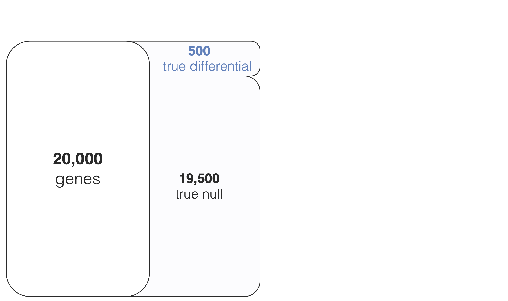
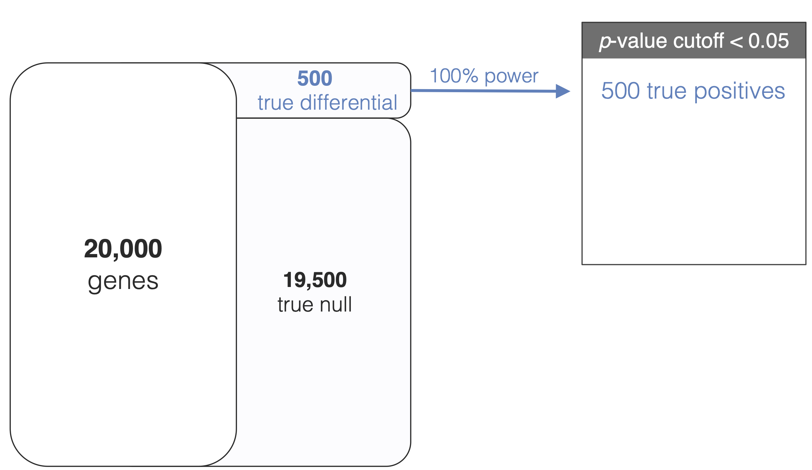
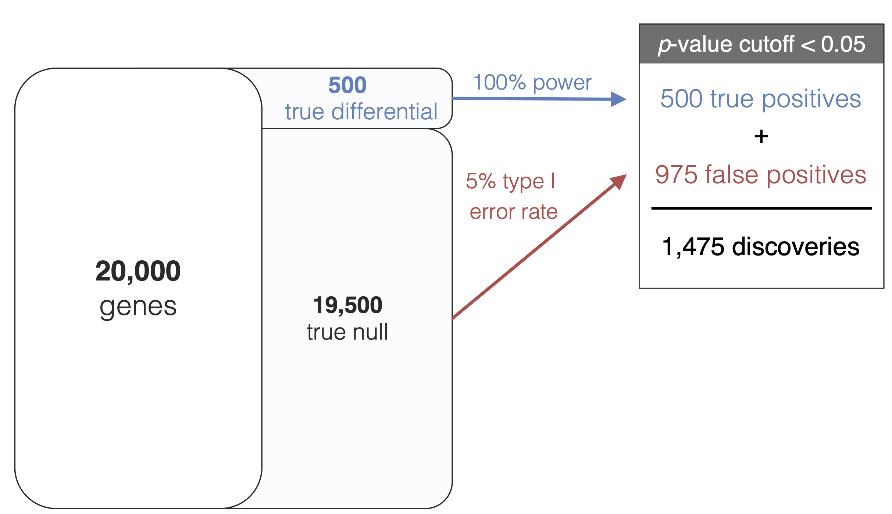
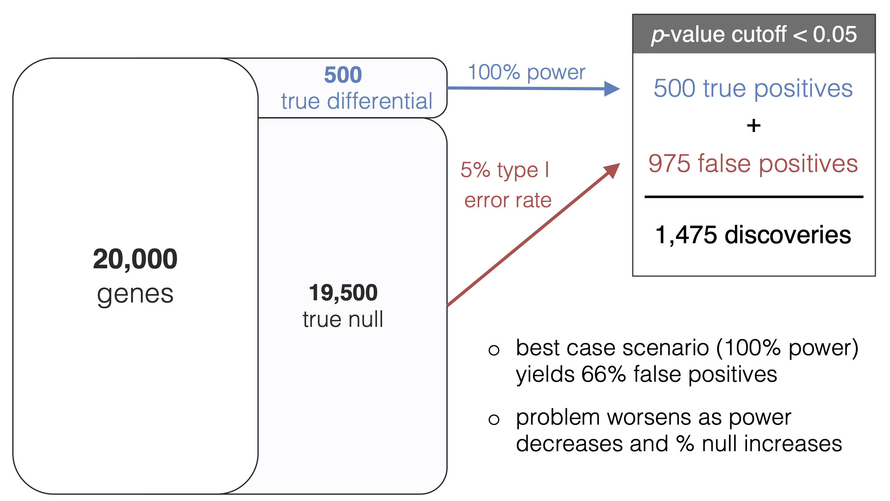
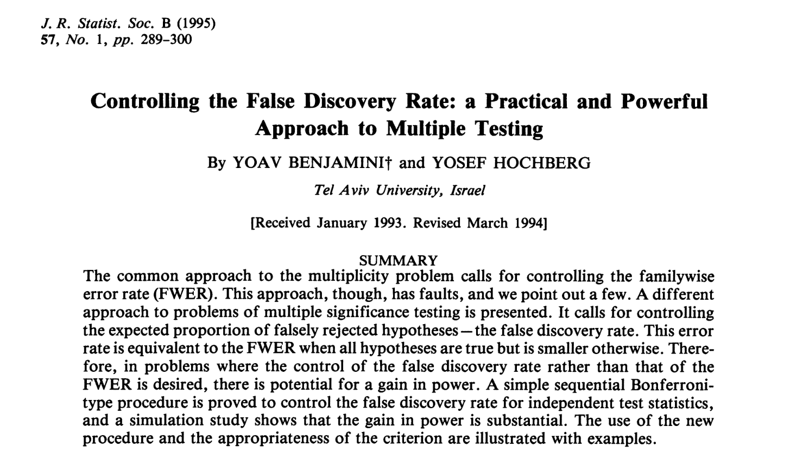
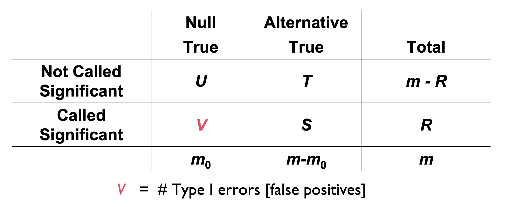
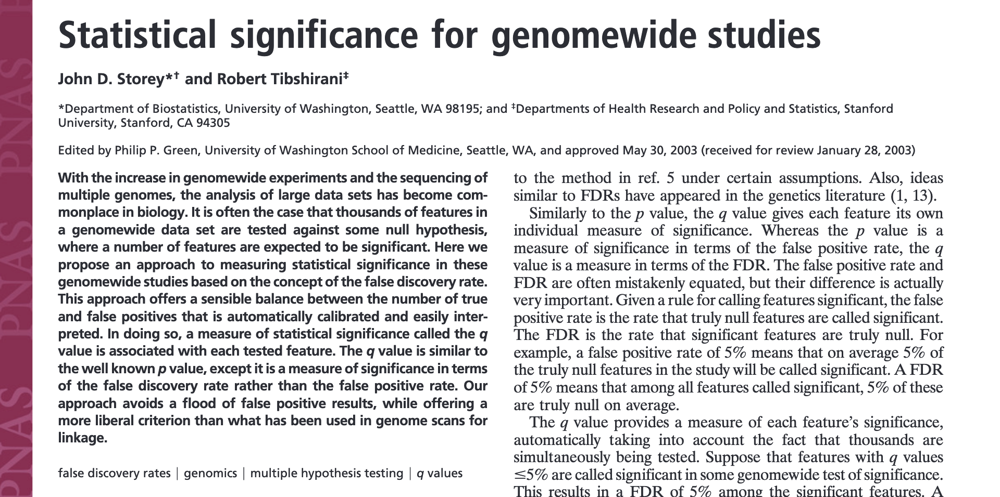

layout: true

<big>

<style>
div.blue { background-color:#e6f0ff; border-radius: 5px; padding: 20px;}
</style>

```{r, include = FALSE}
knitr::opts_chunk$set(tidy = FALSE, tidy.opts=list(width.cutoff=80), fig.retina=3)
ggplot2::theme_set(ggplot2::theme_bw(base_size = 20))
ggplot2::update_geom_defaults("point", list(size = 3))
```

```{r wrap-hook, include=FALSE}
library(knitr)
hook_output = knit_hooks$get('output')
knit_hooks$set(output = function(x, options) {
  # this hook is used only when the linewidth option is not NULL
  if (!is.null(n <- options$linewidth)) {
    x = knitr:::split_lines(x)
    # any lines wider than n should be wrapped
    if (any(nchar(x) > n)) x = strwrap(x, width = n)
    x = paste(x, collapse = '\n')
  }
  
  lines <- options$output.lines
   if (is.null(lines)) {
     return(hook_output(x, options))  # pass to default hook
   }
   x <- unlist(strsplit(x, "\n"))
   if (length(lines)==1) {        # first n lines
     if (length(x) > lines) {
       # truncate the output
       x <- c(head(x, lines))
     }
   } else {
     x <- c(x[lines])
   }
   # paste these lines together
   x <- paste(c(x, ""), collapse = "\n")

  hook_output(x, options)
})

```


```{css, echo = FALSE}
.remark-code, .remark-inline-code {
  background: #f0f0f0;
}
.remark-code {
  font-size: 20px;
}
.huge .remark-code { /*Change made here*/
  font-size: 200% !important;
}
.tiny .remark-code { /*Change made here*/
  font-size: 60% !important;
}
.small .remark-code { /*Change made here*/
  font-size: 90% !important;
}
.smaller .remark-code { /*Change made here*/
  font-size: 80% !important;
}
```

---

# Today

<big>

* practical usage of `limma` 

* comparison to `lm`

* multiple testing & adjusting for multiple comparisons


---

# The hybrid estimator in `limma`

 $$\tilde{s}^2_g = \frac{d_0s_0^2 + ds^2_g}{d_0 + d}$$

* recall that $(s_0, d_0)$ are the *prior* parameters for $\sigma^2_g$:

$$\frac{1}{\sigma^2_g} \sim \frac{1}{d_0s_0^2} \chi^2_{d_0}$$

* the exact estimation formulas for $(s_0, d_0)$ and their derivations are beyond the scope of the course (but `limma` takes care of the details for us)

* note that $(s_0, d_0)$ do not depend on $g$ 

---

# `limma` quickstart

$$\mathbf{Y}_g = \mathbf{X} \boldsymbol\alpha_g + \boldsymbol\varepsilon_g,$$
$$E(\boldsymbol\varepsilon_g) = 0, \,\, Var(\boldsymbol\varepsilon_g) = \sigma^2_g, \,\,\varepsilon_{ig} \perp \varepsilon_{jg},$$
$$(\uparrow \text{within each gene observations are iid / constant variance})$$

* `lmFit()` function in `limma` carries out multiple linear regression on each gene

* Usage: `lmFit(myDat, desMat)` 

  * `myDat` is a data frame or matrix with one row per observation (*G* genes by *N* samples)
  
  * `desMat` is a design matrix (output of `model.matrix(y ~ x)`; *N* samples by $p$ parameters)
  
---


class: middle 

# Let's run `limma` for the interactive model with age

$$\Large y_{i} = \theta + \tau_{KO}x^{KO}_{i} + \tau_{Age}x^{Age}_{i} + \tau_{KO:Age}x^{KO}_{i}x^{Age}_{i}$$

---


## Formulating input for `lmFit`: gene expression data

```{r, include=FALSE}
library(dplyr)
library(ggplot2)

options(lifecycle_disable_warnings = TRUE)

myDes <- readRDS("data/GSE4051_design.rds")
levels(myDes$devStage)[levels(myDes$devStage)=="4_weeks"] <- "4W"

myDat<-read.table("data/GSE4051_data.tsv",
                      sep = "\t", header = T, row.names = 1)

myDes$Age <- ifelse(myDes$devStage == "E16", -4,
                 ifelse(myDes$devStage == "P2", 2, 
                     ifelse(myDes$devStage == "P6", 6, 
                        ifelse(myDes$devStage == "P10", 10, 28))))

```
.tiny[
```{r}
str(myDat)
```
]

---

## Formulating input for `lmFit`: covariate data

.pull-left[
.smaller[
```{r, linewidth=50}
head(myDes)
desMat <- model.matrix(~ gType*Age, 
                       data=myDes)
```
]]

.pull-right[
.tiny[
```{r}
desMat  
```
]]

---

# Computation is fast

<big>

```{r}
library(limma)
system.time(gFit <- lmFit(myDat, desMat))
```

* Using `lmFit` to fit an interactive model on 30K probesets takes a fraction of a second

* The time-intensive parts of an analysis lie in selecting the model and covariates, choosing how to parameterize it, and interpreting the output

---

# Output of `lmFit`


.pull-left[
.smaller[
```{r}
summary(gFit)
```
]
]

.pull-right[
.smaller[
```{r}
29949*4
```
]

]

---

# Output of `lmFit`

.pull-left[
.smaller[
```{r}
summary(gFit)
```
]
]

.pull-right[

.smaller[
```{r}
29949*4
```
]

* OK... but where are the shrunken variable estimates?? How do I pull out p-values??

* Actually, we haven't carried out the empirical Bayesian computation yet -- need to run `eBayes()`!
]

---

# `eBayes()`

<div style= "float:left; position: relative; top: -40px;">
.tiny[
```{r}
summary(gFit)
```
]
</div>

<div style= "float:right; position: relative; top: -40px;">
.tiny[
```{r, highlight.output=c(14:24)}
summary(ebFit <- eBayes(gFit))
```
]
</div>

---

# Components of the empirical Bayes estimators

<center>

| math  | plain english  | `limma` | numerical result | also in `lm`? |
| :---: | :------------: | :-----: | :-----: | :---: |
| $s_g^2$ | gene-specific residual variance | `gFit$sigma^2` | 30K numbers | $\checkmark$ |
| $d$ | residual degrees of freedom $(n-p)$ | `gFit$df.residual` | $39-4=35^*$ | $\checkmark$ |
| $s_0^2$ | mean of inverse $\chi^2$ prior for $s_g^2$ | `ebFit$s2.prior` | `r signif(ebFit$s2.prior,2)` | |
| $d_0$ | degrees of freedom for the prior | `ebFit$df.prior` | `r signif(ebFit$df.prior,3)` | |
| $\tilde{s}_g^2$ | posterior mean of $s_g^2$ (i.e. moderated residual variance) | `ebFit$s2.post` |  30K numbers | |

<small><small>
$^*$ limma can handle more complicated models where this is not the same for each gene, so this is actually a vector of 30K copies of the number 35

---

### `topTable()` will help us extract relevant output in a convenient format!

<small><small><small>
<pre>
topTable(fit, coef=NULL, number=10, genelist=fit$genes, adjust.method="BH",
         sort.by="B", resort.by=NULL, p.value=1, lfc=0, confint=FALSE)
</pre>

<table summary="R argblock">
<tr valign="top"><td><code>fit</code></td>
<td>
<p>list containing a linear model fit produced by <code>lmFit</code>, <code>lm.series</code>, <code>gls.series</code> or <code>mrlm</code>.
For <code>topTable</code>, <code>fit</code> should be an object of class <code>MArrayLM</code> as produced by <code>lmFit</code> and <code>eBayes</code>.</p>
</td></tr>
<tr valign="top"><td><code>coef</code></td>
<td>
<p>column number or column name specifying which coefficient or contrast of the linear model is of interest. For <code>topTable</code>, can also be a vector of column subscripts, in which case the gene ranking is by F-statistic for that set of contrasts.</p>
</td></tr>
<tr valign="top"><td><code>number</code></td>
<td>
<p>maximum number of genes to list</p>
</td></tr>
<tr valign="top"><td><code>adjust.method</code></td>
<td>
<p>method used to adjust the p-values for multiple testing.  Options, in increasing conservatism, include <code>"none"</code>, <code>"BH"</code>, <code>"BY"</code> and <code>"holm"</code>.
See <code><a href="../../stats/html/p.adjust.html">p.adjust</a></code> for the complete list of options. A <code>NULL</code> value will result in the default adjustment method, which is <code>"BH"</code>.</p>
</td></tr>
<tr valign="top"><td><code>sort.by</code></td>
<td>
<p>character string specifying statistic to rank genes by.
Possible values for <code>topTable</code> and <code>toptable</code> are <code>"logFC"</code>, <code>"AveExpr"</code>, <code>"t"</code>, <code>"P"</code>, <code>"p"</code>, <code>"B"</code> or <code>"none"</code>.
(Permitted synonyms are <code>"M"</code> for <code>"logFC"</code>, <code>"A"</code> or <code>"Amean"</code> for <code>"AveExpr"</code>, <code>"T"</code> for <code>"t"</code> and <code>"p"</code> for <code>"P"</code>.)
Possibilities for <code>topTableF</code> are <code>"F"</code> or <code>"none"</code>.
Possibilities for <code>topTreat</code> are as for <code>topTable</code> except for <code>"B"</code>.</p>
</td></tr>
</table>

... (truncated - see `?topTable` for full listing)
---

# Summary of `topTable` function

* `coef` is the argument where you specify the coefficient you want to test for equality with zero (default is NULL; must be specified)

* `number` lets you control size of hit list (default is 10)

* `p.value` lets you specify a minimum adjusted p-value cutoff (defalyt is 1)

* `lfc` lets you specify a minimum observed effect size (default is 0)

* `sort.by` and `resort.by` give control over the ordering (default is by "B": log-odds that the gene is differentially expressed)

* `adjust.method` specifies how/if to adjust p-values for multiple testing (default is BH)

---

## `topTable` in action: `gTypeNrlKO` 


.small[
```{r}
topTable(ebFit, coef = "gTypeNrlKO")
```
]

* `topTable(ebFit, coef = 2)` is equivalent here, but much less informative!!

* this finds genes where the knockouts differ from the wild types *when age is zero*

---

# Plotting the top 6 genes for `gTypeNrlKO`


```{r, echo=FALSE, fig.width=14, fig.height=7, fig.align="center", warning=FALSE, message = FALSE}

prDes <- readRDS("data/GSE4051_design.rds") 
levels(prDes$devStage)[levels(prDes$devStage)=="4_weeks"] <- "4W"

prDat<-read.table("data/GSE4051_data.tsv",
                      sep = "\t", header = T, row.names = 1)
## I've selected this as our hit
keep <- match(rownames(topTable(ebFit, coef = "gTypeNrlKO"))[1:6],
              rownames(prDat))

keepers <- data.frame(probesetID = I(rownames(prDat)[keep]))

devDat <- as.vector(t(prDat[keepers$probesetID, ]))
devDat <- data.frame(gene = rep(keepers$probesetI, 
                                each = nrow(prDes)),
                     gExp = devDat)
devDat <- data.frame(prDes, devDat)

# add pseudo age variable to data frame
devDat$Age <- ifelse(devDat$devStage == "E16", -4,
                 ifelse(devDat$devStage == "P2", 2, 
                     ifelse(devDat$devStage == "P6", 6, 
                        ifelse(devDat$devStage == "P10", 10, 28))))

devDat$gene  = factor(devDat$gene , levels=keepers$probesetID)

ggplot(devDat,aes( x = Age, y = gExp, color=gType)) + 
             geom_jitter(width = 0.2, alpha = 0.7) +
             xlab("Age (days)") +
             facet_wrap( ~ gene) + 
             stat_smooth(method="lm", se=FALSE, cex=0.5)

```

---


## `topTable` in action: `Age` 


.small[
```{r}
topTable(ebFit, coef = "Age")
```
]

* `topTable(ebFit, coef = 3)` is equivalent here, but much less informative!!

* this finds genes where Age significantly affects gene expression *for wt*

---

# Plotting the top 6 genes for `Age`


```{r, echo=FALSE, fig.width=14, fig.height=7, fig.align="center", warning=FALSE, message = FALSE}

## I've selected this as our hit
keep <- match(rownames(topTable(ebFit, coef = "Age"))[1:6],
              rownames(prDat))

keepers <- data.frame(probesetID = I(rownames(prDat)[keep]))

devDat <- as.vector(t(prDat[keepers$probesetID, ]))
devDat <- data.frame(gene = rep(keepers$probesetI, 
                                each = nrow(prDes)),
                     gExp = devDat)
devDat <- data.frame(prDes, devDat)

# add pseudo age variable to data frame
devDat$Age <- ifelse(devDat$devStage == "E16", -4,
                 ifelse(devDat$devStage == "P2", 2, 
                     ifelse(devDat$devStage == "P6", 6, 
                        ifelse(devDat$devStage == "P10", 10, 28))))

devDat$gene  = factor(devDat$gene , levels=keepers$probesetID)

ggplot(devDat,aes( x = Age, y = gExp, color=gType)) + 
             geom_jitter(width = 0.2, alpha = 0.7) +
             xlab("Age (days)") +
             facet_wrap( ~ gene) + 
             stat_smooth(method="lm", se=FALSE, cex=0.5)


```

---

## `topTable` in action: `gTypeNrlKO:Age` 


.small[
```{r}
topTable(ebFit, coef = "gTypeNrlKO:Age")
```
]

* `topTable(ebFit, coef = 4)` is equivalent here, but much less informative!!

* this finds genes where the effect of Age is significantly different in each genotype

---

# Plotting the top 6 genes for `gTypeNrlKO:Age` 


```{r, echo=FALSE, fig.width=14, fig.height=7, fig.align="center", warning=FALSE, message = FALSE}

## I've selected this as our hit
keep <- match(rownames(topTable(ebFit, coef = "gTypeNrlKO:Age"))[1:6],
              rownames(prDat))

keepers <- data.frame(probesetID = I(rownames(prDat)[keep]))

devDat <- as.vector(t(prDat[keepers$probesetID, ]))
devDat <- data.frame(gene = rep(keepers$probesetI, 
                                each = nrow(prDes)),
                     gExp = devDat)
devDat <- data.frame(prDes, devDat)

# add pseudo age variable to data frame
devDat$Age <- ifelse(devDat$devStage == "E16", -4,
                 ifelse(devDat$devStage == "P2", 2, 
                     ifelse(devDat$devStage == "P6", 6, 
                        ifelse(devDat$devStage == "P10", 10, 28))))

devDat$gene  = factor(devDat$gene , levels=keepers$probesetID)

ggplot(devDat,aes( x = Age, y = gExp, color=gType)) + 
             geom_jitter(width = 0.2, alpha = 0.7) +
             xlab("Age (days)") +
             facet_wrap( ~ gene) + 
             stat_smooth(method="lm", se=FALSE, cex=0.5)

```

---

## `topTable` in action: any effect of genotype

.small[
```{r}
topTable(ebFit, coef = c("gTypeNrlKO", "gTypeNrlKO:Age"))[,-3]
```
]

* `topTable(ebFit, coef = c(2,4))` is equivalent here, but much less informative!!

* this finds genes where any (additive/interaction) effect of genotype is significant

---

# Plotting the top 6 genes for any effect of genotype


```{r, echo=FALSE, fig.width=14, fig.height=7, fig.align="center", warning=FALSE, message = FALSE}

## I've selected this as our hit
keep <- match(rownames(topTable(ebFit, coef = c("gTypeNrlKO", "gTypeNrlKO:Age")))[1:6],
              rownames(prDat))

keepers <- data.frame(probesetID = I(rownames(prDat)[keep]))

devDat <- as.vector(t(prDat[keepers$probesetID, ]))
devDat <- data.frame(gene = rep(keepers$probesetI, 
                                each = nrow(prDes)),
                     gExp = devDat)
devDat <- data.frame(prDes, devDat)

# add pseudo age variable to data frame
devDat$Age <- ifelse(devDat$devStage == "E16", -4,
                 ifelse(devDat$devStage == "P2", 2, 
                     ifelse(devDat$devStage == "P6", 6, 
                        ifelse(devDat$devStage == "P10", 10, 28))))

devDat$gene  = factor(devDat$gene , levels=keepers$probesetID)

ggplot(devDat,aes( x = Age, y = gExp, color=gType)) + 
             geom_jitter(width = 0.2, alpha = 0.7) +
             xlab("Age (days)") +
             facet_wrap( ~ gene) + 
             stat_smooth(method="lm", se=FALSE, cex=0.5)

```

---

# Comparison of $s_g^2$ and $\tilde{s}_g^2$ (shrinkage!)

```{r echo=FALSE, fig.width=6, fig.height=5, fig.align="center", warning=FALSE, message = FALSE}

df <- data.frame(limma=ebFit$s2.post, lm=gFit$sigma^2)
df %>% ggplot(aes(y=limma, x = lm)) +
  geom_point(alpha=0.2) +
  geom_abline(intercept=0, slope=1, color="red") +
  scale_x_continuous(trans="log2") +
  scale_y_continuous(trans="log2") +
  ggtitle("Ests of gene-specific variance")
```

* For small variances, limma *increases* the estimates
* For large variances, limma *decreases* the estimates 

---

# Comparison of interaction coefficient p-values

```{r echo=FALSE, fig.width=6, fig.height=5, fig.align="center", warning=FALSE, message = FALSE}


allDat <- as.vector(t(prDat))
allDat <- data.frame(gene =rep(rownames(prDat), each = nrow(prDes)),
             gExp = allDat)
allDat <- data.frame(prDes, allDat)
allDat$Age <- ifelse(allDat$devStage == "E16", -4,
                 ifelse(allDat$devStage == "P2", 2, 
                     ifelse(allDat$devStage == "P6", 6, 
                        ifelse(allDat$devStage == "P10", 10, 28))))

library(broom)

if (file.exists("data/lmpvals.rds")){
  lm_all <- readRDS("data/lmpvals.rds")
}else{
  lm_all <- allDat %>%
    group_by(gene) %>%
    do(tidy(lm(gExp ~ gType*Age, .))) %>% 
    filter(term=="gTypeNrlKO:Age") %>%
    pull(p.value)
  saveRDS(lm_all, "data/lmpvals.rds")
}

df <- data.frame(limma=topTable(ebFit, coef = "gTypeNrlKO:Age", 
                                number=Inf, sort.by = "none")$P.Value,
                 lm=lm_all)

df %>% ggplot(aes(y=limma, x = lm)) +
  geom_point(alpha=0.2) +
  geom_abline(intercept=0, slope=1, color="red") +
  ggtitle("p-value for gTypeNrlKO:Age coef") 
```

* `r sum(df$limma > df$lm)` genes where limma p-value is *larger* than lm
* `r sum(df$limma < df$lm)` genes where limma p-value is *smaller* than lm

---

class: middle 

# <center> Multiple testing

---

# Error rates

```{r, fig.align="center", echo = FALSE, out.width=675}
knitr::include_graphics("img/hypError.png")
```

<br>
$$\alpha = P(\text{Type I Error}), \text{   } \beta = P(\text{Type II Error}), \text{   Power} = 1- \beta$$ 

---

# Type I Error rate for $m$ tests

.pull-left[
* $P(\text{incorrect decision} | H_0) = \alpha$; let $\alpha=0.05$

* $P(\text{correct decision} | H_0) = 1-\alpha = 0.95$


* $P(\text{correct decision on }m\text{ tests} | H_0) =$ $(1-\alpha)^m = 0.95^m$

* $P(\text{at least one incorrect decision on }m\text{ tests} | H_0) =$ $1 - (1-\alpha)^m =$ $1-0.95^m = \alpha_{FWER}$

]

.pull-right[
```{r, fig.width=5, fig.height=4, echo=FALSE, fig.align="right"}
m <- seq(1,1000)
plot(m, 1-0.95^m, type="l")
```
]
---

# Multiple comparisons and error rates

<div style= "float:right;position: relative; top: -50px;">
```{r, out.width="850", fig.align="center", echo=FALSE, include=TRUE}

```
</div>

---

# Multiple comparisons and error rates


<div style= "float:right;position: relative; top: -50px;">
```{r, out.width="850", fig.align="center", echo=FALSE, include=TRUE}

```
</div>

---

# Multiple comparisons and error rates


<div style= "float:right;position: relative; top: -50px;">
```{r, out.width="860", fig.align="center", echo=FALSE, include=TRUE}

```
</div>

---

# Multiple comparisons and error rates


<div style= "float:right;position: relative; top: -50px;">
```{r, out.width="885", fig.align="center", echo=FALSE, include=TRUE}

```
</div>

---

# Multiple comparisons and error rates


<div style= "float:right;position: relative; top: -50px;">
```{r, out.width="900", fig.align="center", echo=FALSE, include=TRUE}

```
</div>

---

# Family-Wise Error Rate (FWER)

* **FWER** is the probability of making at least one error when testing $m$ tests

* **Control** the FWER: limit the probability of making at least one incorrect decision

* One example: the **Bonferroni** correction for $\alpha=0.05$:

  $$\text{If } P(\text{at least one error on }m \text{ tests}) \lt \alpha$$
  
  $$\Rightarrow P(\text{at least one error on }m \text{ tests}) \lt \sum_{i=1}^m P(\text{error on test }i)$$
  
  $$\sum_{i=1}^m P(\text{error on test }i) = m\alpha^{Bon}$$
  
  $$\alpha^{Bon} = \frac{\alpha}{m} = \frac{0.05}{m}$$
  
---
  
# Bonferroni correction: controlling the FWER
  
Can think of controlling the probability of at least one false positive in two ways:
  
1. **Adjust the p-values; keep same $\alpha$:** 
    
    $$p^{Bon}_i=mp_i \text{ (more technically correct: } p^{Bon}_i=min(mp_i, 1))$$ 
    
    $$\text{Then, threshold } p^{Bon}_i \text{ at } \alpha$$

2. **Adjust the $\alpha$ threshold; keep same p-values:**
    
    $$\alpha^{Bon}=\frac{\alpha}{m}$$ 

    $$\text{Then, threshold } p_i \text{ at } \alpha^{Bon}$$
    
    
---

# Multiple test correction is an active area of statistical research

* Bonferroni correction is very conservative (i.e. controls the FWER even lower than $\alpha$ in many settings)

* Several other options are better

* For example, the Holm procedure: multiplier for p-value correction is not the same for all genes:

$$p_1^H = mp_1$$

$$p_2^H = (m-1)p_2$$
$$p_3^H = (m-2)p_3$$
$$\vdots$$
$$\Rightarrow FWER \le \alpha$$
---

# How practical is the FWER in high-throughput biology?

<big>

* Why do we care so much about making one error??


```{r, out.width="250", fig.align="center", echo=FALSE, include=TRUE}

```

--

* One extreme way to ensure no Type I errors: reject no hypotheses! 😃 

  * However, then our power is zero... 😭

--

* Being overly strict about Type I error leads to greater Type II error (loss of power)

---

class: middle

# <center> Radical idea: it's OK to make multiple mistakes, as long as you also have some true positives!

---

# Enter: the False Discovery Rate (FDR)


.pull-left[
```{r, out.width="750", fig.align="center", echo=FALSE, include=TRUE}

```
]

.pull-right[

Benjamini Y, Hochberg Y. "Controlling the false discovery rate: a practical and powerful approach to multiple testing." Journal of the Royal statistical society: series B (Methodological). 1995 Jan;57(1):289-300.

Over 60K citations!!
]


---

# False Discovery Rate

```{r, out.width="800", fig.align="center", echo=FALSE, include=TRUE}

```

### FDR is designed to control the expected proportion of false positives (V) among all hypotheses where the null has been rejected (R)

---

# False Discovery Rate

```{r, out.width="800", fig.align="center", echo=FALSE, include=TRUE}

```

$$FDR = E \Big[ \frac{V}{R} \Big]$$ 


---

# FDR vs FPR vs FWER

* False Discovery Rate (FDR) is the rate that significant features $(R)$ are truly null

$$FDR = E \Big[ \frac{V}{R} \Big]$$ 

* False Positive Rate (FPR) is the rate that significant features $(m_0)$ are truly null

$$FPR =  E\Big[\frac{V}{m_0}\Big]$$

* Family-Wise Error Rate (FWER) is the probability that the number of truly null features rejected $(V)$ is at least 1

$$\text{FWER } = P(V\ge1) $$
---

# Benjamini Hochberg FDR

* Proposed the idea of controlling FDR instead of FWER

* Proposed a procedure for doing so 

  * note that we know $R$, but we don't know $V$

* Procedure: control FDR at level $q$

  1. order the raw p-values $p_1 \le p_2 \le ...\le p_m$
  
  2. find test with highest rank $j$ such that $p_j < \frac{jq}{m}$
  
  3. declare all smaller ranks up to $j$ significant

---

# Controlling FDR at level $q = 0.05$ 

| Rank $(j)$ | P-value |
| :---: | --- |
| 1 | 0.0008 |
| 2 | 0.009 |
| 3 | 0.127 |
| 4 | 0.205 | 
| 5 | 0.396 |
| 6 | 0.450 |
| 7 | 0.641 |
| 8 | 0.781 |
| 9 | 0.900 |
| 10 | 0.993 |

---

# Controlling FDR at level $q = 0.05$ 

| Rank $(j)$ | P-value | (j/m)*q |
| :---: | --- | --- |
| 1 | 0.0008 | 0.005 |
| 2 | 0.009 | 0.010 |
| 3 | 0.127 | 0.015 |
| 4 | 0.205 | 0.020 |
| 5 | 0.396 | 0.025 |
| 6 | 0.450 | 0.030 |
| 7 | 0.641 | 0.035 |
| 8 | 0.781 | 0.040 |
| 9 | 0.900 | 0.045 |
| 10 | 0.993 | 0.050 |

---

# Controlling FDR at level $q = 0.05$ 

| Rank $(j)$ | P-value | (j/m)*q | Reject $H_0$? |
| :---: | --- | --- | :---: |
| 1 | 0.0008 | 0.005 | $\checkmark$ |
| 2 | 0.009 | 0.010 | $\checkmark$ |
| 3 | 0.127 | 0.015 | $\checkmark$ |
| 4 | 0.205 | 0.020 | |
| 5 | 0.396 | 0.025 | |
| 6 | 0.450 | 0.030 | |
| 7 | 0.641 | 0.035 | |
| 8 | 0.781 | 0.040 | |
| 9 | 0.900 | 0.045 | |
| 10 | 0.993 | 0.050 | |

---

# Controlling FDR at level $q = 0.05$ 

| Rank $(j)$ | P-value | (j/m)*q | Reject $H_0$? | $FWER_{Bon} < 0.05$? |
| :---: | --- | --- | :---: | :---: |
| 1 | 0.0008 | 0.005 | $\checkmark$ | $\checkmark$ |
| 2 | 0.009 | 0.010 | $\checkmark$ | |
| 3 | 0.127 | 0.015 | $\checkmark$ | |
| 4 | 0.205 | 0.020 | | |
| 5 | 0.396 | 0.025 | | |
| 6 | 0.450 | 0.030 | | |
| 7 | 0.641 | 0.035 | | |
| 8 | 0.781 | 0.040 | | |
| 9 | 0.900 | 0.045 | | |
| 10 | 0.993 | 0.050 | | |

Where $\alpha^{bon}=0.05/10=0.005$

---

# BH FDR values given in `limma` by default

```{r}
topTable(ebFit, coef = "gTypeNrlKO")
```

Or, obtain them yourself for any vector of p-values `p` with `p.adjust(p, method="BH")`

---

# Other ways to control FDR

* BH is just one (the first) method to control FDR

* Since the publication of the BH method, other methods have been proposed

* One of the most popular is Storey's q-value

```{r, out.width="500", fig.align="center", echo=FALSE, include=TRUE}

```

* `qvalue` package implementation: provides adjusted p-values

---

# Storey's q-value vs BH (Conceptual)

<big>

* Just like BH, is focused on the proportion of discoveries that are false positives 

* *Conceptual* difference between BH and Storey's q-value is: 

  * BH **controls** the FDR 
  
  * q-values give an unbiased **estimate** of the FDR (will control the FDR on eaverage)
  

---

# Storey's q-value vs BH (Mathematical)


* Mathematically, the difference between the two is in how $m_0$ is estimated 

  * Or equivalently, how $\pi_0=\frac{m_0}{m}$ is estimated (since $m$ is known)
  
  * $\pi_0$ represents the proportion of tests that are truly null
  
* q-value: 

$$\hat{q}(p_i) = \min_i \Big( \frac{\hat{\pi}_0m}{rank(p_i)}p_i,  \, 1\Big)$$

* q-value and BH-adjusted p-values are equivalent when $\pi_0=1$

$$\hat{p}^{BH}(p_i) = \min_i \Big(\frac{m}{rank(p_i)}p_i, \, 1\Big)$$

(BH conservatively assumes that $\pi_0=1$)

---

# BH vs q-value in our example

| Rank $(j)$ | P-value | $\hat{p}^{BH}$ | $\hat{q}(p_i)$ |
| :---: | --- | --- | :---: |
| 1 | 0.0008 | 0.008 | 0.008 |
| 2 | 0.009 | 0.045 | 0.045 |
| 3 | 0.127 | 0.423 | 0.423 |
| 4 | 0.205 | 0.513 | 0.513 |
| 5 | 0.396 | 0.792 | 0.750 |
| 6 | 0.450 | 0.750 | 0.750 |
| 7 | 0.641 | 0.916 | 0.916 |
| 8 | 0.781 | 0.976 | 0.976 |
| 9 | 0.900 | 1.000 | 0.993 |
| 10 | 0.993 | 0.993 | 0.993 |

---

# Compounding issues of multiple comparisons


* What if you're not only testing 30K genes, but also multiple tests per gene (e.g. multiple contrasts, such as several two-group comparisons)?

* Classical procedures for adjustment: 
    * Tukey multiple comparison procedure
    * Scheffe multiple comparison procedure
    * Bonferroni or Holm FWER correction
  
* In our setting, we can also apply BH to all p-values globally

  * `limma::decideTests(pvals, method="global")` for a matrix of p-values or `eBayes` output (e.g. rows = genes, columns = contrasts)
  
  * p-values are combined, adjusted globally, then separated back out and sorted


---

# Assumptions about p-values

* Implicit assumption for all multiple testing correction methods: 

#### <center> p-value distribution is "well-behaved"

* What does this mean? 

  * primarily, that the distribution of p-values under the null is **uniform**
  
```{r, fig.align="center", echo=FALSE, fig.width=6, fig.height=4}
set.seed(22)
pval <- replicate(1000, t.test(rnorm(100))$p.value)
hist(pval, breaks=30) 
```

---

# p-value distributions

Spike of small p-values indicates non-null tests:

```{r, fig.align="center", echo=FALSE, fig.width=6, fig.height=4}
set.seed(22)
pval <- replicate(1000, t.test(rnorm(100))$p.value)
pval <- c(pval, replicate(200, t.test(rnorm(100,0.2))$p.value))
hist(pval, breaks=30) 
```

Great primer on how things can go wrong: [http://varianceexplained.org/statistics/interpreting-pvalue-histogram/](http://varianceexplained.org/statistics/interpreting-pvalue-histogram/)

---

# What if p-values are poorly behaved?

* FDR estimates can be invalid (assumptions are violated)

* Solution: compute p-values "empirically" using resampling/permutation/bootstrap techniques 

* **Bootstrap**: take repeated random samples with replacement from your data and compute statistic; repeat many times and use bootstrap statistics as your sampling distribution rather than a t, Normal, F, $\chi^2$, etc

* **Permutation**: construct a simulated version of your dataset that satisfies the null hypothesis and compute statistic (e.g. shuffle group labels for a two-group comparison); repeat many times and use permutation statistics as your sampling distribution rather than a t, Normal, F, $\chi^2$, etc

* Downside: often computationally intensive for genomics


