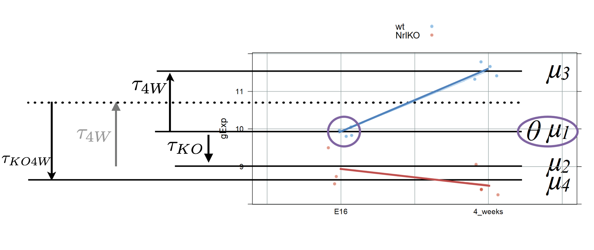

```{r setup, include=FALSE}
knitr::opts_chunk$set(echo = TRUE)
```
class: middle

### Mathematically (a bit more difficult...)

$$Y_{ijk}=\theta + \tau_{KO} \times x_{KO,ijk}+ \tau_{4W} \times x_{4W,ijk}+ \tau_{KO4W} \times x_{KO,ijk}\times x_{4W,ijk}+ \varepsilon_{ijk}$$
Subscripts: $i$ indexes samples per group, $j=\{wt, NrlKO\}$, $k=\{E16, 4W\}$  

The names of these parameters and variables look overwhelming but think of them as just names for:

> $x_{KO,ijk}$: a dummy variable with value 1 for NrlKO genotype samples (j=NrlKO), and 0 otherwise. I call this variable $x_{KO}$

> $x_{4W,ijk}$: a different dummy variable with value 1 for 4W  samples (k=4W), and 0 otherwise. I call this variable $x_{4W}$

> $\tau_{KO}$, $\tau_{4W}$, and $\tau_{KO4W}$: parameters to model the *conditional* effects of genotype (NrlKO), development (4W), and their interaction

**Note**: in this "simple" version with 2 levels per factor we need only one dummy variable per factor: $x_{KO}$ and $x_{4W}$. 

### This model can be extended to multiple factors with multiple levels!!

## Reference: wt & E16

As before, comparisons are relative to a reference but now we have reference levels in both factors: E16 and wt

$$Y_{ijk}=\theta + \tau_{KO} \times x_{KO,ijk}+ \tau_{4W} \times x_{4W,ijk}+ \tau_{KO4W} \times x_{KO,ijk}\times x_{4W,ijk}+ \varepsilon_{ijk}$$
  
  
For any sample $i$ in the reference group: $j=wt$ and $k=E16$, then $x_{KO}=0$ and $x_{4W}=0$ 
  
As before $\theta$ is the mean of the reference group: $E[Y_{wt,E16}]=\theta$
  



### *Simple* genotype effect: wt *vs* NrlKO <font color="blue"> at E16 </font>


$$Y_{ijk}=\theta + \tau_{KO} \times x_{KO,ijk}+ \tau_{4W} \times x_{4W,ijk}+ \tau_{KO4W} \times x_{KO,ijk}\times x_{4W,ijk}+ \varepsilon_{ijk}$$
  
For any wt sample at E16: $x_{KO}=0$ and $x_{4W}=0$. Then <font color="red"> $E[Y_{wt,E16}]=\theta$ </font>
  
For any KO sample at E16: $x_{KO}=1$ and $x_{4W}=0$. Then <font color="red"> $E[Y_{NrlKO,E16}]=\theta + \tau_{KO}$ </font>
  
Then (substract expectations), $\tau_{KO}$ is the *conditional* genotype effect <font color="blue"> at E16 </font>: 
  
$\tau_{KO}=E[Y_{NrlKO,E16}]-E[Y_{wt,E16}]$ 
  
### *Simple* developmental effect: E16 *vs* 4W <font color="blue"> at wt </font>

$$Y_{ijk}=\theta + \tau_{KO} \times x_{KO,ijk}+ \tau_{4W} \times x_{4W,ijk}+ \tau_{KO4W} \times x_{KO,ijk}\times x_{4W,ijk}+ \varepsilon_{ijk}$$
  
For any wt sample at E16: $x_{KO}=0$ and $x_{4W}=0$. Then <font color="red"> $E[Y_{wt,E16}]=\theta$ </font>
  
For any wt sample at 4W: $x_{KO}=0$ and $x_{4W}=1$. Then <font color="red"> $E[Y_{wt,4W}]=\theta + \tau_{4W}$ </font>
  
Then (substract expectations), $\tau_{4W}$ is the *conditional* development effect <font color="blue"> at wt </font>: 
  
$\tau_{4W}=E[Y_{wt,4W}]-E[Y_{wt,E16}]$ 
  
### Interaction effect: can we add up both effects??

$$Y_{ijk}=\theta + \tau_{KO} \times x_{KO,ijk}+ \tau_{4W} \times x_{4W,ijk}+ \tau_{KO4W} \times x_{KO,ijk}\times x_{4W,ijk}+ \varepsilon_{ijk}$$
  
Mathematically more challenging (try it!):
  
For any KO sample at 4w: $x_{KO}=1$ and $x_{4W}=1$. Then <font color="red"> $E[Y_{NrlKO,4W}]=\theta + \tau_{KO} + \tau_{4W} + \tau_{KO4W}$ </font>
  
Using the expectations from previous pages, you can show that:
  
$\tau_{KO4W}=(E[Y_{NrlKO,E16}]-E[Y_{wt,E16}]) + (E[Y_{NrlKO,4W}]-E[Y_{wt,4W}])$ 
  

$$  , \ \mu_2=E[Y_{(NrlKO,E16)}], 
\ \mu_3=E[Y_{(wt,4W)}], \ \mu_4=E[Y_{(NrlKO,4W)}] $$


### Example 4: development @wt is statistically significant

Again, the interaction effect is not significant, so there may be a developmetn effect *regardless* of the genotype. 

How do we test a *main effect*?? coming soon!  

```{r,echo=FALSE}
egDat<-prDat %>% subset(row.names(prDat) %in%
       c("1447988_at","1438764_at")) %>%
       tibble::rownames_to_column(var = "gene")%>% 
       gather(sidChar, gExp,-gene) %>%
       inner_join(prDes,by="sidChar")%>% 
       mutate(grp=interaction(gType, devStage))
```

```{r,echo=FALSE,highlight.output = c(4)}
multFit <- lm(gExp ~ gType * devStage, subset(egDat,gene=="1447988_at"))
summary(multFit)$coeff
```

```{r echo=FALSE, fig.height=4, fig.width=14,warning=FALSE,dev='svg'}
plot1Dat <- filter(egDat, gene == "1447988_at")
plot2Dat <- filter(egDat, gene == "1438764_at")

#cell-means for plot 1
mu.hat1<-plot1Dat %>% group_by(grp) %>% summarize(mean(gExp)) %>% as.data.frame()

plot1Lim <- ggplot(plot1Dat, aes(x = devStage, y = gExp, group=gType, colour=gType)) + 
  geom_jitter(width = 0.1) +
             labs(title = "1447988_at") +
             theme_bw() +
             theme(legend.position = "none") +
             ylim(5.5, 8) +  stat_summary(aes(group=gType,colour=gType), fun.y=mean, geom="line",size=1.5) +
  scale_color_manual(values = c('wt' = '#00BFC4', 'NrlKO' = '#F8766D'))+
  geom_segment(aes(x=1,y=mu.hat1[3,2],xend=1,yend=mu.hat1[1,2]),colour=1,arrow = arrow(length = unit(0.1,"cm")))+
  geom_segment(aes(x=1,y=mu.hat1[1,2],xend=1,yend=mu.hat1[3,2]),colour=1,arrow = arrow(length = unit(0.1,"cm")))+ #other way for double arrow??
  geom_segment(aes(x=1,y=mu.hat1[3,2],xend=2,yend=mu.hat1[3,2]),colour='grey',linetype=2)

#cell-means for plot 2
mu.hat2<-plot2Dat %>% group_by(grp) %>% summarize(mean(gExp)) %>% as.data.frame()

plot2Lim <- ggplot(plot2Dat, aes(x = devStage, y = gExp, group=gType, colour=gType)) + 
  geom_jitter(width = 0.1) +
             labs(title = "1438764_at") +
             theme_bw() +
             theme(legend.position = "none") +
             ylim(5.5, 8) +  stat_summary(aes(group=gType,colour=gType), fun.y=mean, geom="line",size=1.5) +
  scale_color_manual(values = c('wt' = '#00BFC4', 'NrlKO' = '#F8766D'))+
  geom_segment(aes(x=1,y=mu.hat2[3,2],xend=1,yend=mu.hat2[1,2]),colour=1,arrow = arrow(length = unit(0.1,"cm")))+
  geom_segment(aes(x=1,y=mu.hat2[1,2],xend=1,yend=mu.hat2[3,2]),colour=1,arrow = arrow(length = unit(0.1,"cm")))+ #other way for double arrow??
  geom_segment(aes(x=1,y=mu.hat2[3,2],xend=2,yend=mu.hat2[3,2]),colour='grey',linetype=2)
grid.arrange(plot1Lim, plot2Lim, ncol = 2)
```


### Example 5: conditional development and genotype are statistically significant

but not the interaction... note the almost parallel pattern

```{r,echo=FALSE}
egDat<-prDat %>% subset(row.names(prDat) %in%
       c("1456930_at","1417810_a_at")) %>%
       tibble::rownames_to_column(var = "gene")%>% 
       gather(sidChar, gExp,-gene) %>%
       inner_join(prDes,by="sidChar")
```


```{r,echo=FALSE,highlight.output = c(3:5),warning=FALSE}
multFit <- lm(gExp ~ gType * devStage, subset(egDat,gene=="1456930_at"))
summary(multFit)$coeff
```

```{r echo=FALSE, fig.height=4, fig.width=14,warning=FALSE, dev='svg'}
plot1Dat <- filter(egDat, gene == "1456930_at")
plot2Dat <- filter(egDat, gene == "1417810_a_at")

plot1Lim <- ggplot(plot1Dat, aes(x = devStage, y = gExp, group=gType, colour=gType)) + 
  geom_jitter(width = 0.1) +
             labs(title = "1456930_at") +
             theme_bw() +
             theme(legend.position = "none") +
             ylim(8, 13) +  stat_summary(aes(group=gType,colour=gType), fun.y=mean, geom="line",size=1.5) +
  scale_color_manual(values = c('wt' = '#00BFC4', 'NrlKO' = '#F8766D'))

plot2Lim <- ggplot(plot2Dat, aes(x = devStage, y = gExp, group=gType, colour=gType)) + 
  geom_jitter(width = 0.1) +
             labs(title = "1417810_a_at") +
             theme_bw() +
             theme(legend.position = "none") +
             ylim(8,13) +  stat_summary(aes(group=gType,colour=gType), fun.y=mean, geom="line",size=1.5) +
  scale_color_manual(values = c('wt' = '#00BFC4', 'NrlKO' = '#F8766D'))

grid.arrange(plot1Lim, plot2Lim, ncol = 2)
```

---
